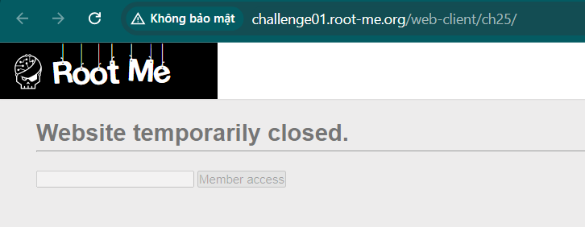
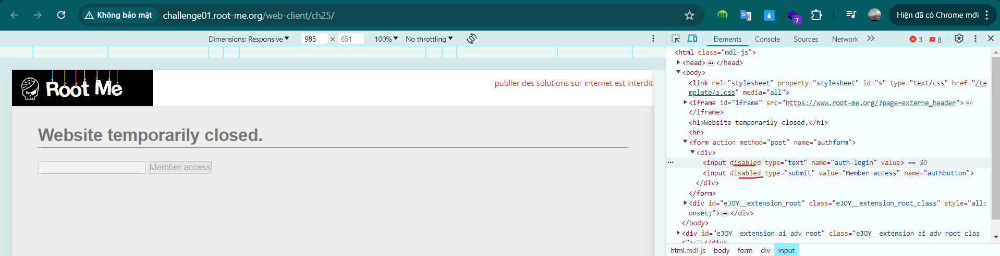
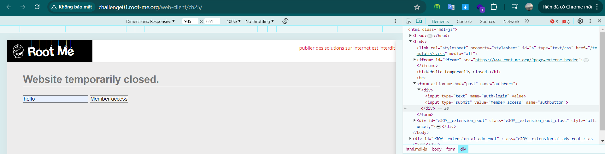
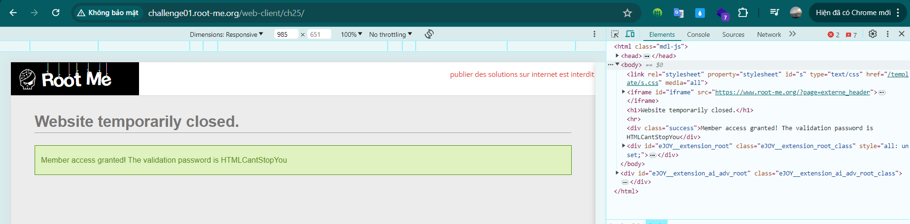

Challenge: http://challenge01.root-me.org/web-client/ch25/

Truy cập vào challenge ta thấy có 1 input nhưng không nhập được. 
 

Bật dev tool và chỉ vào ô input ta thấy ô input và submit đang bị `disable`:

Xóa thuộc tính này ta có thể nhâp vào input và submit: 

Sau khi submit ta đã có được flag: 

Note: Việc xóa thông tin hay các parameter không còn sử dụng nên được xử lí phía back-end, nếu để lộ ở phía front-end thì người dùng có thể tìm ra và có những cách để tương tác với nó, và nếu back-end vẫn có logic xử lí những thông tin này thì sẽ dẫn đến những kịch bản không mong muốn.