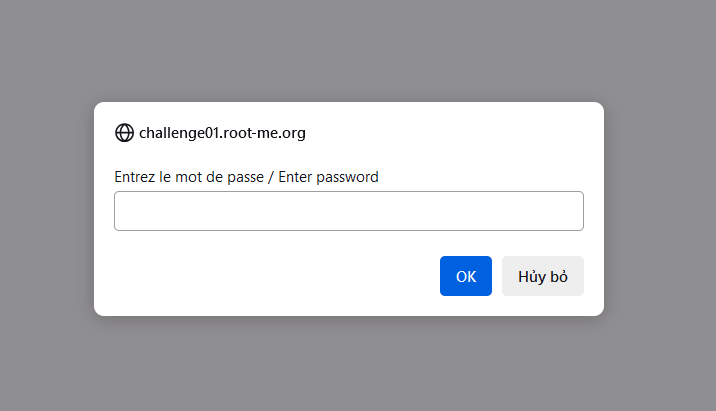
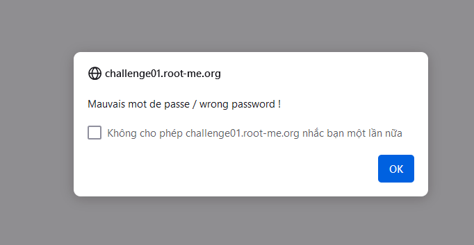
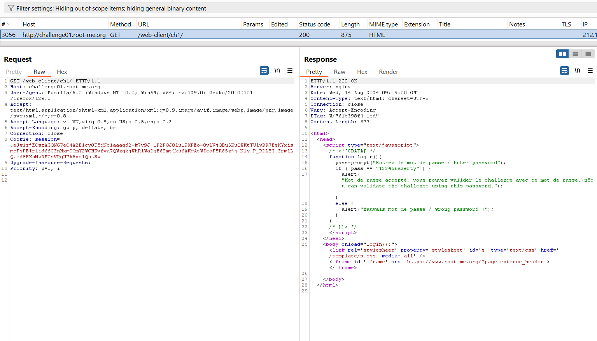
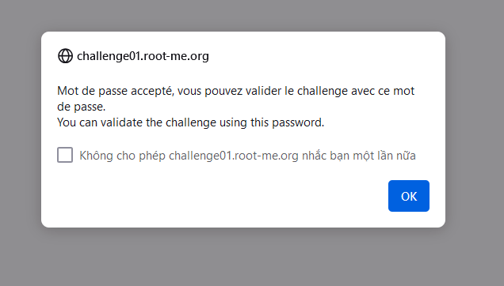

Challenge: http://challenge01.root-me.org/web-client/ch1/

Khi bắt đầu vào trang web đã hiện ra 1 pop-up yêu cầu đăng nhập: 

Đăng nhập thử với pass bất kì: `admin` nó trả về :

Ở Burp Suite ta bắt được gói tin: 

Trong này có function login và ta có được đoạn string để so sánh với pass, ta sẽ thử đăng nhập lại: 

Note: Không xử lí các logic quan trọng ở phía client