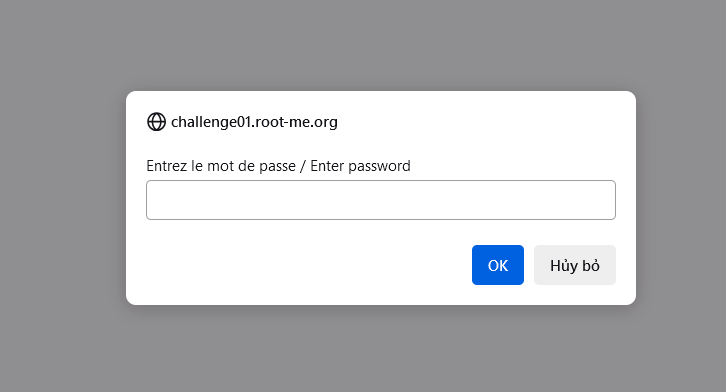
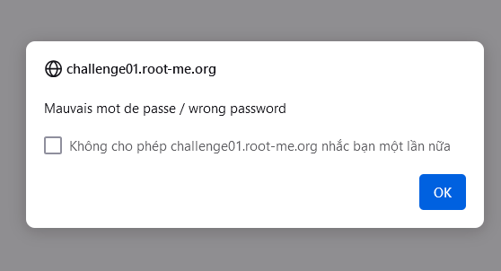
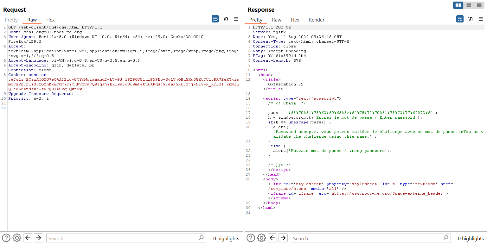
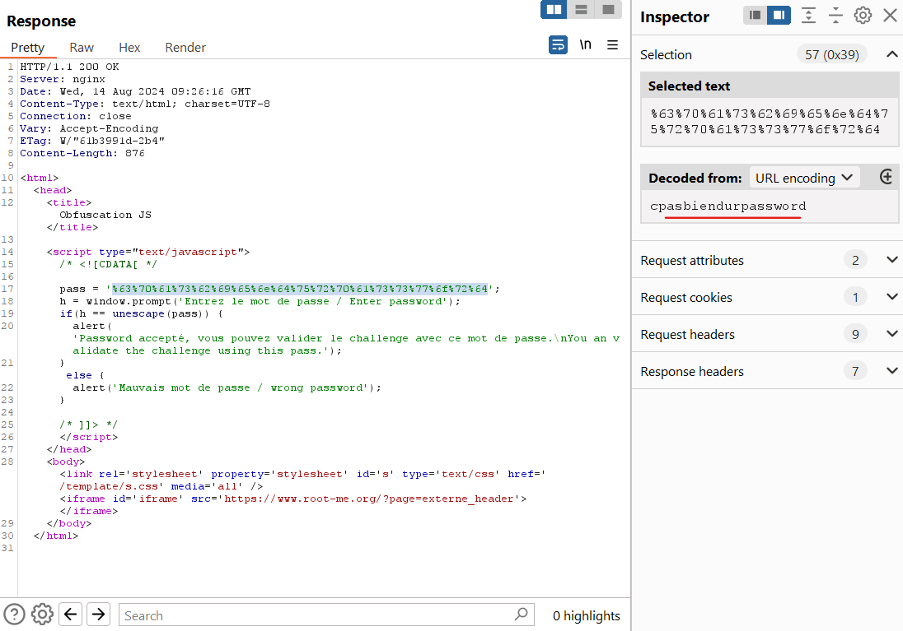
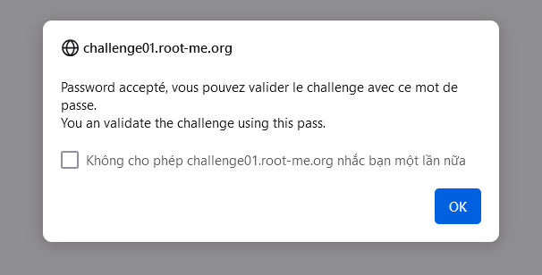

Challenge: http://challenge01.root-me.org/web-client/ch4/ch4.html

Sau khi vào trang web thì hiển thị 1 bảng bắt đăng nhập: 

Và nếu ấn Hủy hay nhập sai mật khẩu thì sẽ hiện: 

Kiểm tra Burp Suite ta thấy: 

Ở đây password đã bị URL encode, ta chỉ cần decode nó ra: 

Thử đăng nhập lại: 

