Challenge: http://challenge01.root-me.org:58057/

Đầu tiên khi vào trang web ta thấy có 3 trang hiển thị: Home, Renderer, Report
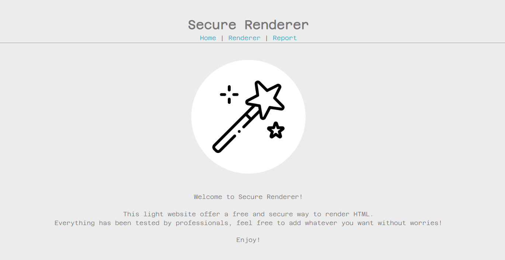

Ở page Renderer ta có thể thực thi đoạn HTML:
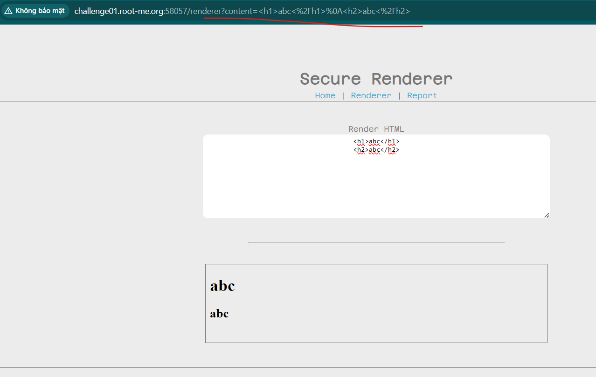

Sau đó có thể Report bug ở page Report.

Tiếp theo ta sẽ xem code xử lí phần Renderer: 

[main.js](main.js)


Để ý phần xử lí `input`, `input` sẽ được đưa vào thư viện DOMPurify để xử lí và xuất ra: 
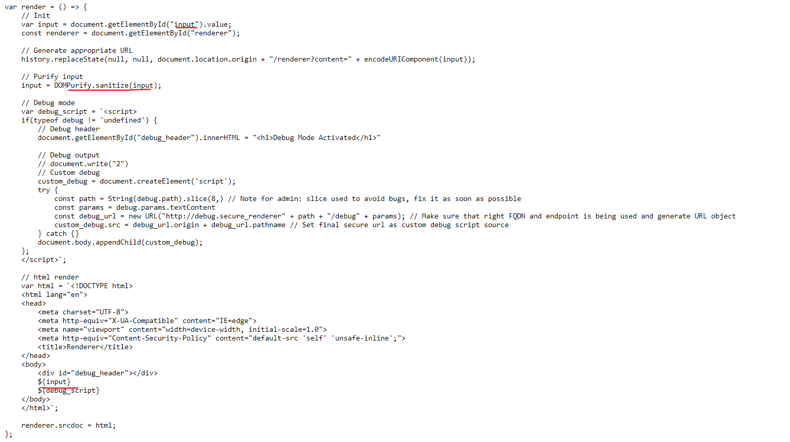

Nếu `input` có js thì nó sẽ bị filter ngay: 
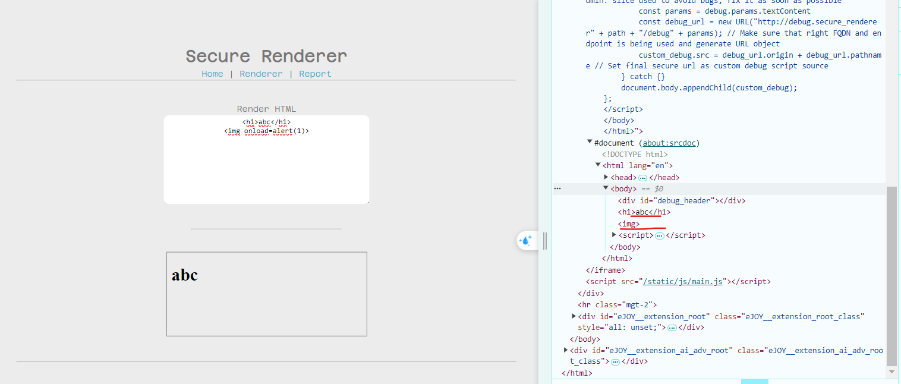

Quay lại với DOM clobbering, mục đích của lỗi này là ghi đè những biến toàn cục của JS bằng DOM, ở đây để ý cạnh `input` luôn có 1 biến `debug`, ta sẽ inject vào biến này bằng DOM có `id=debug` mục đích là để ghi đè biến này: 
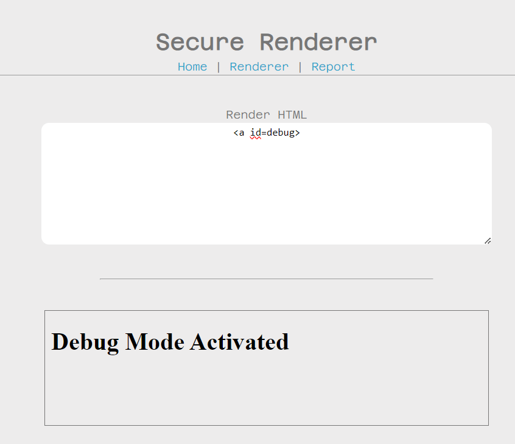

Ở đây nó đã thực hiện đoạn code xử lí: 
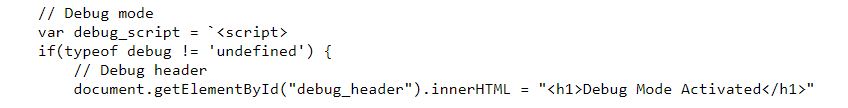

Tiếp theo là đoạn code:
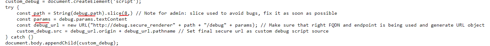

Ta sẽ cần ghi đè cả `path ` và `params` để từ đó sửa được `debug_url`:
```const debug_url = new URL("http://debug.secure_renderer" + path + "/debug" + params);```

và đây cũng chính là `src` của `<script>`:
```
custom_debug.src = debug_url.origin + debug_url.pathname
...
document.body.appendChild(custom_debug);
```

Đầu tiên là phần host, host của `debug_url` đang là: `http://debug.secure_renderer` nhưng ta có thể thay đổi bằng `@`:
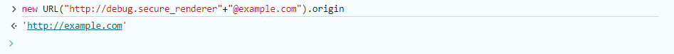

Thứ 2 là path thì nó sẽ cắt đi 8 kí tự đầu: `const path = String(debug.path).slice(8,)`

Thứ 3 là trang html có CSP và chỉ cho `self` và `unsafe-inline`: 
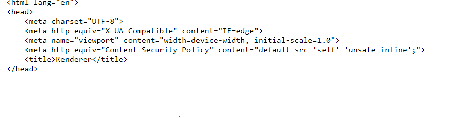

Nên ta cần tìm path để thêm Javascript mà có thể inject vào:
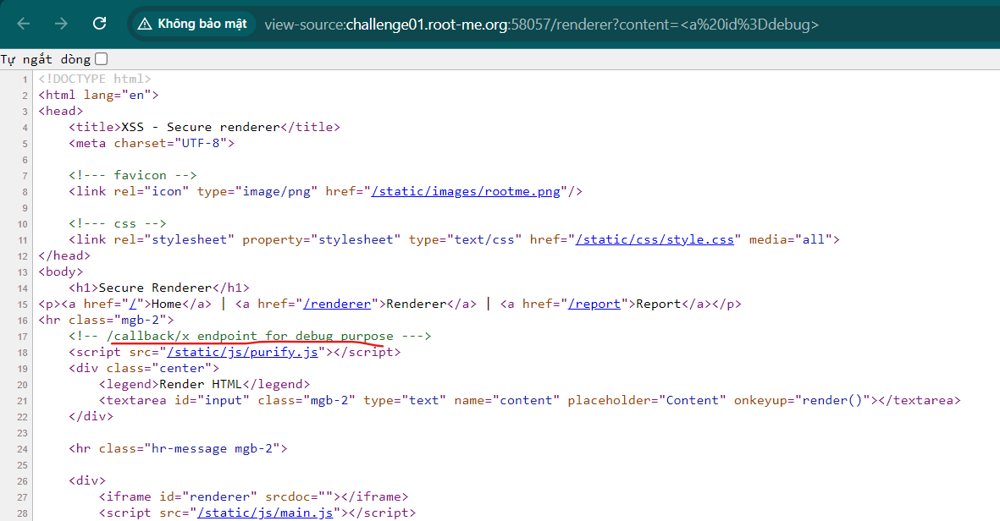

Thì ta có `/callback/x` để render debug thì ta thấy ở đây có thể thêm code tùy ý và có thể vượt qua CSP: 
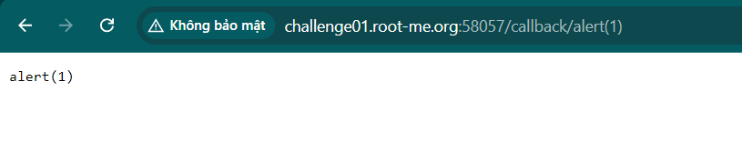

Vậy ở đây ta thấy biến `params` không đóng vai trò trong url ta cần sửa nhưng vì test thì thấy nếu ko có `params` thì đoạn code lấy url sẽ ko chạy nên vẫn cần thêm vào để code chạy ổn định: 
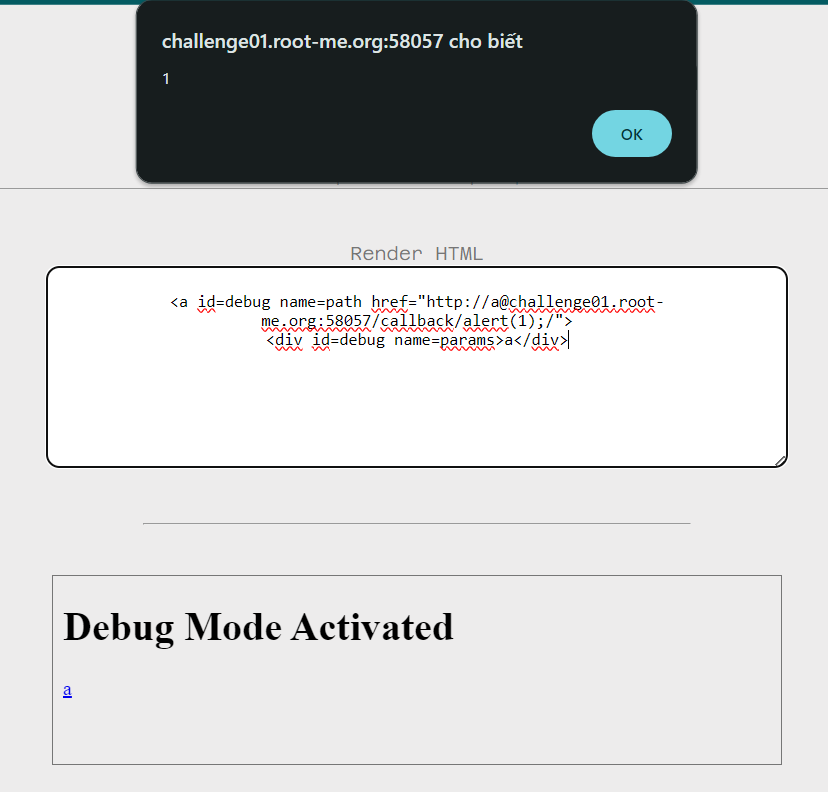

Ở đây đoạn href: `http://a@challenge01.root-me.org:58057/callback/alert(1);/` sẽ bị cắt 8 kí tự đầu và chỉ lấy `@challenge01.root-me.org:58057/callback/alert(1);/` nên ta sẽ xóa được phần `debug_url` có sẵn.
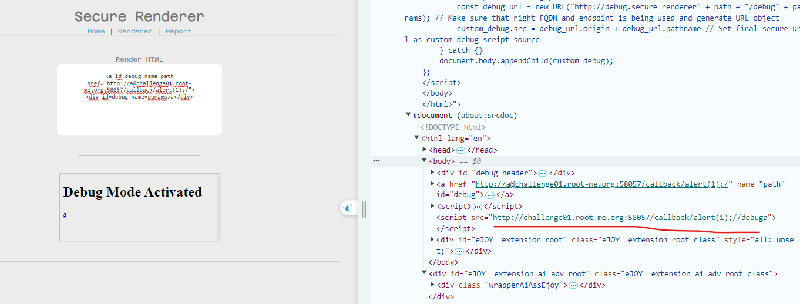

Cuối cùng là gửi gói tin ra và lấy cookie: 
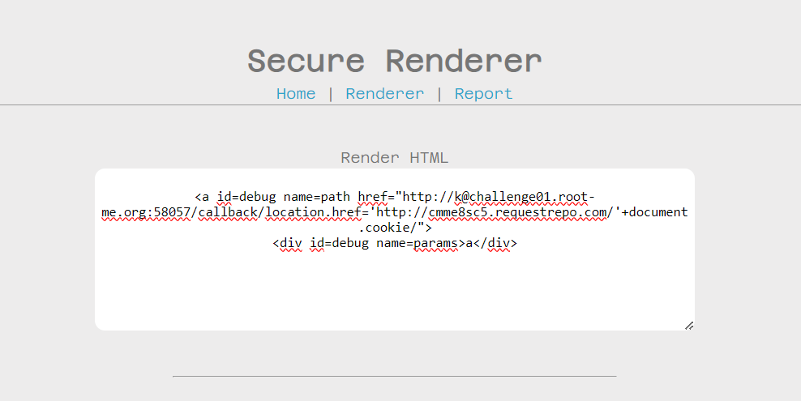

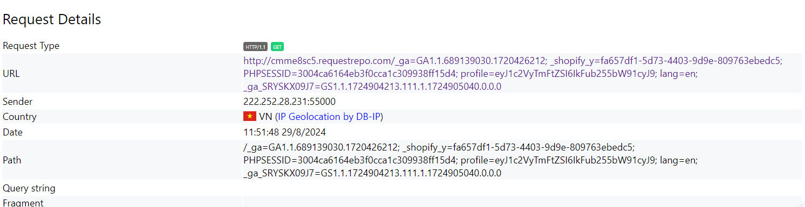

Copy URL và report cho admin và chờ nhận flag:
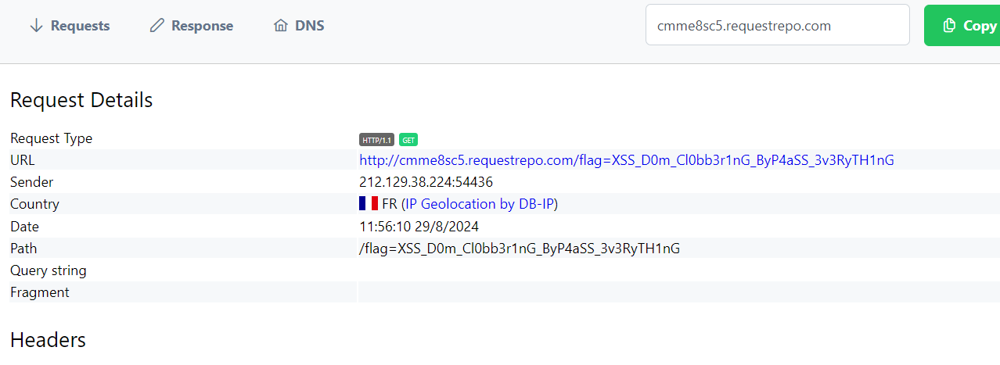


