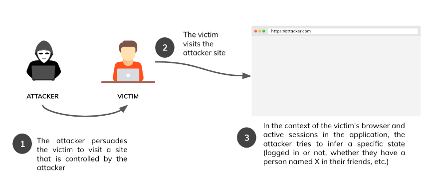
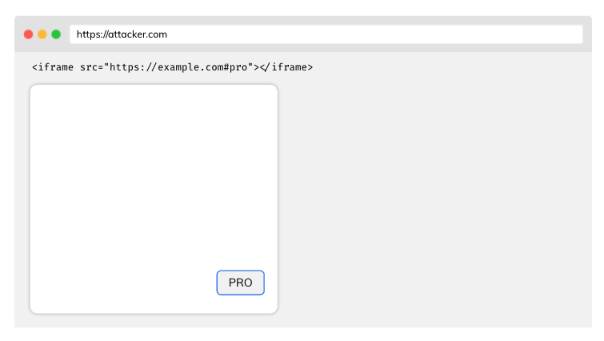

https://cheatsheetseries.owasp.org/cheatsheets/XS_Leaks_Cheat_Sheet.html

# Cross-site leaks Cheat Sheet
## Introduction
Bài viết này mô tả các ví dụ về các cuộc tấn công và phòng thủ chống lại lỗ hổng rò rỉ giữa các trang (XS Leaks). Vì lỗ hổng này dựa trên cơ chế cốt lõi của các trình duyệt web hiện đại nên nó còn được gọi là cuộc tấn công kênh bên của trình duyệt. \
Các cuộc tấn công XS-Leaks tìm cách khai thác thực tế những thông tin dường như không quan trọng được trao đổi trong giao tiếp giữa các trang web. Thông tin này suy ra câu trả lời cho các câu hỏi đã đặt ra trước đó về tài khoản người dùng của nạn nhân. Xin hãy xem các ví dụ được cung cấp dưới đây:
- Người dùng hiện có đăng nhập không?
- ID người dùng có phải là 1337 không?
- Người dùng có phải là quản trị viên không?
- Người dùng có một người có địa chỉ email cụ thể trong danh sách liên hệ của họ không?

Trên cơ sở những câu hỏi như vậy, kẻ tấn công có thể cố gắng suy ra câu trả lời, tùy thuộc vào ngữ cảnh của ứng dụng. Trong hầu hết các trường hợp, câu trả lời sẽ ở dạng nhị phân (yes hoặc no). Tác động của lỗ hổng này phụ thuộc rất nhiều vào  ứng dụng. Mặc dù vậy, XS Leaks có thể là mối đe dọa thực sự đối với quyền riêng tư và tính ẩn danh của người dùng.
## Attack vector

## Same Origin Policy (SOP)
Trước khi mô tả các cuộc tấn công, bạn nên hiểu một trong những cơ chế bảo mật quan trọng nhất trong trình duyệt - The Same-origin Policy. Một vài khía cạnh chính:
- Hai URL được coi là có cùng nguồn gốc nếu giao thức, cổng và máy chủ của chúng giống nhau
- Bất kỳ nguồn gốc nào cũng có thể gửi yêu cầu đến nguồn khác, nhưng do Same-origin Policy nên họ sẽ không thể đọc phản hồi trực tiếp
- Chính sách xuất xứ tương tự có thể được nới lỏng bằng cách chia sẻ tài nguyên nguồn gốc chéo (CORS).

Mặc dù nguyên tắc SOP bảo vệ chúng ta khỏi việc truy cập thông tin trong giao tiếp giữa nhiều nguồn gốc, nhưng các cuộc tấn công XS-Leaks dựa trên dữ liệu dư thừa có thể suy ra một số thông tin.
## SameSite Cookies
Thuộc tính SameSite của cookie cho trình duyệt biết liệu nó có nên đưa cookie vào yêu cầu từ trang web khác hay không. Thuộc tính SameSite nhận các giá trị sau:
- `None`- cookie sẽ được đính kèm với yêu cầu từ một trang web khác, nhưng nó phải được gửi qua kênh HTTPS an toàn
- `Lax` - cookie sẽ được thêm vào yêu cầu từ một trang khác nếu phương thức yêu cầu là GET và yêu cầu được thực hiện đối với điều hướng cấp cao nhất (tức là điều hướng thay đổi địa chỉ trong thanh trên cùng của trình duyệt)
- Strict - cookie sẽ không bao giờ được gửi từ trang web khác

Điều đáng nói ở đây là phản ứng của các trình duyệt dựa trên Chrome trong đó các cookie không có thuộc tính SameSite được đặt theo mặc định sẽ được coi là `Lax`.

### Attacks using the element ID attribute
Các thành phần trong DOM có thể có thuộc tính ID duy nhất trong tài liệu. Ví dụ:\
`<button id="pro">Pro account</button>`\
Trình duyệt sẽ tự động tập trung vào một phần tử có ID nhất định nếu chúng tôi thêm hàm băm vào URL, ví dụ: https://example.com#pro. Hơn nữa, sự kiện tập trung vào JavaScript sẽ được kích hoạt. Kẻ tấn công có thể cố gắng nhúng ứng dụng vào iframe bằng nguồn cụ thể trên trang được kiểm soát của chính nó:
\
sau đó thêm trình nghe vào tài liệu chính cho sự kiện làm mờ (blur event) (ngược lại với focus). Khi nạn nhân truy cập trang web của kẻ tấn công, sự kiện làm mờ sẽ được kích hoạt. Kẻ tấn công sẽ có thể kết luận rằng nạn nhân có tài khoản chuyên nghiệp.

### Attacks based on error events
Việc nhúng từ các tài nguyên từ nguồn khác thường được cho phép. Ví dụ: bạn có thể nhúng hình ảnh từ nguồn khác hoặc thậm chí là tập lệnh trên trang của mình. Điều không được phép là đọc tài nguyên có nguồn gốc chéo do chính sách SOP.\
Khi trình duyệt gửi yêu cầu về tài nguyên, máy chủ sẽ xử lý yêu cầu và quyết định phản hồi, ví dụ: (200 OK hoặc 404 KHÔNG TÌM THẤY). Trình duyệt nhận được phản hồi HTTP và dựa vào đó, sự kiện JavaScript thích hợp sẽ được kích hoạt (onload hoặc onerror).\
Bằng cách này, chúng tôi có thể thử tải tài nguyên và dựa trên trạng thái phản hồi, suy ra liệu chúng có tồn tại hay không trong bối cảnh nạn nhân đăng nhập. Chúng ta hãy xem tình huống sau:
- GET /api/user/1234 - 200 OK - người dùng đăng nhập hiện tại là 1234 vì chúng tôi đã tải tài nguyên thành công (sự kiện onload đã được kích hoạt)
- GET /api/user/1235 - 401 Unauthorized - 1235 không phải là ID của người dùng hiện đang đăng nhập (sự kiện lỗi sẽ được kích hoạt)

Với ví dụ trên, kẻ tấn công có thể sử dụng JavaScript trên nguồn gốc được kiểm soát của mình để đoán ID của nạn nhân bằng cách liệt kê tất cả các giá trị trong một vòng lặp đơn giản.

