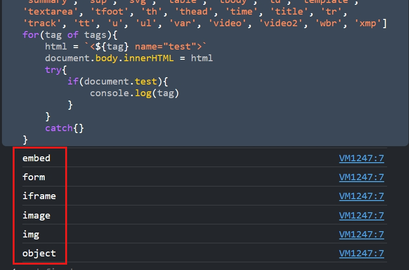
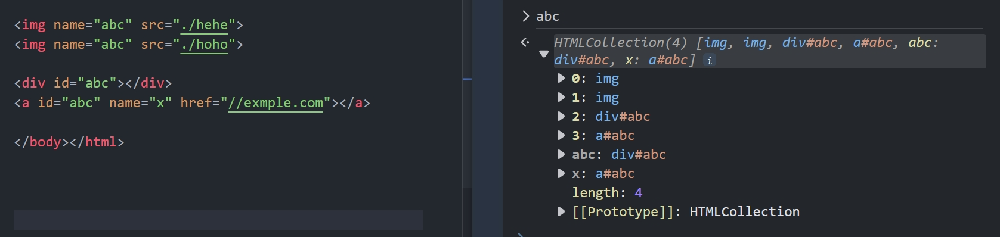

[DOM Clobbering](https://hackmd.io/@chuong/dom-clobbering?utm_source=preview-mode&utm_medium=rec#form-element)

Tìm hiểu về DOM clobbering: 
## DOM Clobbering là gì? 
Là kỹ thuật đặc biệt hữu ích trong trường hợp không thể thực hiện được XSS, nhưng có thể kiểm soát các HTML elements trên trang có thuộc tính `id` hoặc `name` sau khi được filter bằng whitelist.\
Thuật ngữ clobbering (ghi đè) xuất phát từ thực tế là việc "clobbering" một biến global hoặc thuộc tính của một đối tượng và thay vào đó ghi đè lên nó bằng DOM hoặc HTMLCollection.
### object `window` và khả năng truy cập
Khi truy cập name qua window (window[name] hay window.name) sẽ trả về một element hoặc là một collection các elements.\
Một điều đặc biệt là: khi một element được gán attribute `id` thì có thể truy cập được đến element đó qua `window` với `name` là `id`. Với tính chất của object window thì: `id` đó trở thành biến `global` gọi đến element kia.


Còn khi có nhiều element có cùng `id` nó sẽ trở thành `HTMLCollection`:


Khác với `id` chấp nhận tất cả tag thì attribute `name` cũng như vậy `nhưng chỉ đối với một số tags nhất định`. Bằng script đơn giản để xem tag nào có thể dùng ghi được vào window:
```
tags = ['a', 'a2', 'abbr', 'acronym', 'address', 'animate', 'animatemotion', 'animatetransform', 'applet', 'area', 'article', 'aside', 'audio', 'audio2', 'b', 'bdi', 'bdo', 'big', 'blink', 'blockquote', 'body', 'br', 'button', 'canvas', 'caption', 'center', 'cite', 'code', 'col', 'colgroup', 'command', 'content', 'custom tags', 'data', 'datalist', 'dd', 'del', 'details', 'dfn', 'dialog', 'dir', 'div', 'dl', 'dt', 'element', 'em', 'embed', 'fieldset', 'figcaption', 'figure', 'font', 'footer', 'form', 'frame', 'frameset', 'h1', 'head', 'header', 'hgroup', 'hr', 'html', 'i', 'iframe', 'iframe2', 'image', 'image2', 'image3', 'img', 'img2', 'input', 'input2', 'input3', 'input4', 'ins', 'kbd', 'keygen', 'label', 'legend', 'li', 'link', 'listing', 'main', 'map', 'mark', 'marquee', 'menu', 'menuitem', 'meta', 'meter', 'multicol', 'nav', 'nextid', 'nobr', 'noembed', 'noframes', 'noscript', 'object', 'ol', 'optgroup', 'option', 'output', 'p', 'param', 'picture', 'plaintext', 'pre', 'progress', 'q', 'rb', 'rp', 'rt', 'rtc', 'ruby', 's', 'samp', 'script', 'section', 'select', 'set', 'shadow', 'slot', 'small', 'source', 'spacer', 'span', 'strike', 'strong', 'style', 'sub', 'summary', 'sup', 'svg', 'table', 'tbody', 'td', 'template', 'textarea', 'tfoot', 'th', 'thead', 'time', 'title', 'tr', 'track', 'tt', 'u', 'ul', 'var', 'video', 'video2', 'wbr', 'xmp']
for(tag of tags){
    html = `<${tag} name="test">`
    document.body.innerHTML = html
    try{
        if(window.test){
            console.log(tag)
        }
    }
    catch{}
}
```


=> Như vậy các tags: `embed`, `form`, `iframe`, `image`, `img`, `object` có thể dùng được dưới `window` từ attribute `name`
### object `document` và khả năng truy cập
Tương tự với `window`:
- Với attribute `id`:
```
tags = ['a', 'a2', 'abbr', 'acronym', 'address', 'animate', 'animatemotion', 'animatetransform', 'applet', 'area', 'article', 'aside', 'audio', 'audio2', 'b', 'bdi', 'bdo', 'big', 'blink', 'blockquote', 'body', 'br', 'button', 'canvas', 'caption', 'center', 'cite', 'code', 'col', 'colgroup', 'command', 'content', 'custom tags', 'data', 'datalist', 'dd', 'del', 'details', 'dfn', 'dialog', 'dir', 'div', 'dl', 'dt', 'element', 'em', 'embed', 'fieldset', 'figcaption', 'figure', 'font', 'footer', 'form', 'frame', 'frameset', 'h1', 'head', 'header', 'hgroup', 'hr', 'html', 'i', 'iframe', 'iframe2', 'image', 'image2', 'image3', 'img', 'img2', 'input', 'input2', 'input3', 'input4', 'ins', 'kbd', 'keygen', 'label', 'legend', 'li', 'link', 'listing', 'main', 'map', 'mark', 'marquee', 'menu', 'menuitem', 'meta', 'meter', 'multicol', 'nav', 'nextid', 'nobr', 'noembed', 'noframes', 'noscript', 'object', 'ol', 'optgroup', 'option', 'output', 'p', 'param', 'picture', 'plaintext', 'pre', 'progress', 'q', 'rb', 'rp', 'rt', 'rtc', 'ruby', 's', 'samp', 'script', 'section', 'select', 'set', 'shadow', 'slot', 'small', 'source', 'spacer', 'span', 'strike', 'strong', 'style', 'sub', 'summary', 'sup', 'svg', 'table', 'tbody', 'td', 'template', 'textarea', 'tfoot', 'th', 'thead', 'time', 'title', 'tr', 'track', 'tt', 'u', 'ul', 'var', 'video', 'video2', 'wbr', 'xmp']
for(tag of tags){
    html = `<${tag} id="test">`
    document.body.innerHTML = html
    try{
        if(document.test){
            console.log(tag)
        }
    }
    catch{}
}
```
\
Như vậy chỉ có tag `object`.
- Với attribute `name`:
```
tags = ['a', 'a2', 'abbr', 'acronym', 'address', 'animate', 'animatemotion', 'animatetransform', 'applet', 'area', 'article', 'aside', 'audio', 'audio2', 'b', 'bdi', 'bdo', 'big', 'blink', 'blockquote', 'body', 'br', 'button', 'canvas', 'caption', 'center', 'cite', 'code', 'col', 'colgroup', 'command', 'content', 'custom tags', 'data', 'datalist', 'dd', 'del', 'details', 'dfn', 'dialog', 'dir', 'div', 'dl', 'dt', 'element', 'em', 'embed', 'fieldset', 'figcaption', 'figure', 'font', 'footer', 'form', 'frame', 'frameset', 'h1', 'head', 'header', 'hgroup', 'hr', 'html', 'i', 'iframe', 'iframe2', 'image', 'image2', 'image3', 'img', 'img2', 'input', 'input2', 'input3', 'input4', 'ins', 'kbd', 'keygen', 'label', 'legend', 'li', 'link', 'listing', 'main', 'map', 'mark', 'marquee', 'menu', 'menuitem', 'meta', 'meter', 'multicol', 'nav', 'nextid', 'nobr', 'noembed', 'noframes', 'noscript', 'object', 'ol', 'optgroup', 'option', 'output', 'p', 'param', 'picture', 'plaintext', 'pre', 'progress', 'q', 'rb', 'rp', 'rt', 'rtc', 'ruby', 's', 'samp', 'script', 'section', 'select', 'set', 'shadow', 'slot', 'small', 'source', 'spacer', 'span', 'strike', 'strong', 'style', 'sub', 'summary', 'sup', 'svg', 'table', 'tbody', 'td', 'template', 'textarea', 'tfoot', 'th', 'thead', 'time', 'title', 'tr', 'track', 'tt', 'u', 'ul', 'var', 'video', 'video2', 'wbr', 'xmp']
for(tag of tags){
    html = `<${tag} name="test">`
    document.body.innerHTML = html
    try{
        if(document.test){
            console.log(tag)
        }
    }
    catch{}
}
```


Có thể thấy các tags `embed`, `form`, `iframe`, `image`, `img`, `object` có thể ghi được vào `document` với attribute `name`. (Điều này giống với object `window`)

### Tại sao lại vậy?
Khi web được load, browser sẽ tạo DOM Tree để thể hiện cho cấu trúc, nội dung của trang web. Thuật toán `named property visibility` là một cơ chế quy định cách mà các atrribute được gán trong HTML được truy cập và xử lý trong JavaScript. Khi một trang web chứa các elements HTML với atrribute `id` hoặc `name`, browser sẽ tự động ánh xạ các elements này thành các `object` trong JavaScript dựa trên các atrributes đó. Điều này có nghĩa là các phần tử HTML với `id` hoặc `name` sẽ trở thành các properties của object `window` hoặc `document` trong JavaScript.\
**Khi có sự trùng tên giữa biến JavaScript và element HTML, browser sẽ ưu tiên truy cập đến element HTML thay vì biến JavaScript. Điều này dẫn đến việc một biến JavaScript có thể bị clobbering bởi element HTML cùng tên đó, và điều này có thể dẫn đến các cuộc tấn công như XSS thông qua DOM Clobbering.**

### Clobbering trong object và document
Trước tiên ta đề cập tới vấn đề prototype.\
#### Object prototypes
Lấy ví dụ với object sau:
```
const person = {
  name: "chuong",
  greet() {
    console.log('hello');
  },
};
```
object trên có 1 property `name` và 1 method là `greet()`. Tuy nhiên không chỉ vậy, object này còn có nhiều properties khác nữa:

Chúng đến từ đâu?\
Mọi object trong JavaScript đều có một built-in property, được gọi là prototype. Bản thân prototype là một object, vì vậy prototype sẽ có prototype của nó, tạo nên prototype chain. Chain này kết thức khi chạm tới giá trị `null`.
- Để lấy prototype ta sử dụng `Object.getPrototypeOf(obj)` hoặc có thể sử dụng `__proto__.` Ví dụ: `person.__proto__`

Khi cố gắng truy cập vào property của object, nếu không tìm thấy trên chính đối tượng đó thì sẽ chuyển sang prototype của object đó để tìm kiếm.
- Để kiểm tra một property có thuộc object đó không ta sử dụng `obj.hasOwnProperty()`, method này sẽ chỉ kiểm tra trong chính obj hiện tại:

Do ở đây `toString` thuộc prototype của nó:


#### window
Với element HTML chứa attribute `id` và `name` mà ta có thể truy cập từ `window`:
\
Nhưng nó không được clobbering vào object `window` để trở thành `property`:
\
Như vậy không thể clobbering từ `window`:
\
Note: Điều này chỉ đúng trên trên Chromium-based browser.\
(Có thể việc xử lý window trên Chomre khác với browser khác)

#### document

Như vậy là `document` có thể clobbering được.\
Điều này cũng có nghĩa là `document` sẽ dễ bị attack:

### HTMLCollection
HTMLCollection sẽ collect các elements có cùng `id` hoặc `name`, ngoài ra nó cũng collect các elements có cùng `id` lẫn `name`:\
\

### toString()
Đây là method convert từ object sang string nó sẽ tự động thực thi khi obj được dùng dưới dạng string.\
Trong JavaScript, một số hàm có thể làm điều này như: String(), innerHTML, outerHTML, innerText,…

### form element
Đây là một kỹ thuật phổ biến sử dụng element `form` kết hợp với element khác như `input` để clobbering x.y (trong đó x có thể là bất kỳ x, `window.x`, hoặc `document.x`)
Khác với việc clobbering thông thường từ tag khác, form có có mỗi quan hệ parent-child với tag khác, điển hình là `input`.


Để kiểm tra xem có tag nào tương tự `input` ta dùng script:
```
tags = ['a', 'a2', 'abbr', 'acronym', 'address', 'animate', 'animatemotion', 'animatetransform', 'applet', 'area', 'article', 'aside', 'audio', 'audio2', 'b', 'bdi', 'bdo', 'big', 'blink', 'blockquote', 'body', 'br', 'button', 'canvas', 'caption', 'center', 'cite', 'code', 'col', 'colgroup', 'command', 'content', 'custom tags', 'data', 'datalist', 'dd', 'del', 'details', 'dfn', 'dialog', 'dir', 'div', 'dl', 'dt', 'element', 'em', 'embed', 'fieldset', 'figcaption', 'figure', 'font', 'footer', 'form', 'frame', 'frameset', 'h1', 'head', 'header', 'hgroup', 'hr', 'html', 'i', 'iframe', 'iframe2', 'image', 'image2', 'image3', 'img', 'img2', 'input', 'input2', 'input3', 'input4', 'ins', 'kbd', 'keygen', 'label', 'legend', 'li', 'link', 'listing', 'main', 'map', 'mark', 'marquee', 'menu', 'menuitem', 'meta', 'meter', 'multicol', 'nav', 'nextid', 'nobr', 'noembed', 'noframes', 'noscript', 'object', 'ol', 'optgroup', 'option', 'output', 'p', 'param', 'picture', 'plaintext', 'pre', 'progress', 'q', 'rb', 'rp', 'rt', 'rtc', 'ruby', 's', 'samp', 'script', 'section', 'select', 'set', 'shadow', 'slot', 'small', 'source', 'spacer', 'span', 'strike', 'strong', 'style', 'sub', 'summary', 'sup', 'svg', 'table', 'tbody', 'td', 'template', 'textarea', 'tfoot', 'th', 'thead', 'time', 'title', 'tr', 'track', 'tt', 'u', 'ul', 'var', 'video', 'video2', 'wbr', 'xmp']
for(tag of tags){
    html = `<form id=x >
    <${tag} id="y"></form>`
    document.body.innerHTML = html
    try{
        if(x.y){
            console.log(tag)
        }
    }
    catch{}
}

```


Như vậy là các tags: `button`, `fieldset`, `image`, `img`, `input`, `object`, `output`, `select`, `textarea` dùng được. (các tag này dùng `id` hay `name` đều được)


### iframe element
Khác với các tag khác, đối với `iframe`, khi truy cập từ `id` sẽ trả về element, còn khi truy cập từ `name` sẽ trả về `window` chứa `iframe` đó:


`iframe` có attribute `srcdoc` để tạo ra `#document` mới.


Từ đó ta dùng `name` từ `iframe` để lấy ra các element trong `srcdoc` để thực hiện DOM Clobbering (điều này tương tự với object `window` đã nói phía trên).


**Với CSP có `script-src`: `self` sẽ không cho phép thực thi JS bằng protocol `data:` hoặc từ `srcdoc`**

## Clobbering Higher Levels
Kỹ thuật này có thể clobbering lên chuỗi properties: a.b.c.d...

### DOMC Payload Generator
- a.b.c.d:
```
<iframe name="a" srcdoc="<iframe name='b' srcdoc='<a id=c></a><a id=c name=d href=clobbered></a>'></iframe>"></iframe>
```
- a.b.c.d.e:
```
<iframe name=window srcdoc=" <iframe name=a srcdoc=&quot; <iframe name=b srcdoc=&amp;quot; <iframe name=c srcdoc=&amp;amp;quot; <iframe name=d srcdoc=&amp;amp;amp;quot; <a id='e' href='clobbered'></a> &amp;amp;amp;quot;></iframe> &amp;amp;quot;></iframe> &amp;quot;></iframe> &quot;></iframe> "></iframe>
```

## Phòng chống
- HTML Sanitization: sử dụng DOMPurify kèm option `SANITIZE_DOM` hay `SANITIZE_NAMED_PROPS` hoặc Sanitizer API
- CSP
- Sử dụng `Object.freeze()`
- Validate input
- Không sử dụng document, window cho biến global
- Cẩn thận với Document Built-in APIs
- Sử dụng `strict`


