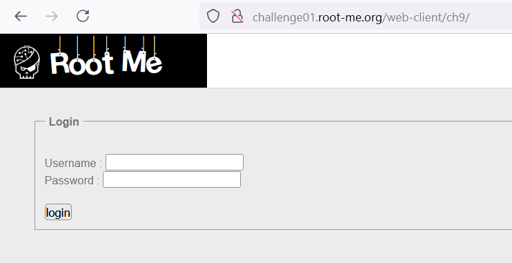
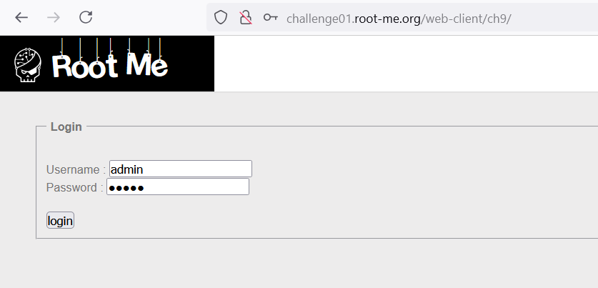
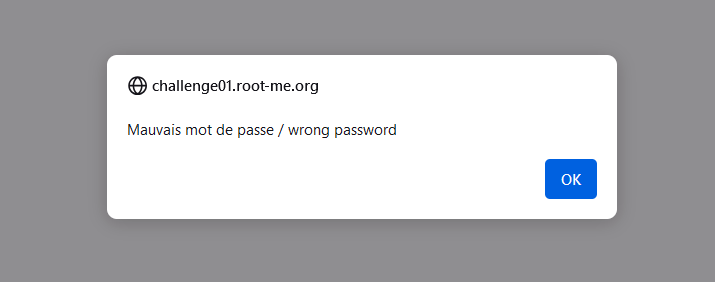
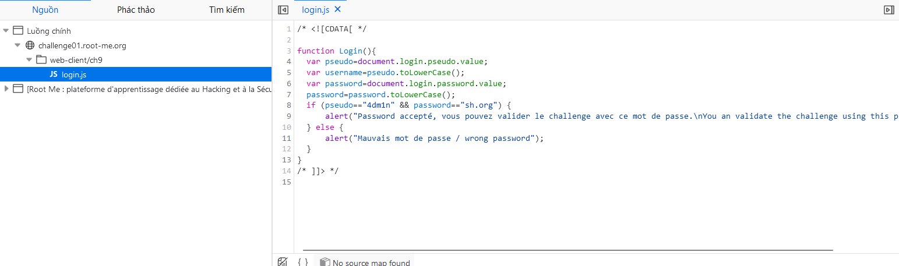

Challenge: http://challenge01.root-me.org/web-client/ch9/

Thử đăng nhập với username và password bất kì `admin:admin`: 

Thông báo sẽ trả về là wrong: 

Kiểm tra source code của web: 

Ta thấy có 1 file `login.js` và bên trong có thông tin xử lí khi đăng nhập: 

Note: không để các file xử lý logic quan trọng trả về phía client
