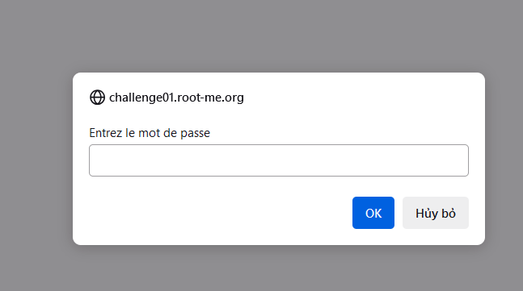
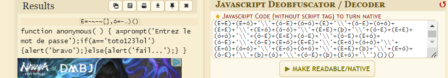
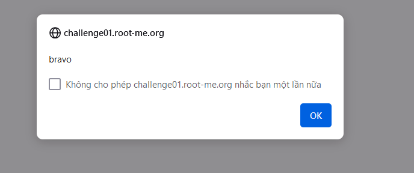

Challenge: http://challenge01.root-me.org/web-client/ch16/ch16.html

Tiếp tục là bảng yêu cầu điền password:

Giống như những bài trước thì lần này cũng trả về 1 đoạn mã JS, ta đoán là để xử lí đăng nhập nhưng đã bị làm rối đi hoặc mã hóa: 

Với tên đề bài là Native code ta đoán nó đang có 1 kiểu thống nhất thay đổi các kí tự, tìm 1 trang có thể decode đoạn này thì ta được kết quả: 

Ta thấy đoạn thông báo ban đầu và `alert('fail...')` đúng với khi ta nhập sai mật khẩu nên có thể đoán nó đã decode đúng.

Vậy ở đây pass là `toto123lol`

