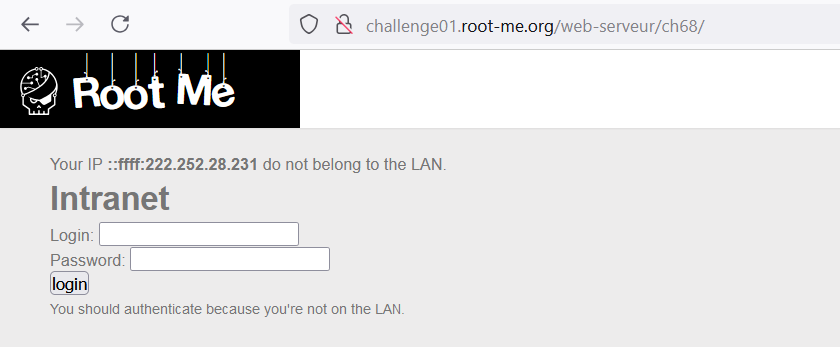
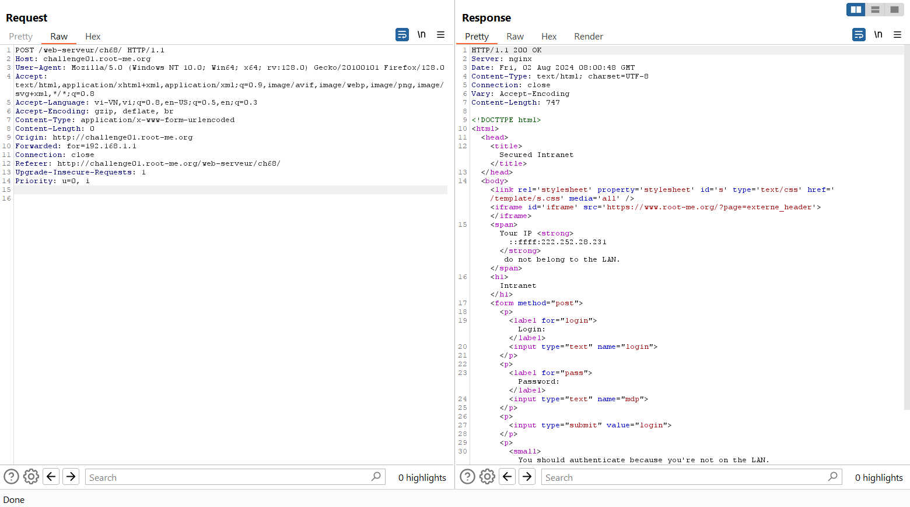
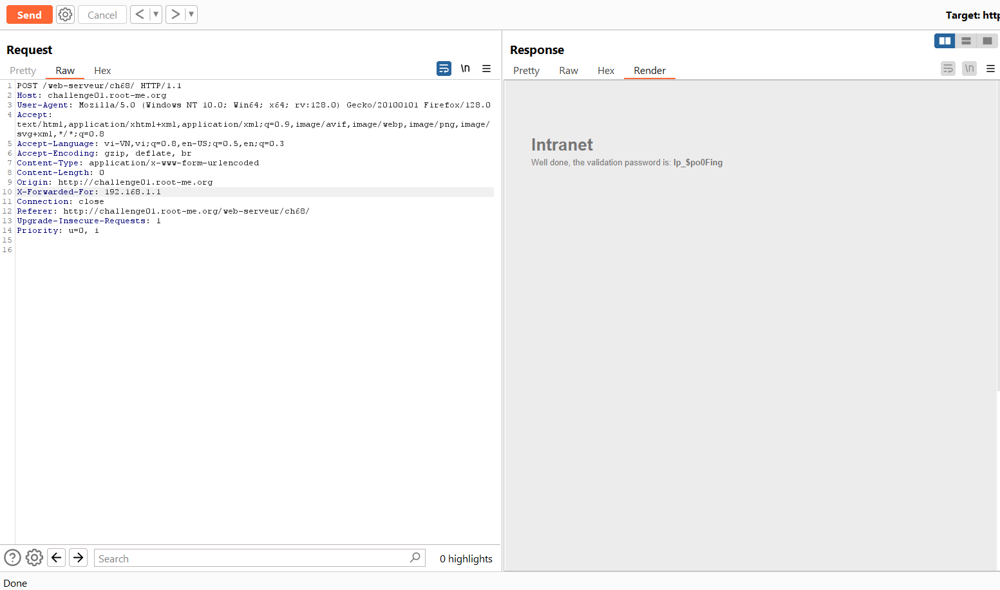

Challenge: http://challenge01.root-me.org/web-serveur/ch68/


Ở phần giới thiệu, nó chỉ ra là không cần đăng nhập khi kết nối mạng nội bộ. Ở đây, trang web chỉ ra IP của mình và ```do not belong to the LAN```

Vậy mục tiêu có thể dùng địa chỉ IP để check xem kết nối có phải cùng IP với LAN hay không.

Để xác định địa chỉ IP của client gốc, có thể sử dụng header: 
- [Forwarded]()
- [X-Forwarded-For]()

### Đối với Forwarded cú pháp: 
```Forwarded: by=<identifier>; for=<identifier>; host=<host>; proto=<http|https>```
- by: Địa chỉ của proxy hoặc load balancer.
- for: Địa chỉ IP của client gốc.
- host: Tên host của server đích.
- proto: Giao thức được sử dụng (http hoặc https). 


### Đối với X-forwarded-for cú pháp: 
```X-Forwarded-For: <client>, <proxy1>, <proxy2>```
- client: Địa chỉ IP của client gốc.
- proxy1, proxy2, ...: Địa chỉ IP của các proxy trung gian.


Ở đây ta thấy dùng X-forwarded-for thì trả về password còn dùng Forwarded thì không trả về, lí do tìm hiểu thì có thể do X-forwarded-for được dùng cho các server cũ hơn, còn Forwarded là loại chuẩn hóa mới và được dùng ở các server mới hơn. 

Note: Không nên xác thực người dùng bằng các thông tin có thể dễ dàng sửa đổi bằng HTTP header.

Cách sửa: 
- Cấu hình máy chủ: 

Nginx:
```
server {
    listen 80;
    server_name example.com;

    location / {
        allow 192.168.0.0/16;
        allow 10.0.0.0/8;
        allow 172.16.0.0/12;
        deny all;
    }
}
```
Apache:
```
<Directory "/var/www/html">
    Require ip 192.168.0.0/16
    Require ip 10.0.0.0/8
    Require ip 172.16.0.0/12
</Directory>

```

- Kiểm tra địa chỉ IP từ biến remote-addr:
Ví dụ với PHP:
```
function getRealIpAddress() {
    if (!empty($_SERVER['REMOTE_ADDR'])) {
        $ipAddress = $_SERVER['REMOTE_ADDR'];
    } else {
        $ipAddress = 'UNKNOWN';
    }
    return $ipAddress;
}

$userIp = getRealIpAddress();

```
Bằng cách này thì thông tin IP sẽ được lấy từ gói tin TCP giúp cho thông tin chính xác hơn. 

