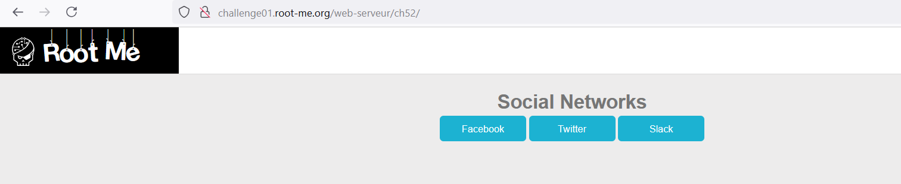
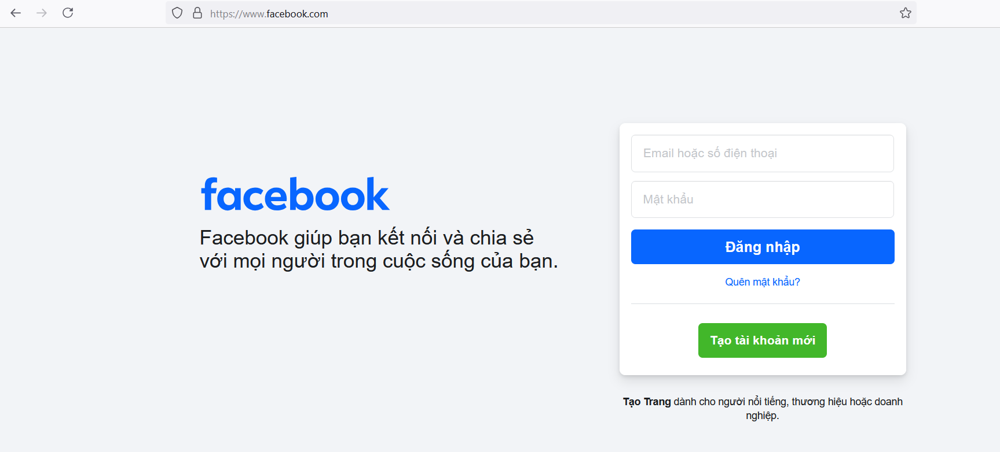
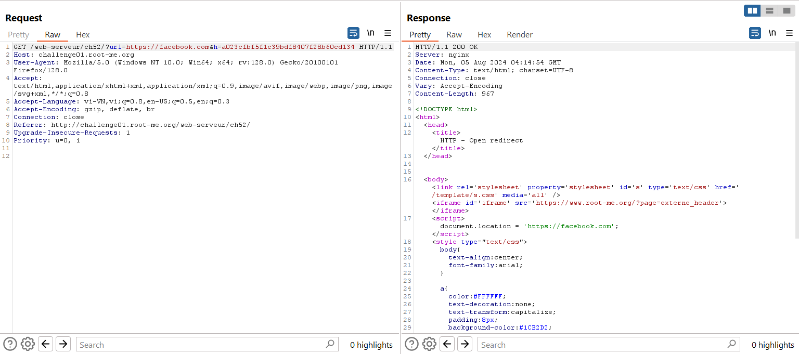
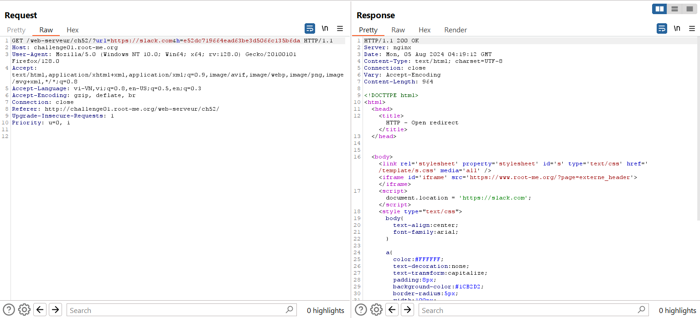
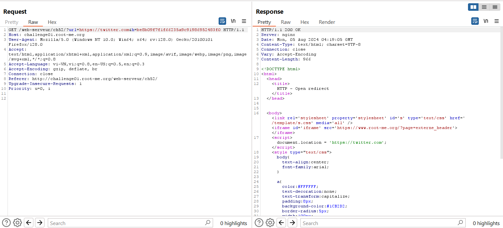
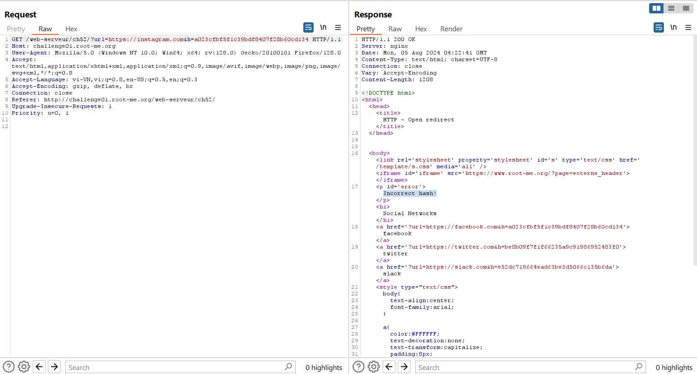
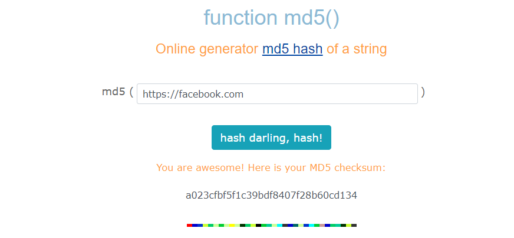
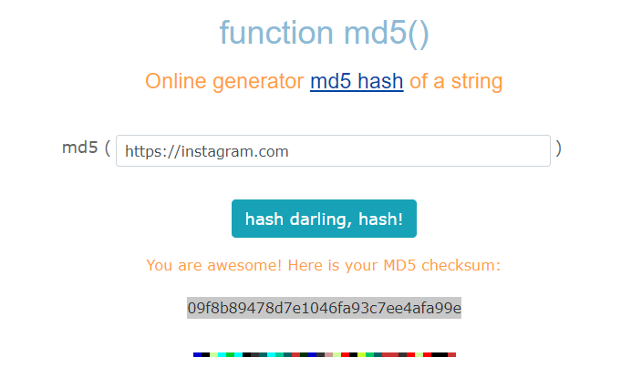
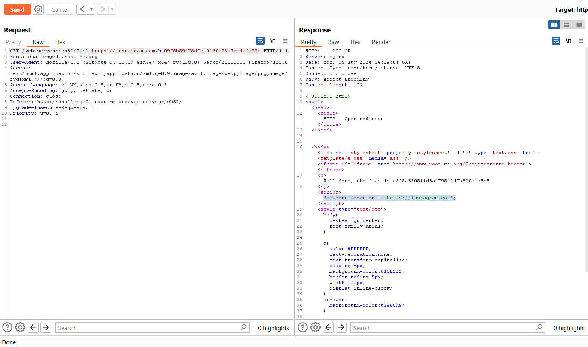

Challenge: http://challenge01.root-me.org/web-serveur/ch52/

Yêu cầu rõ ràng: Tìm cách chuyển hướng đến một tên miền khác với tên miền được hiển thị trên trang web.

Bắt đầu truy cập vào web: 

Khi nhấn vào các button thì nó chuyển hướng ta đến những trang web tương ứng: 

Đưa vào Burp Suite để bắt gói tin: 

Ở đây ta thấy có script: `document.location = 'https://facebook.com';` sẽ giúp ta chuyển hướng đến trang facebook.com và tương tự cho các trang trên button. 

Có 2 parameter khi request gồm ***url*** và ***h*** và ta thấy khi ***url*** thay đổi thì ***h*** cũng thay đổi theo. Khi mà ta chỉ thay đổi ***url*** không thay đổi ***h*** thì server trả về *Incorrect Hash*

Vậy ta biết được đây là những hash riêng cho từng url. Thử đoán đây là hash của url cần redirect, thử với MD5: 
 

Ta thấy nó trùng với ***h*** khi request với ***url=https://facebook.com*** vậy bây giờ thử hash MD5 của `https://instagram.com`:
 
Và thay vào request: 

Nó đã có thể redirect thành công và nhận được flag. 

Vậy ở đây, lỗi ở phần logic khi mà check hash trùng mới md5(url) thì sẽ được phép redirect, nếu chỉ cho phép redirect 1 số trang thì ở đây chỉ nên dùng 1 white list để tránh bị redirect những trang khác. 
