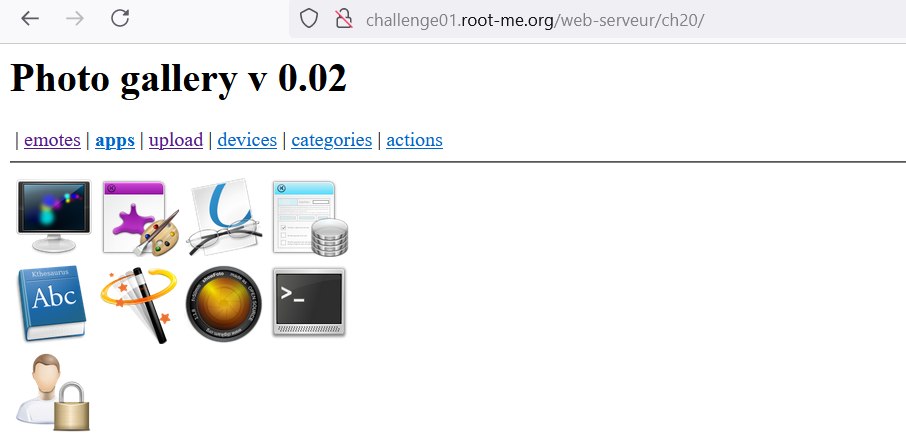
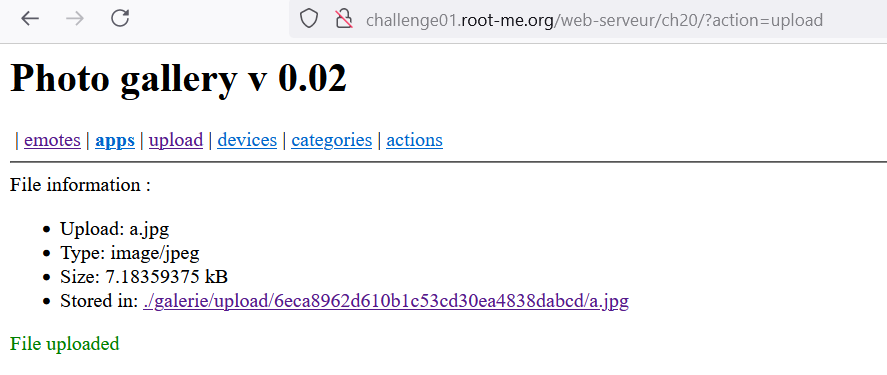
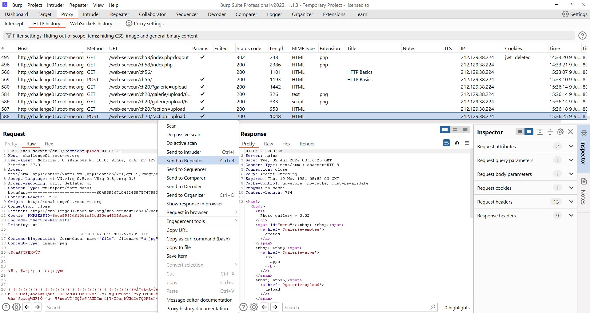
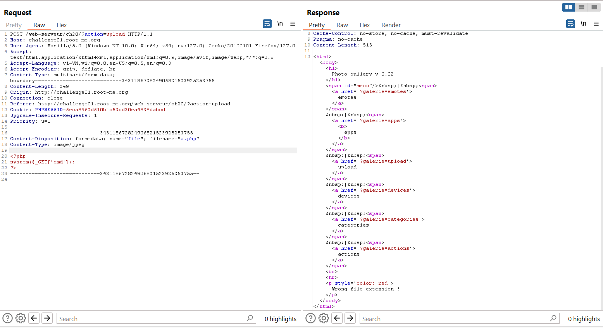
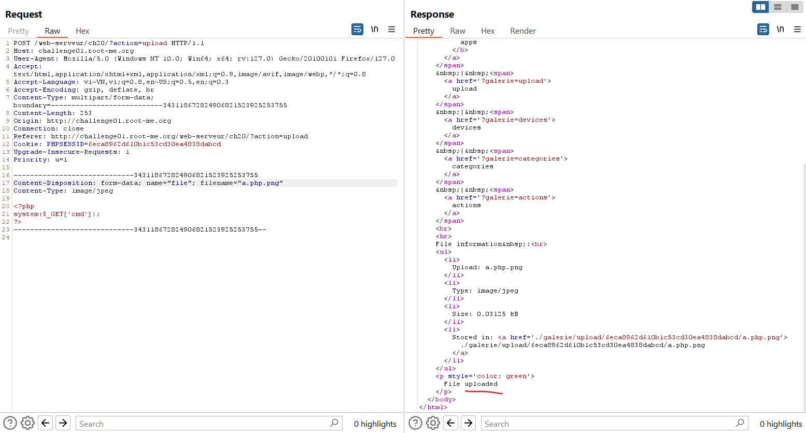
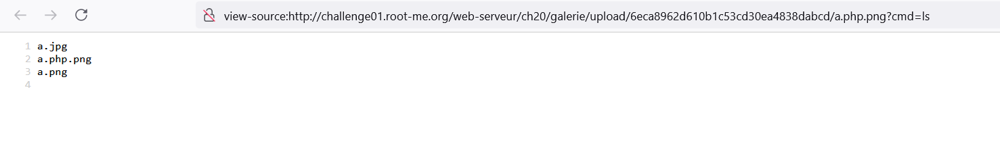
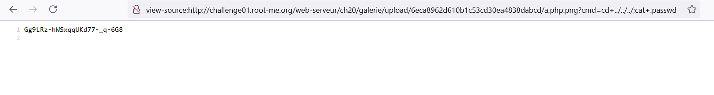

# FILE UPLOAD - DOUBLE EXTENSIONS

Challenge: http://challenge01.root-me.org/web-serveur/ch20/

Tìm hiểu về [File-Upload](file-upload.md)

Chọn vào phần Upload và upload thử 1 file hợp lệ lên (image)

Bây giờ nhiệm vụ như bài ra là ta cần upload file PHP và chạy nó để đọc được flag. Vào BurpSuite và xem phần vừa upload và gửi nó sang Repeater:

Sửa phần nội dung file thành code PHP và tên file thành a.php ta nhận được phản hồi là Wrong file extension! Từ đây ta biết được là server đang dùng extension để đánh giá 1 file.

Ta sửa lại để extension hợp lệ thì sẽ upload thành công:

Ở đây code php là 1 shell đơn giản lệnh xử lí qua biến cmd:

Đưa đường dẫn về root bằng Path traversal và đọc file .passwd:

Note: Ở đây server chỉ đánh giá 1 file dựa trên extension cuối cùng, nên chỉ cần thêm 1 extension cuối cùng hợp lệ là có thể đánh lừa máy chủ và server vẫn cho phép PHP engine thực thi file nên có thể chạy file PHP.

Cách khắc phục: tắt PHP engine và đánh giá tất cả các extension bằng 1 white list: jpeg, png, gif,... ngoài các extension này ra thì không hợp lệ. 

(Vì jpeg vẫn có thể chèn code PHP vào phần comment ảnh nên vẫn nên tắt PHP engine ở folder đó)