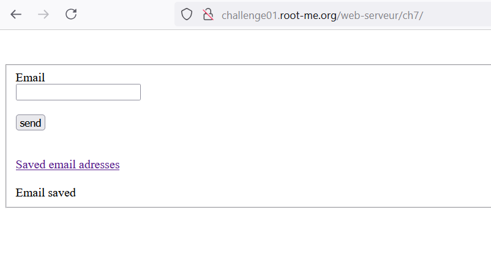
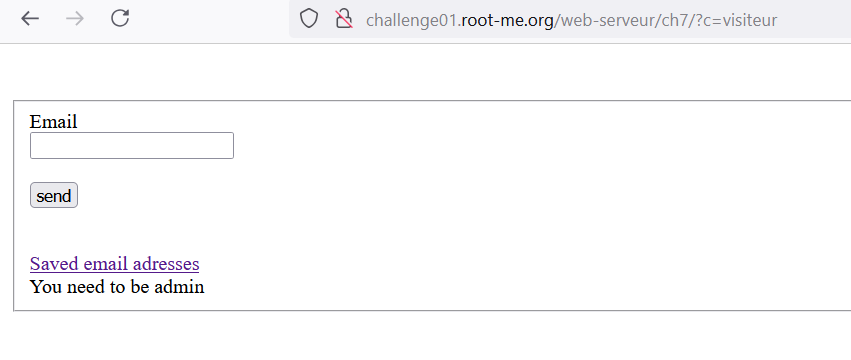
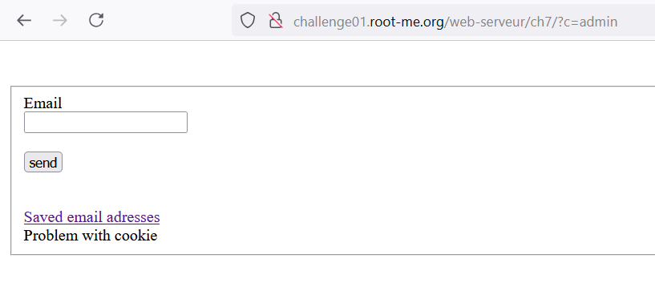
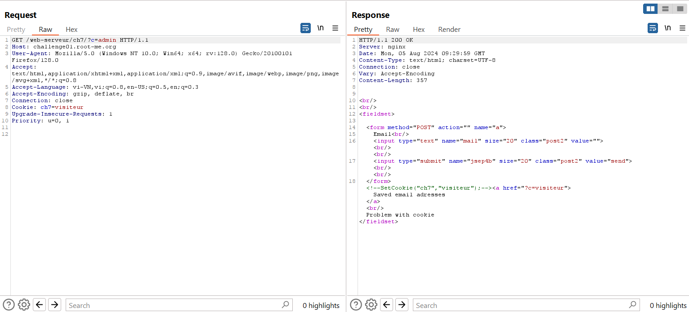
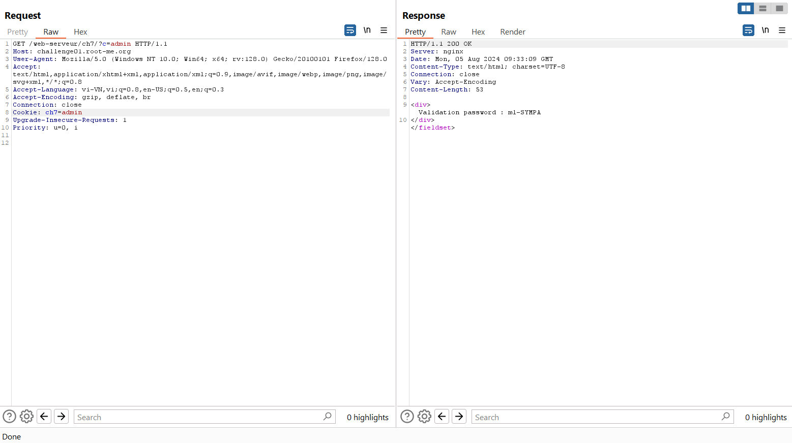

Challenge: http://challenge01.root-me.org/web-serveur/ch7/

Đầu tiên vào trang web và gửi 1 email hợp lệ:

Thử vào `Saved email adreddes` thì nó yêu cầu quyền admin:

Ở đây chú ý ta thấy parameter `c=visiteur` khi truy cập, có thể là web xác thực bằng cách này, thử đổi thành `admin`:

Hiện ra thông báo: `Problem with cookie`

Vào Burp Suite kiểm tra: 

Ta thấy cookie ở đây đang được đặt `Cookie: ch7=visiteur` nên dù thay đổi URL thì nó vẫn nhận đây là visiteur, thay đổi giá trị cookie và request lại: 

Note: không nên xác thực người dùng bằng cookie đơn giản hoặc mã hóa đơn giản dễ đoán. 

