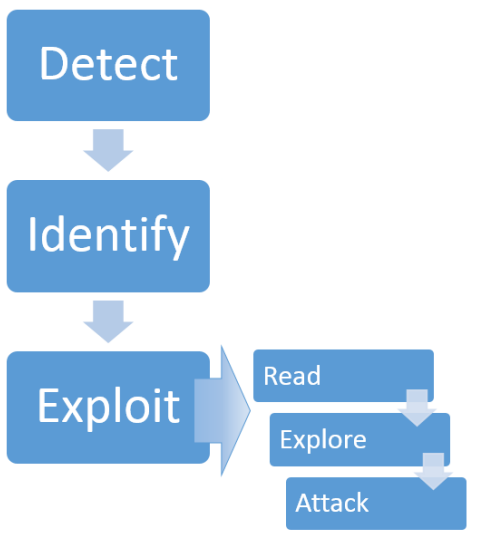
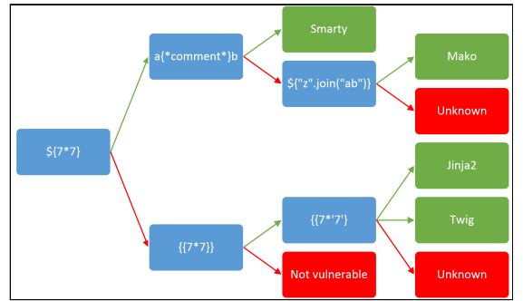

# Server-Side Template Injection:RCE

## TÓM TẮT
Template engine được sử dụng rộng rãi để trình bày dynamic data qua các trang web và email. Việc nhúng input của người dùng vào template một cách không an toàn sẽ dẫn đến lỗ hổng SSTI. SSTI dễ nhầm lẫn với Cross-Site Scripting (XSS) hoặc bỏ sót. Không giống như XSS, SSTI có thể được sử dụng để tấn công trực tiếp vào bên trong máy chủ web và thường dẫn đến RCE.

## Introduction
Các ứng dụng web thường xuyên sử dụng Template engine như `Twig` và `FreeMarker` để nhúng nội dung vào các trang web và email. Ví dụ một ứng dụng tiếp thị gửi email hàng loạt và sử dụng Twig để chào đón người nhận theo tên. Nếu tên chỉ được chuyển vào template, như trong ví dụ sau, thì mọi thứ đều hoạt động tốt:\
`$output = $twig->render("Dear {first_name},", array("first_name" => $user.first_name) );`

Tuy nhiên, nếu người dùng được phép tùy chỉnh những email này thì sẽ phát sinh vấn đề: \
`$output = $twig->render($_GET['custom_email'], array("first_name" => $user.first_name) );`

Trong ví dụ này, người dùng tự kiểm soát nội dung thông qua `GET['custom_email']`. Kết quả từ hai tin nhắn chào mừng sau đây gợi ý về một lỗ hổng phía máy chủ:
```
custom_email={{7*7}}
49
```
```
custom_email={{self}}
Object of class
__TwigTemplate_7ae62e582f8a35e5ea6cc639800ecf15b96c0d6f78db3538221c1145580ca4a5 could not be
converted to string
```

## Template injection methodology


### Detect
Lỗ hổng này có thể xuất hiện trong 2 bối cảnh riêng biệt, mỗi bối cảnh yêu cầu phương pháp phát hiện riêng:
1. Plain text
Hầu hết các template đều hỗ trợ plain text nơi có thể nhúng trực tiếp vào HTML. Nó thường sẽ xuất hiện theo một trong những cách sau:
```
smarty=Hello {user.name}
Hello user1
```
```
freemarker=Hello ${username}
Hello newuser
```
```
any=<b>Hello</b>
<b>Hello<b>
```
Điều này thường dẫn đến XSS, do đó, sự hiện diện của XSS có thể được sử dụng làm tín hiệu để thăm dò việc inject template kỹ lưỡng hơn.  Template sử dụng cú pháp được chọn rõ ràng để không xung đột với các ký tự được sử dụng trong HTML thông thường, do đó, việc đánh giá bảo mật hộp đen thủ công rất dễ bỏ sót hoàn toàn việc đưa mẫu vào. Để phát hiện ra nó, chúng ta cần gọi template engine bằng cách nhúng một câu lệnh. Có một số lượng lớn các template nhưng nhiều template trong số đó có chung các đặc điểm cú pháp cơ bản. Chúng ta có thể tận dụng lợi thế này bằng cách gửi các tải trọng chung, không xác định mẫu bằng cách sử dụng các thao tác cơ bản để phát hiện nhiều công cụ tạo mẫu bằng một yêu cầu HTTP duy nhất:
```
smarty=Hello ${7*7}
Hello 49
freemarker=Hello ${7*7}
Hello 49
```
2. Code context 
Input của người dùng cũng có thể được đặt trong code template, thường là tên biến:
```
personal_greeting=username
Hello user01
```
Trường hợp này dễ bị bỏ sót hơn trong quá trình đánh giá vì nó không dẫn đến XSS rõ ràng và gần như không thể phân biệt được với tra cứu hashmap đơn giản. Việc thay đổi giá trị từ tên người dùng thường sẽ dẫn đến kết quả trống hoặc ứng dụng bị lỗi. Nó có thể được phát hiện bằng cách xác minh tham số không có XSS trực tiếp, sau đó thoát ra khỏi câu lệnh mẫu và chèn thẻ HTML vào sau nó:
```
personal_greeting=username<tag>
Hello
personal_greeting=username}}<tag>
Hello user01 <tag>
```
### Identify
Sau khi phát hiện SSTI, bước tiếp theo là xác định template engine được sử dụng. Bước này đôi khi không quan trọng vì template engine có thể nhận dạng trong các thông báo lỗi thu được. Tuy nhiên, kỹ thuật này không thành công khi các thông báo lỗi bị chặn. Thay vào đó, chúng ta có thể tự động hóa việc này trong Burp Suite bằng cách sử dụng cây quyết định về tải trọng dành riêng cho từng ngôn ngữ. Mũi tên xanh và đỏ tương ứng thể hiện phản hồi 'thành công' và 'thất bại'. Trong một số trường hợp, một trọng tải có thể có nhiều phản hồi thành công riêng biệt - ví dụ: thăm dò {{7*'7'}}sẽ cho kết quả là 49 trong Twig, 7777777 trong Jinja2 và cũng không có kết quả nào nếu không sử dụng ngôn ngữ mẫu.

### Exploit
#### Read
Sau khi tìm thấy SSTI và xác định template engine là đọc tài liệu. Không nên đánh giá thấp tầm quan trọng của bước này; một trong những cách khai thác zeroday tiếp theo có nguồn gốc hoàn toàn từ việc nghiên cứu tài liệu chăm chỉ. Các lĩnh vực quan tâm chính là:
- Cú pháp cơ bản
- 'Security Considerations' - rất có thể người phát triển ứng dụng mà bạn đang thử nghiệm đã không đọc nội dung này và nó có thể chứa một số gợi ý hữu ích.
- Danh sách các phương thức, hàm, bộ lọc và biến dựng sẵn
- Danh sách tiện ích mở rộng/plugin - một số có thể được bật theo mặc định.
#### Explore
Giả sử không có cách khai thác nào được nêu ra, bước tiếp theo là khám phá môi trường để tìm hiểu chính xác những gì bạn có quyền truy cập. Bạn có thể mong đợi tìm thấy cả các đối tượng mặc định do công cụ tạo mẫu cung cấp và các đối tượng dành riêng cho ứng dụng được nhà phát triển chuyển vào mẫu. Nhiều hệ thống mẫu hiển thị một đối tượng 'self' hoặc không gian tên chứa mọi thứ trong phạm vi và một cách thành ngữ để liệt kê các thuộc tính và phương thức của đối tượng.

Nếu không có đối tượng tự dựng sẵn, bạn sẽ phải đặt tên biến một cách thô bạo. Tôi đã tạo một danh sách từ cho việc này bằng cách thu thập dữ liệu GitHub để tìm các tên biến GET/POST được sử dụng trong các dự án PHP và phát hành công khai nó thông qua bộ sưu tập danh sách từ của FuzzDB và Burp Intruder.

Các đối tượng do nhà phát triển cung cấp đặc biệt có khả năng chứa thông tin nhạy cảm và có thể khác nhau giữa các mẫu khác nhau trong một ứng dụng, vì vậy, lý tưởng nhất, quy trình này nên được áp dụng cho từng mẫu riêng biệt.

#### Attack
Tại thời điểm này, bạn nên có ý tưởng chắc chắn về bề mặt tấn công có sẵn cho mình và có thể tiến hành các kỹ thuật kiểm tra bảo mật truyền thống, xem xét từng chức năng để tìm các lỗ hổng có thể khai thác được. Điều quan trọng là tiếp cận vấn đề này trong bối cảnh ứng dụng rộng hơn - một số chức năng có thể được sử dụng để khai thác các tính năng dành riêng cho ứng dụng. Các ví dụ tiếp theo sẽ sử dụng tính năng chèn mẫu để kích hoạt việc tạo đối tượng tùy ý, đọc/ghi tệp tùy ý, bao gồm tệp từ xa, tiết lộ thông tin và các lỗ hổng leo thang đặc quyền.

