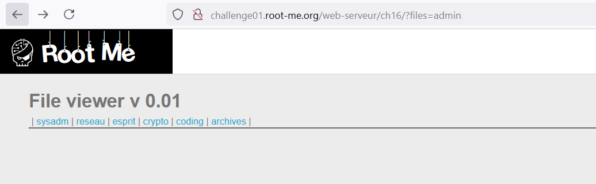
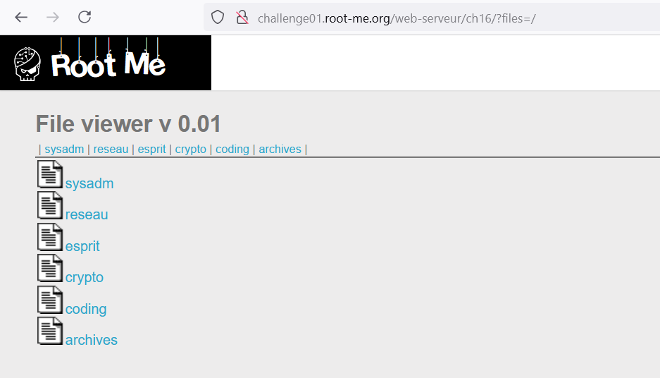
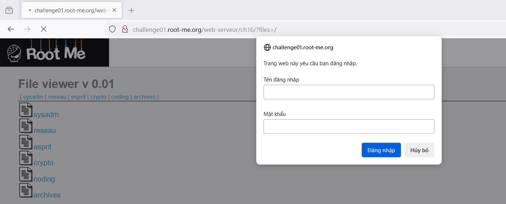
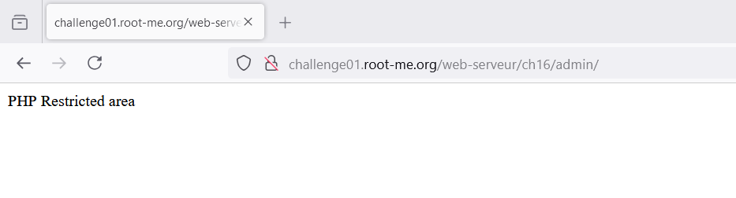
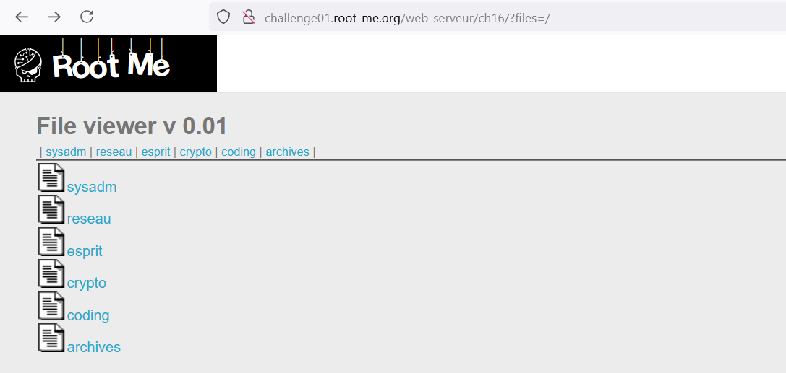
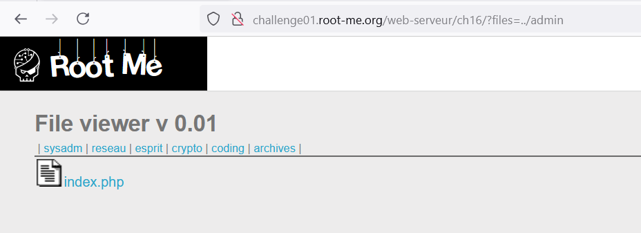
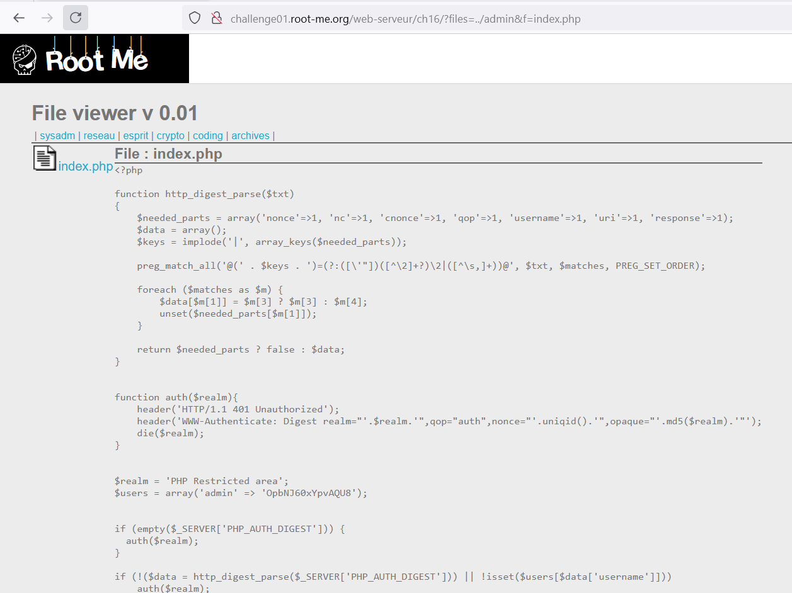
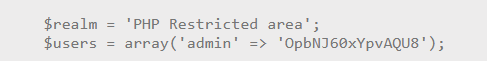

Challenge: http://challenge01.root-me.org/web-serveur/ch16/

Với gợi ý tìm admin section.

Đầu tiên truy cập trang: 

Ta thấy ta có thể truy cập các section bằng parameter `files`

Nhưng ở đây không thấy có sự xuất hiện section `admin`.

Xem thử có section `admin` hay còn section nào khác trong folder hiện tại không:

Vậy là trong folder này không có admin, thử truy cập admin:

Nó sẽ bắt đăng nhập và khi ấn Hủy bỏ, ta có được path đến admin:

Vậy là nó nằm ở `http://challenge01.root-me.org/web-serveur/ch16/admin/`

Vậy thì từ path này, ta cần lùi 1 folder để vào admin:

Ta sẽ thử input: `../admin`

Vậy là ta đã vào được `admin` và xem `index.php`:

[Code](index.php) file `index.php`, code này chỉ xử lí phần đăng nhập, không xử phần hiển thị file.

Đến đây thì ta đã có thể đăng nhâp bằng admin: 

