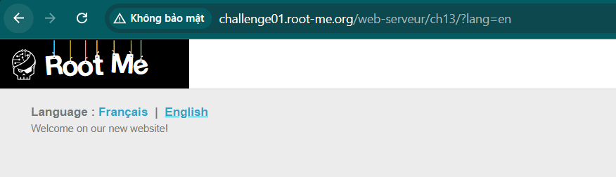
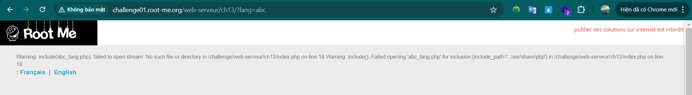
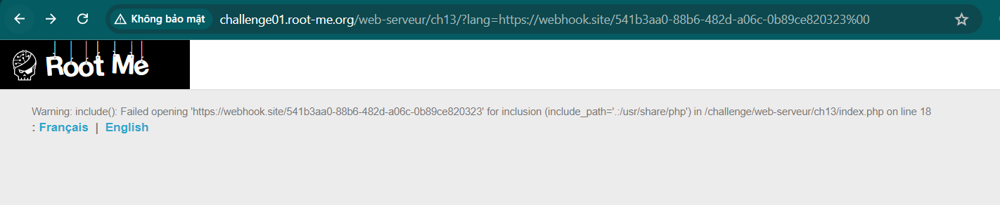
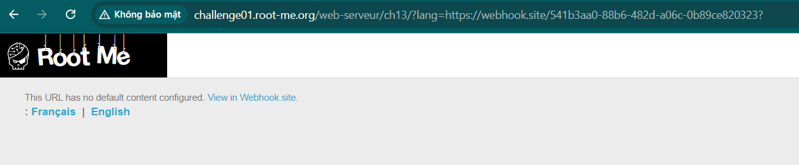
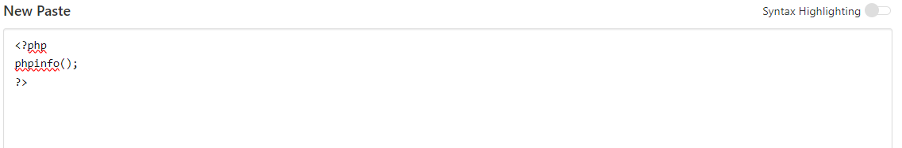
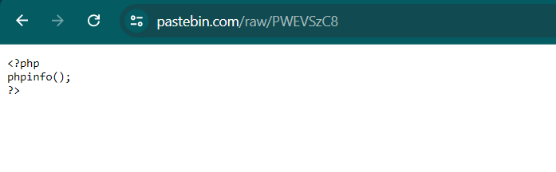
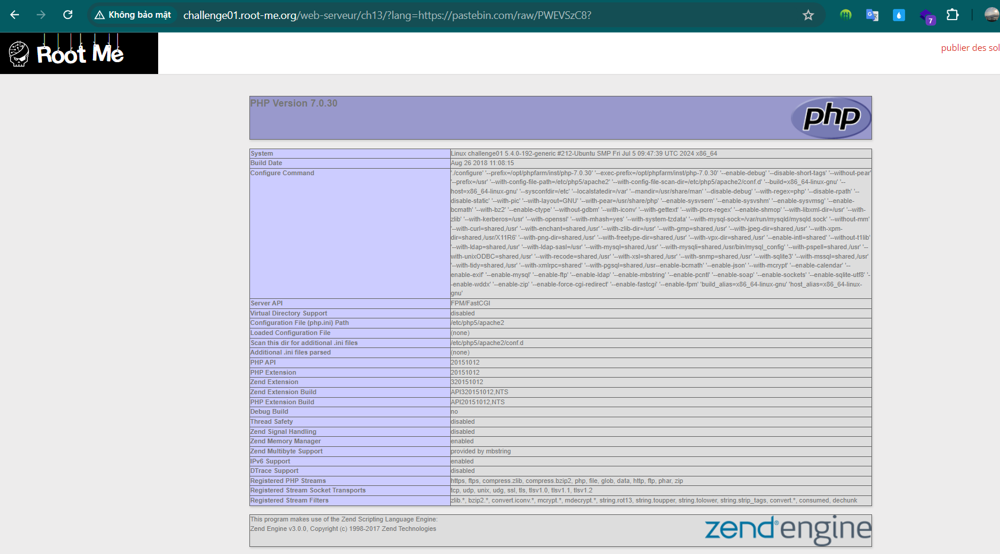
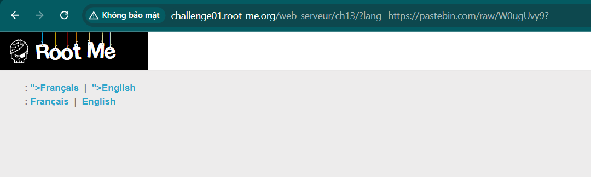
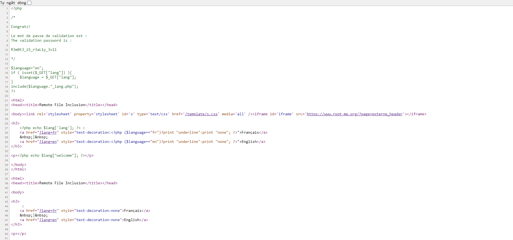

Challenge: http://challenge01.root-me.org/web-serveur/ch13/

Truy cập trang web, ta thấy có 1 chức năng là chuyển đổi ngôn ngữ của trang web bằng parameter `lang`: 


Thử thay giá trị `lang` bằng 1 giá trị khác, nó hiện ra warning là không thể include file `abc_lang.php`: 


Ta biết được ở đây, khi nhập `lang=en` hay `lang=fr` thì nó đã thêm đuôi `_lang.php` để run file `en_lang.php` hay `fr_lang.php` và tập này được tìm kiếm ở .(đường dẫn hiện tại):/usr/share/php (hoặc đường dẫn này) và ở đây ko được set đường dẫn tương đối nên có thể dẫn tới RFI.

Thử với 1 trang web và dùng null byte nhưng vẫn không được


Tìm kiếm cách để thoát khỏi đoạn thêm cuối ta tìm được cách thêm `?` vào cuối để đoạn sau đó đóng vai trò như query của URL:


Bây giờ ta sẽ thử inject code php:




Thành công, bây giờ ta sẽ thêm 1 đoạn PHP để đọc file index.php:
```
<?php
$myfile = fopen("index.php", "r") or die("Unable to open file!");
echo fread($myfile,filesize("index.php"));
fclose($myfile);
?>
```




