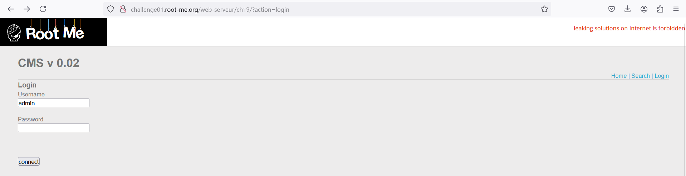
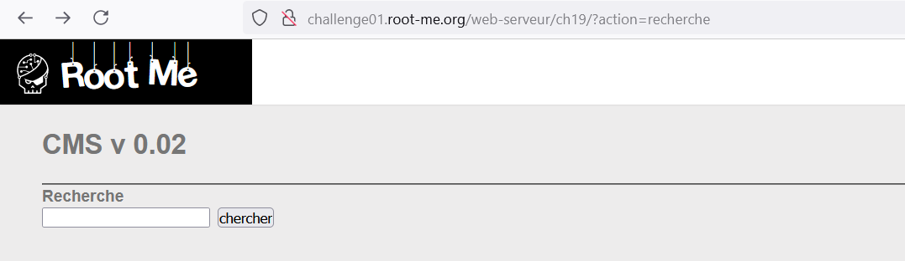
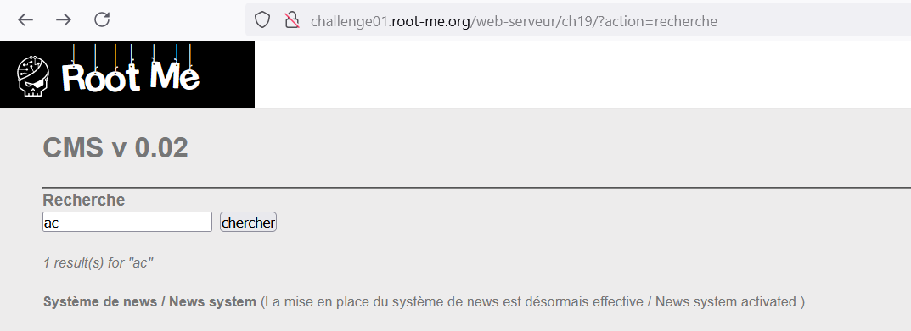
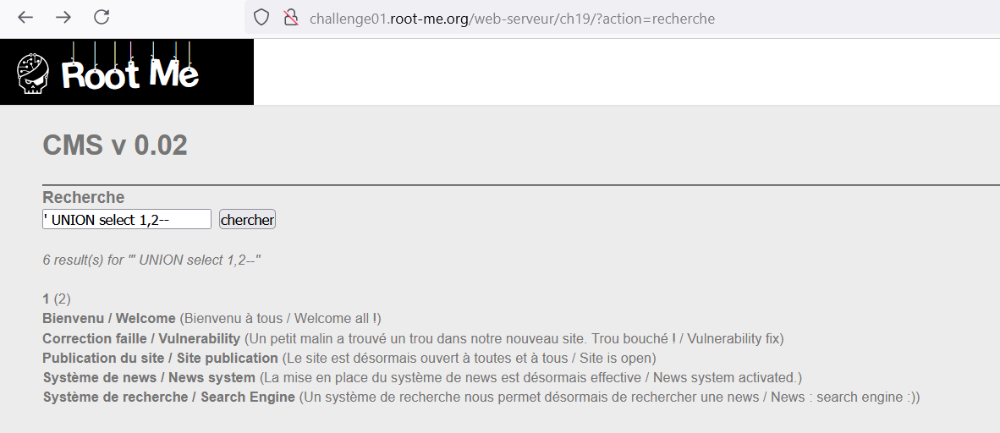
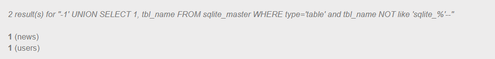
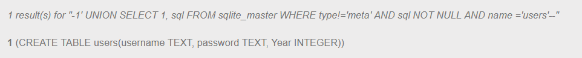
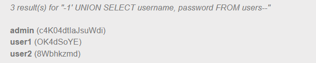

https://www.root-me.org/en/Challenges/Web-Server/SQL-injection-authentication


Bài này chúng ta không tiếp cận theo việc inject vào input user và pass mà ta sẽ tiếp cận theo phần Search. Search dùng để tìm kiếm bài viết vì vậy nó dùng các câu lệnh SQL cho việc tìm kiếm.


Thử tìm kiếm:


Tiếp theo ta sẽ dò xem phần tìm kiếm này cần bao nhiêu trường bằng UNION, thử lần lượt ta tìm ra được ở đây chỉ select 2 trường, trường đầu tiên sẽ xuất ra là tiêu đề (in đậm) và trường thứ 2 là nội dung:


Tiếp theo ta sẽ tìm kiếm xem hệ thống dùng SQL nào, thường xuất hiện nhất hiện tại là MySQL và SQLite, sau khi thử thì mình tìm ra nó dùng SQLite:
```-1' UNION SELECT 1, tbl_name FROM sqlite_master WHERE type='table' and tbl_name NOT like 'sqlite_%'--``` dùng câu lệnh này để tìm xem trong database hiện tại có những bảng nào:


Có 2 bảng là news và users và chắc chắn là ta sẽ muốn xem bảng users để lấy được pass admin, tiếp theo ta xem thử trong users có những trường nào bằng câu lệnh ```-1' UNION SELECT 1, sql FROM sqlite_master WHERE type!='meta' AND sql NOT NULL AND name ='users'--``` ta nhận được: 


Bảng users sẽ gồm 3 trường là username, password, Year.
Đến đây ta sẽ xuất ra các giá trị username và password:
```-1' UNION SELECT username, password FROM users--```


Đến đây thì ta đã có được username và password của admin.

