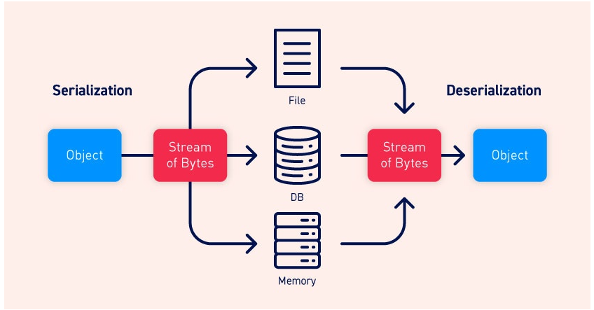

https://portswigger.net/web-security/deserialization

## What is serialization?
Serialization là quá trình chuyển đổi các cấu trúc dữ liệu phức tạp, chẳng hạn như các đối tượng và field của chúng, thành định dạng "phẳng hơn" có thể được gửi và nhận dưới dạng luồng byte tuần tự. Việc serialize dữ liệu giúp việc:
- Ghi dữ liệu phức tạp vào bộ nhớ liên tiến trình, tệp hoặc cơ sở dữ liệu
- Gửi dữ liệu phức tạp, chẳng hạn như qua mạng, giữa các thành phần khác nhau của ứng dụng hoặc trong lệnh gọi API

Điều quan trọng là khi serialize một đối tượng, trạng thái của nó cũng được duy trì. Nói cách khác, các thuộc tính của đối tượng được giữ nguyên cùng với các giá trị được gán cho chúng.

## Serialization vs deserialization
Deserialization là quá trình khôi phục luồng byte này thành một bản sao đầy đủ chức năng của đối tượng ban đầu, ở trạng thái chính xác như khi nó được serialize. Sau đó, logic của trang web có thể tương tác với đối tượng đã được deserialize này, giống như với bất kỳ đối tượng nào khác.


Mỗi ngôn ngữ lập trình có phương thức riêng cho việc serialize. Một số ngôn ngữ serialize các đối tượng thành định dạng nhị phân, trong khi những ngôn ngữ khác sử dụng các định dạng chuỗi khác, với mức độ dễ đọc khác nhau của con người. Lưu ý rằng tất cả thuộc tính của đối tượng ban đầu được lưu trữ trong luồng dữ liệu được serialize, bao gồm cả trường **private**. Để ngăn một trường được serialize, trường đó phải được đánh dấu rõ ràng là "transient" trong phần khai báo lớp.

Lưu ý rằng các ngôn ngữ lập trình khác nhau serialize có thể được gọi là marshalling (Ruby) hoặc pickling (Python). Những thuật ngữ này đồng nghĩa với "serialization" trong bối cảnh này.

## What is insecure deserialization?
Quá trình deserialize không an toàn là khi dữ liệu do người dùng kiểm soát được một trang web deserialize. Điều này có khả năng cho phép kẻ tấn công thao túng các đối tượng được serialize để truyền dữ liệu có hại vào code.

Thậm chí có thể thay thế một đối tượng được serialize bằng một đối tượng thuộc một lớp hoàn toàn khác. Điều đáng báo động là các đối tượng thuộc bất kỳ lớp nào có sẵn trên trang web sẽ được deserialize và khởi tạo. Vì lý do này, quá trình deserialize không an toàn đôi khi được gọi là lỗ hổng "object injection".

Một đối tượng thuộc lớp *không mong muốn* có thể gây ra ngoại lệ. Nhiều cuộc tấn công dựa trên quá trình deserialize được hoàn thành **trước** khi quá trình deserialize **kết thúc**. Điều này có nghĩa là bản thân quá trình deserialize có thể bắt đầu một cuộc tấn công, ngay cả khi chức năng của chính trang web không tương tác trực tiếp với đối tượng độc hại. 

## How do insecure deserialization vulnerabilities arise?
Việc deserialize không an toàn thường phát sinh do thiếu hiểu biết chung về mức độ nguy hiểm của việc deserialize dữ liệu do người dùng kiểm soát. Lý tưởng nhất là đầu vào của người dùng không bao giờ được deserialize.\
Tuy nhiên, đôi khi chủ sở hữu trang web cho rằng họ an toàn vì họ triển khai một số hình thức kiểm tra bổ sung đối với dữ liệu đã được deserialize. Cách tiếp cận này thường không hiệu quả vì hầu như không thể thực hiện xác nhận hoặc dọn dẹp để giải quyết mọi tình huống. Những bước kiểm tra này về cơ bản cũng có sai sót vì chúng dựa vào việc kiểm tra dữ liệu sau khi được deserialize, điều này trong nhiều trường hợp sẽ là quá muộn để ngăn chặn cuộc tấn công.\
Các lỗ hổng cũng có thể phát sinh do các đối tượng được deserialized thường được cho là đáng tin cậy. Đặc biệt khi sử dụng các ngôn ngữ có định dạng serialize nhị phân, nhà phát triển có thể nghĩ rằng người dùng không thể đọc hoặc thao tác dữ liệu một cách hiệu quả. Tuy nhiên, mặc dù có thể cần nhiều nỗ lực hơn nhưng kẻ tấn công vẫn có thể khai thác các đối tượng được serialize nhị phân giống như khai thác các định dạng dựa trên chuỗi.\
Các cuộc tấn công dựa trên quá trình deserialize cũng có thể được thực hiện do 1 số dependency tồn tại trong các trang web hiện đại. Một trang web điển hình có thể triển khai nhiều thư viện khác nhau, mỗi thư viện cũng có phần dependency riêng. Điều này tạo ra một lượng lớn các lớp và phương thức khó quản lý một cách an toàn. Vì kẻ tấn công có thể tạo các phiên bản của bất kỳ lớp nào trong số này nên rất khó để dự đoán phương thức nào có thể được gọi trên dữ liệu độc hại. Điều này đặc biệt đúng nếu kẻ tấn công có thể xâu chuỗi một chuỗi dài các lệnh gọi phương thức không mong muốn lại với nhau, truyền dữ liệu vào một vùng chứa hoàn toàn không liên quan đến nguồn ban đầu. Do đó, hầu như không thể lường trước được luồng dữ liệu độc hại và bịt mọi lỗ hổng tiềm ẩn.\
Nói tóm lại, có thể lập luận rằng không thể deserialize đầu vào không đáng tin cậy một cách an toàn.
## What is the impact of insecure deserialization?
Tác động của quá trình deserialize không an toàn có thể rất nghiêm trọng vì nó cung cấp nhiều cách tấn công. Nó cho phép kẻ tấn công sử dụng lại code hiện có theo những cách có hại, dẫn đến nhiều lỗ hổng khác, thường là thực thi mã từ xa.\
Ngay cả trong trường hợp không thể thực thi RCE, việc deserialize không an toàn có thể dẫn đến leo thang đặc quyền, truy cập tệp tùy ý và tấn công từ chối dịch vụ.
## Identifying
Việc xác định quá trình deserialize không an toàn tương đối đơn giản bất kể là thử nghiệm hộp trắng hay hộp đen.\
Trong quá trình kiểm tra, bạn nên xem xét tất cả dữ liệu được chuyển vào trang web và cố gắng xác định bất kỳ dữ liệu nào trông giống như dữ liệu được serialize. Dữ liệu được serialize có thể được xác định tương đối dễ dàng nếu bạn biết định dạng mà các ngôn ngữ khác nhau sử dụng. Trong phần này, chúng tôi sẽ hiển thị các ví dụ từ serialize PHP và Java. Sau khi xác định được dữ liệu được serialize, bạn có thể kiểm tra xem mình có thể kiểm soát dữ liệu đó hay không.
### PHP serialization format
PHP sử dụng định dạng chuỗi hầu như con người có thể đọc được, với các chữ cái biểu thị kiểu dữ liệu và các số biểu thị độ dài của mỗi mục nhập. Ví dụ: hãy xem xét một đối tượng `User` có các thuộc tính:
```
$user->name = "carlos";
$user->isLoggedIn = true;
```
Khi được serialize, đối tượng sẽ như thế này:\
`O:4:"User":2:{s:4:"name":s:6:"carlos"; s:10:"isLoggedIn":b:1;}`\
Trong đó:
- `O:4:"User"` - Một đối tượng có tên lớp gồm 4 ký tự `"User"`
- `2` - đối tượng có 2 thuộc tính
- `s:4:"name"` - Key của thuộc tính đầu tiên là chuỗi 4 ký tự `"name"`
- `s:6:"carlos"` - Value của thuộc tính đầu tiên là chuỗi 6 ký tự `"carlos"`
- `s:10:"isLoggedIn"` - Key của thuộc tính thứ hai là chuỗi 10 ký tự `"isLoggedIn"`
- `b:1` - Value thuộc tính thứ hai là giá trị boolean `true`

Các phương thức gốc của PHP để Serialize là `serialize()` và `unserialize()`. Nếu có quyền truy cập mã nguồn, nên bắt đầu bằng cách tìm kiếm `unserialize()` ở bất kỳ đâu trong code và điều tra thêm.

### Java serialization format
Một số ngôn ngữ, chẳng hạn như Java, sử dụng định dạng serialize là nhị phân. Điều này khó đọc hơn nhưng vẫn có thể xác định được dữ liệu được serialize nếu biết cách nhận biết một số dấu hiệu nhận biết. Ví dụ: các đối tượng Java được serialize luôn bắt đầu bằng cùng một byte, được mã hóa là `ac ed` theo hệ thập lục phân và `rO0` trong Base64.\
Bất kỳ lớp nào triển khai interface `java.io.Serializable` đều có thể được serialize và deserialize. Nếu có quyền truy cập mã nguồn, hãy lưu ý đến bất kỳ code nào sử dụng phương thức `readObject()`, được sử dụng để đọc và deserialize dữ liệu từ `InputStream`.
## Manipulating serialized objects
Việc khai thác một số lỗ hổng deserialize có thể dễ dàng như thay đổi một thuộc tính trong một đối tượng được serialize. Khi trạng thái đối tượng được duy trì, bạn có thể nghiên cứu dữ liệu được serialize để xác định và chỉnh sửa các giá trị thuộc tính thú vị. Sau đó, bạn có thể chuyển đối tượng độc hại vào trang web thông qua quá trình deserialize của nó. Đây là bước đầu tiên để khai thác dersialize cơ bản.\
Nói rộng hơn, có hai cách tiếp cận bạn có thể thực hiện khi thao tác với các đối tượng được serialize. Bạn có thể chỉnh sửa đối tượng trực tiếp ở dạng luồng byte hoặc bạn có thể viết một tập lệnh ngắn bằng ngôn ngữ tương ứng để tự tạo và serialize đối tượng mới. Cách tiếp cận thứ hai thường dễ dàng hơn khi làm việc với các định dạng serialize nhị phân.

### Modifying object attributes - Sửa đổi thuộc tính đối tượng
Khi giả mạo dữ liệu, miễn là kẻ tấn công cung cấp một đối tượng được serialize hợp lệ, quá trình deserialize sẽ tạo ra một đối tượng phía máy chủ với các giá trị thuộc tính được sửa đổi.\
Ví dụ đơn giản, hãy xem xét một trang web sử dụng đối tượng `User` được serialize để lưu trữ dữ liệu về phiên của người dùng trong cookie. Nếu kẻ tấn công phát hiện đối tượng được serialize này trong một yêu cầu HTTP, chúng có thể deserialize nó để tìm luồng byte sau:\
`O:4:"User":2:{s:8:"username";s:6:"carlos";s:7:"isAdmin";b:0;}`\
Thuộc tính `isAdmin` là một điểm đáng quan tâm rõ ràng. Kẻ tấn công có thể chỉ cần thay đổi giá trị boolean của thuộc tính thành 1 (true), mã hóa lại đối tượng và ghi đè cookie hiện tại của chúng bằng giá trị được sửa đổi này. Giả sử trang web sử dụng cookie này để kiểm tra xem người dùng hiện tại có quyền truy cập vào một số chức năng quản trị nhất định hay không:\
```
$user = unserialize($_COOKIE);
if ($user->isAdmin === true) {
// allow access to admin interface
}
```
Mã này sẽ khởi tạo một đối tượng User dựa trên dữ liệu từ cookie, bao gồm cả thuộc tính `isAdmin` bị kẻ tấn công sửa đổi. Không có code kiểm tra tính xác thực của đối tượng được serialize, dữ liệu này sau đó được chuyển vào câu lệnh có điều kiện và trong trường hợp này sẽ cho phép leo đặc quyền dễ dàng.\
### Modifying data types - Sửa đổi type của thuộc tính
Ngoài cung cấp giá trị ko mong muốn thì còn có thể dẫn đến cung cấp kiểu dữ liệu ko mong muốn.\
Logic PHP dễ bị tổn thương trước loại thao tác này do hoạt động của toán tử so sánh lỏng lẻo (==) khi so sánh các loại dữ liệu khác nhau. Ví dụ: nếu bạn thực hiện so sánh lỏng lẻo giữa một số nguyên và một chuỗi, PHP sẽ cố gắng chuyển đổi chuỗi đó thành một số nguyên, nghĩa là 5 == "5" đánh giá là đúng.\
Điều bất thường là tính năng này cũng hoạt động với bất kỳ chuỗi chữ và số nào bắt đầu bằng số. Trong trường hợp này, PHP sẽ chuyển đổi toàn bộ chuỗi thành giá trị nguyên dựa trên số ban đầu một cách hiệu quả. Phần còn lại của chuỗi bị bỏ qua hoàn toàn. Do đó, 5 == "5 của một cái gì đó" trong thực tế được coi là 5 == 5.\
Điều này càng trở nên lạ hơn khi so sánh một chuỗi số nguyên 0:\
`0 == "Example string" // true`\
Lưu ý: khi sửa đổi loại dữ liệu ở bất kỳ định dạng đối tượng được serialize nào, điều quan trọng cần nhớ là cập nhật mọi nhãn type và chỉ báo độ dài trong dữ liệu được serialzie. Nếu không, đối tượng được serialize sẽ bị hỏng và sẽ không được deserialize.

## Using application functionality
Ngoài việc kiểm tra các giá trị thuộc tính, chức năng của trang web cũng có thể thực hiện các hoạt động nguy hiểm trên dữ liệu từ một đối tượng đã được deserialize. Trong trường hợp này, bạn có thể sử dụng quá trình deserialize không an toàn để truyền dữ liệu không mong muốn và tận dụng func liên quan để gây thiệt hại.\
Ví dụ: như một phần của chức năng "Delete user" của trang web, ảnh hồ sơ của người dùng sẽ bị xóa bằng cách truy cập vào đường dẫn tệp trong thuộc tính `$user->image_location`. Nếu `$user` này được tạo từ một đối tượng được serialize, kẻ tấn công có thể khai thác điều này bằng cách chuyển vào một đối tượng đã sửa đổi với `image_location` được đặt thành một đường dẫn tệp tùy ý. Việc xóa tài khoản người dùng sau đó cũng sẽ xóa tệp tùy ý này.\
Ví dụ này dựa vào việc kẻ tấn công gọi phương thức nguy hiểm theo cách thủ công thông qua chức năng mà người dùng có thể truy cập. Tuy nhiên, quá trình deserialize không an toàn trở nên thú vị hơn nhiều khi bạn tạo các khai thác tự động chuyển dữ liệu vào các phương thức nguy hiểm. Điều này được kích hoạt bằng cách sử dụng "magic methods".
### Magic methods
Các magic methods là một tập hợp con đặc biệt của các methods mà bạn không cần phải gọi một cách rõ ràng. Thay vào đó, chúng được gọi tự động bất cứ khi nào một sự kiện hoặc tình huống cụ thể xảy ra. Các magic method là một đặc điểm chung của lập trình hướng đối tượng bằng nhiều ngôn ngữ khác nhau. Đôi khi chúng được biểu thị bằng tiền tố hoặc bao quanh tên phương thức bằng dấu gạch dưới kép (__a).\
Các nhà phát triển có thể thêm các magic method vào một lớp để xác định trước code nào sẽ được thực thi khi sự kiện hoặc tình huống tương ứng xảy ra. Chính xác khi nào và tại sao một số magic method kích hoạt lại khác nhau giữa các phương thức. Một trong những ví dụ phổ biến nhất trong PHP là `__construct()`, được gọi bất cứ khi nào một đối tượng của lớp được khởi tạo, tương tự như `__init__` của Python. Thông thường, các magic method của hàm tạo như thế này chứa code để khởi tạo các thuộc tính của đối tượng. Tuy nhiên, các nhà phát triển có thể tùy chỉnh các magic method để thực thi bất kỳ code nào họ muốn.\
Các magic method được sử dụng rộng rãi và bản thân chúng không gây ra lỗ hổng. Nhưng chúng có thể trở nên nguy hiểm khi code mà chúng thực thi xử lý dữ liệu do kẻ tấn công kiểm soát, chẳng hạn như từ một đối tượng đã được deserialize. Điều này có thể bị kẻ tấn công khai thác để tự động gọi các phương thức trên dữ liệu đã được deserialize khi đáp ứng các điều kiện tương ứng.\
Quan trọng nhất trong bối cảnh này, một số ngôn ngữ có các magic method được gọi tự động trong quá trình deserialize. Ví dụ: phương thức `unserialize()` của PHP tìm kiếm và gọi magic method `__wakeup()` của một đối tượng.\
Trong quá trình deserialize Java, điều tương tự cũng áp dụng cho phương thức `ObjectInputStream.readObject()`, được sử dụng để đọc dữ liệu từ luồng byte ban đầu và về cơ bản hoạt động giống như một hàm tạo để "khởi tạo lại" một đối tượng được serialize. Tuy nhiên, các lớp Serializable cũng có thể khai báo phương thức `readObject()` của riêng chúng như sau:
```
private void readObject(ObjectInputStream in) throws IOException, ClassNotFoundException
{
    // implementation
}
```
Phương thức `readObject()` được khai báo chính xác theo cách này hoạt động như một magic method được gọi trong quá trình deserialize. Điều này cho phép lớp kiểm soát quá trình deserialize các trường của chính nó chặt chẽ hơn.\
Bạn nên chú ý đến bất kỳ lớp nào có chứa các loại magic method này. Chúng cho phép bạn truyền dữ liệu từ một đối tượng được serialize vào code của trang web trước khi đối tượng đó được deserialize hoàn toàn. Đây là điểm khởi đầu để tạo ra các khai thác nâng cao hơn.
### Injecting arbitrary objects - Tiêm các đối tượng
Như chúng ta đã thấy, đôi khi có thể khai thác quá trình deserialize không an toàn bằng cách chỉnh sửa đối tượng do trang web cung cấp. Tuy nhiên, việc chèn các loại đối tượng tùy ý có thể mở ra nhiều khả năng hơn.\
Trong lập trình hướng đối tượng, các phương thức có sẵn cho một đối tượng được xác định bởi lớp của nó. Do đó, nếu kẻ tấn công có thể thao túng lớp đối tượng nào đang được truyền vào dưới dạng dữ liệu được serialize, thì chúng có thể ảnh hưởng đến code được thực thi sau đó và thậm chí trong quá trình deserialize.\
Các phương pháp deserialize thường không kiểm tra những gì chúng đang deserialize. Điều này có nghĩa là bạn có thể chuyển vào các đối tượng thuộc bất kỳ lớp có thể serialize nào có sẵn trên trang web và đối tượng sẽ được deserialize. Điều này cho phép kẻ tấn công tạo ra các phiên bản của các lớp tùy ý một cách hiệu quả. Việc đối tượng này không thuộc lớp được mong đợi không thành vấn đề. Loại đối tượng không mong muốn có thể gây ra ngoại lệ trong logic ứng dụng, nhưng đối tượng độc hại sẽ được khởi tạo trước đó.\
Nếu kẻ tấn công có quyền truy cập vào mã nguồn, chúng có thể nghiên cứu chi tiết tất cả các lớp có sẵn. Để xây dựng một cách khai thác đơn giản, họ sẽ tìm kiếm các lớp chứa các magic method để deserialize, sau đó kiểm tra xem có bất kỳ phương pháp nào trong số chúng thực hiện các hoạt động nguy hiểm trên dữ liệu có thể kiểm soát được hay không. Sau đó, kẻ tấn công có thể chuyển vào một đối tượng được serialize của lớp này để sử dụng magic method của nó để khai thác.\
Các lớp chứa các magic method để deserialize này cũng có thể được sử dụng để bắt đầu các cuộc tấn công phức tạp hơn liên quan đến một chuỗi dài các lời gọi phương thức, được gọi là "chuỗi tiện ích"(`gadget chain`)
## Gadget chains
"Gadget" là một đoạn mã tồn tại trong ứng dụng có thể giúp kẻ tấn công đạt được một mục tiêu cụ thể. Một gadget riêng lẻ có thể không trực tiếp làm bất cứ điều gì có hại với thông tin đầu vào của người dùng. Tuy nhiên, mục tiêu của kẻ tấn công có thể chỉ đơn giản là gọi ra một phương thức sẽ chuyển đầu vào của chúng sang một gadget khác. Bằng cách kết nối nhiều gadget lại với nhau theo cách này, kẻ tấn công có thể chuyển thông tin đầu vào của chúng vào một "sink gadget" nguy hiểm, nơi nó có thể gây ra thiệt hại lớn.\
Điều quan trọng là phải hiểu rằng, không giống như một số kiểu khai thác khác, chuỗi gadget không phải là trọng tải của các phương thức xâu chuỗi do kẻ tấn công xây dựng mà là tất cả code đã tồn tại trên trang web. Điều duy nhất kẻ tấn công kiểm soát là dữ liệu được chuyển vào chuỗi gadget. Điều này thường được thực hiện bằng cách sử dụng một magic method được gọi trong quá trình deserialize, đôi khi được gọi là "kick-off gadget".\
Trong thực tế, nhiều lỗ hổng khử serialize không an toàn sẽ chỉ có thể bị khai thác thông qua việc sử dụng chuỗi gadget. Điều này đôi khi có thể là một chuỗi một hoặc hai bước đơn giản, nhưng việc xây dựng các cuộc tấn công có mức độ nghiêm trọng cao có thể sẽ yêu cầu một chuỗi phức tạp hơn về khởi tạo đối tượng và gọi phương thức. Do đó, việc có thể xây dựng chuỗi gadget là một trong những khía cạnh quan trọng để khai thác thành công quá trình deserialize không an toàn.
### Working with pre-built gadget chains - Chuỗi được tạo sẵn
Việc xác định chuỗi gadget theo cách thủ công có thể là một quá trình khá khó khăn và gần như không thể thực hiện được nếu không có quyền truy cập mã nguồn. May mắn thay, có một số tùy chọn để làm việc với chuỗi gadget được tạo sẵn mà bạn có thể thử trước.\
Có một số công cụ có sẵn cung cấp một loạt các chuỗi được phát hiện trước đã được khai thác thành công trên các trang web khác. Ngay cả khi không có quyền truy cập vào mã nguồn, bạn vẫn có thể sử dụng các công cụ này để xác định và khai thác các lỗ hổng deserialize không an toàn mà không tốn nhiều công sức. Cách tiếp cận này có thể thực hiện được nhờ việc sử dụng rộng rãi các thư viện chứa chuỗi gadget có thể khai thác được. Ví dụ: nếu một chuỗi gadget trong thư viện `Apache Commons Collections` của Java có thể bị khai thác trên một trang web thì bất kỳ trang web nào khác triển khai thư viện này cũng có thể bị khai thác bằng cách sử dụng cùng một chuỗi.
#### ysoserial
Một công cụ như vậy để deserialize Java là "ysoserial". Điều này cho phép bạn chọn một trong các chuỗi gadget được cung cấp cho thư viện mà bạn cho rằng ứng dụng đích đang sử dụng, sau đó chuyển lệnh mà bạn muốn thực thi. Sau đó nó tạo ra một đối tượng được serialize thích hợp dựa trên chuỗi đã chọn. Điều này vẫn đòi hỏi một số lần thử và sai sót nhất định, nhưng nó ít tốn công sức hơn đáng kể so với việc xây dựng chuỗi gadget của riêng bạn theo cách thủ công.
#### PHP Generic Gadget Chains 
Hầu hết các ngôn ngữ thường xuyên gặp phải các lỗ hổng deserialize không an toàn đều có các công cụ tương đương. Ví dụ: đối với các trang web PHP, bạn có thể sử dụng "PHP Generic Gadget Chains" (PHPGGC).
#### Working with documented gadget chains
### PHAR deserialization
Cho đến nay, chúng ta chủ yếu xem xét việc khai thác các lỗ hổng deserialize trong đó trang web deserialize một cách rõ ràng thông tin đầu vào của người dùng. Tuy nhiên, trong PHP đôi khi có thể khai thác quá trình deserialize ngay cả khi không sử dụng rõ ràng phương thức `unserialize()`.\
PHP cung cấp một số wrapper URL mà bạn có thể sử dụng để xử lý các giao thức khác nhau khi truy cập đường dẫn tệp. Một trong số đó là wrapper `phar://`, cung cấp giao diện luồng để truy cập các tệp PHP Archive (`.phar`).\
Tài liệu PHP tiết lộ rằng tệp `PHAR` chứa siêu dữ liệu được `serialize`. Điều quan trọng là nếu bạn thực hiện bất kỳ thao tác hệ thống tệp nào trên luồng `phar://` thì siêu dữ liệu này sẽ được `deserialize` hoàn toàn. Điều này có nghĩa là luồng `phar://` có thể có khả năng là một vectơ để khai thác quá trình deserialize không an toàn, miễn là bạn có thể chuyển luồng này vào một phương thức hệ thống tệp.\
Trong trường hợp các phương thức hệ thống tệp rõ ràng là nguy hiểm, chẳng hạn như `include()` hoặc `fopen()`, các trang web có thể đã triển khai các biện pháp đối phó để giảm khả năng chúng bị sử dụng với mục đích xấu. Tuy nhiên, các phương pháp như `file_exists()`, không quá nguy hiểm, có thể không được bảo vệ tốt.\
Kỹ thuật này cũng yêu cầu bạn phải upload file `PHAR` lên máy chủ bằng cách nào đó. Ví dụ: một cách tiếp cận là sử dụng chức năng tải lên hình ảnh. Nếu bạn có thể tạo tệp đa ngôn ngữ, với `PHAR` giả mạo dưới dạng `JPG` đơn giản, đôi khi bạn có thể bỏ qua quá trình kiểm tra xác thực của trang web. Sau đó, nếu bạn có thể buộc trang web tải "JPG" đa ngôn ngữ này từ luồng `phar://` thì mọi dữ liệu có hại mà bạn đưa vào qua siêu dữ liệu `PHAR` sẽ được deserialize. Vì phần mở rộng tệp không được kiểm tra khi PHP đọc luồng, nên việc tệp sử dụng phần mở rộng hình ảnh không thành vấn đề.\
Miễn là lớp của đối tượng được trang web hỗ trợ, cả magic method `__wakeup()` và `__struct()` đều có thể được gọi theo cách này, cho phép bạn có khả năng khởi động chuỗi gadget bằng kỹ thuật này.
## How to prevent insecure deserialization vulnerabilities
Nói chung, nên tránh việc deserialize input của người dùng trừ khi thực sự cần thiết. Mức độ nghiêm trọng cao của các hành vi khai thác mà nó có khả năng gây ra và khó khăn trong việc bảo vệ chống lại chúng, lớn hơn lợi ích trong nhiều trường hợp.\
Nếu bạn cần deserialize dữ liệu từ các nguồn không đáng tin cậy, hãy kết hợp các biện pháp mạnh mẽ để đảm bảo rằng dữ liệu không bị giả mạo. Ví dụ: bạn có thể triển khai chữ ký số để kiểm tra tính toàn vẹn của dữ liệu. Tuy nhiên, hãy nhớ rằng mọi hoạt động kiểm tra đều phải diễn ra trước khi bắt đầu quá trình deserialize. Nếu không, chúng ít được sử dụng.\
Nếu có thể, bạn nên tránh sử dụng hoàn toàn các tính năng deserialize. Dữ liệu được serialize từ các phương thức này chứa tất cả thuộc tính của đối tượng ban đầu, bao gồm cả các trường riêng tư có khả năng chứa thông tin nhạy cảm. Thay vào đó, bạn có thể tạo các phương thức serialize dành riêng cho lớp của riêng mình để ít nhất bạn có thể kiểm soát trường nào được hiển thị.\
Cuối cùng, hãy nhớ rằng lỗ hổng bảo mật là quá trình deserialize đầu vào của người dùng chứ không phải sự hiện diện của chuỗi gadget xử lý dữ liệu sau đó. Đừng dựa vào việc cố gắng loại bỏ các chuỗi gadget mà bạn xác định được trong quá trình thử nghiệm. Việc thử và cắm tất cả chúng là không thực tế do mạng lưới các phụ thuộc giữa các thư viện gần như chắc chắn tồn tại trên trang web của bạn. Tại bất kỳ thời điểm nào, việc khai thác lỗi bộ nhớ được ghi lại công khai cũng là một yếu tố, có nghĩa là ứng dụng của bạn có thể dễ bị tấn công.


