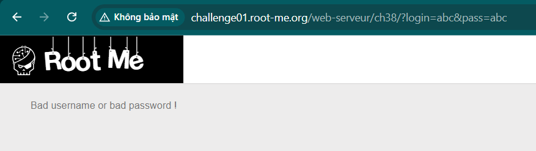
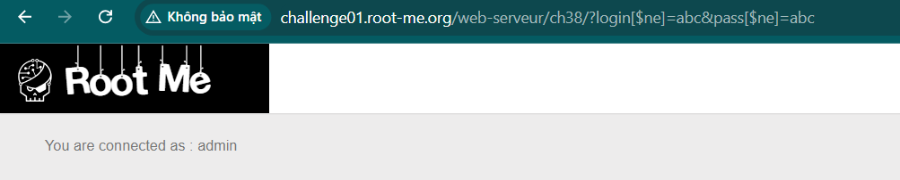
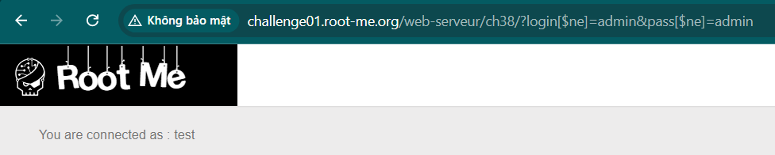
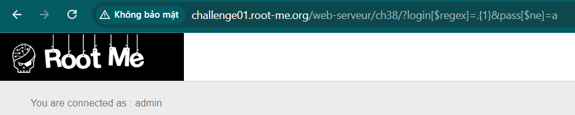
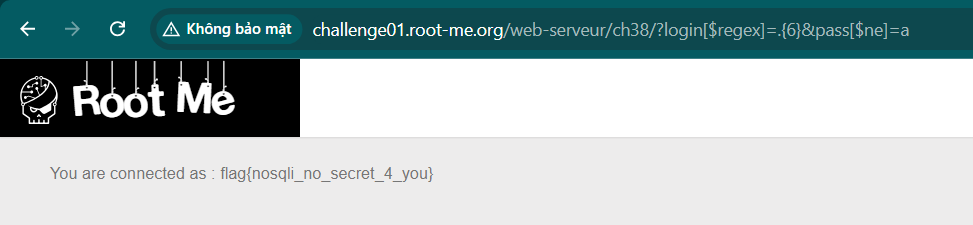

Challenge: http://challenge01.root-me.org/web-serveur/ch38/

Đầu tiên ta thử đăng nhập `abc:abc`:

Ta thấy ở đây username và pass được đưa lên url: 
`http://challenge01.root-me.org/web-serveur/ch38/?login=abc&pass=abc`

Tìm về NoSQL vulnerabilities ta biết được ta có thể thêm `[$ne]` vào username để xác định giá trị khcas với giá trị mình cung cấp: 
`http://challenge01.root-me.org/web-serveur/ch38/?login[$ne]=abc&pass[$ne]=abc`

Ta đăng nhập được với tư cách admin:

Vậy giờ cần tìm user khác ta sẽ cho `[$ne]=admin`:

Nhưng ở đây vẫn không phải user cần tìm, vấn đề là `[$ne]` chỉ có thể với 1 chữ, nếu để là admin thì ra test và nếu để test sẽ nhận được admin. Dùng thử [$nin] để có thể dùng với nhiều giá trị nhưng không được.

Vậy thì ở đây có 1 cách khác là sẽ tìm có nhiều kí tự: `[$regex]=.{1}` với cách này ta có thể thử xem username có mấy kí tự:

Với số bằng 1,2,3,4,5 thì vẫn ra admin nhưng khi là 6:

Do test và admin đều < 6 kí tự nên sẽ không đúng với điều kiện nữa.

Validate đầu vào các toán tử.