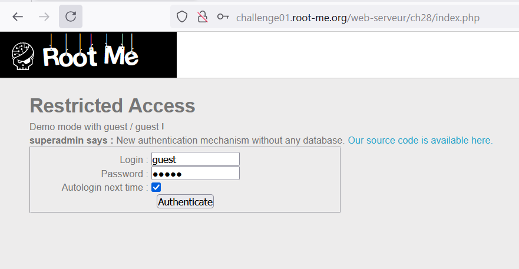
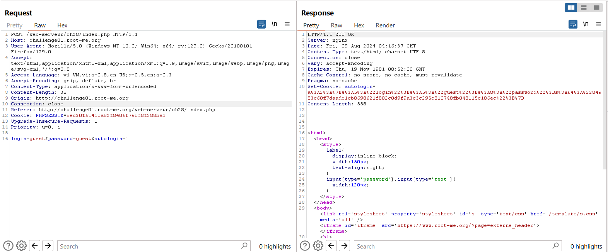
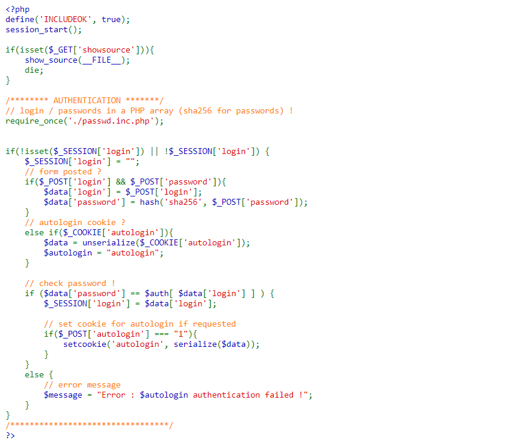
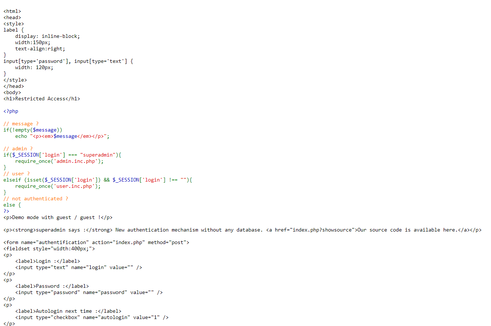
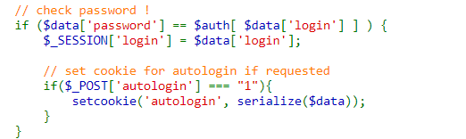
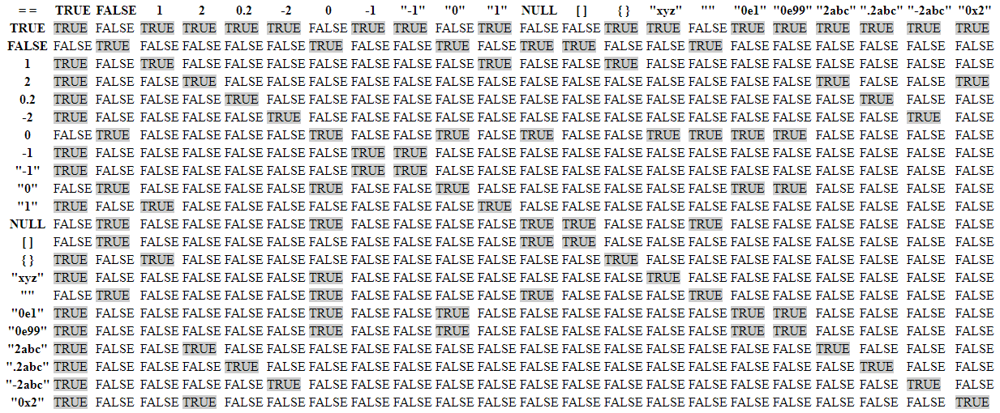
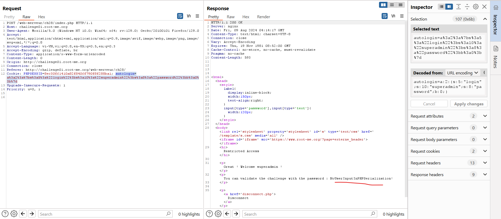

Challenge:http://challenge01.root-me.org/web-serveur/ch28/

Đầu tiên đăng nhập bằng guest/guest:

Phản hồi trả về cookie:

`a:2:{s:5:"login";s:5:"guest";s:8:"password";s:64:"84983c60f7daadc1cb8698621f802c0d9f9a3c3c295c810748fb048115c186ec";}` \
Đoạn cookie này bao gồm `login:guest` và `password:hash("guest")` 

Đọc code:

Vậy ở đây ta có thể đăng nhập bằng form hoặc cũng có thể truy cập bằng COOKIE `autologin`.

Sau đó nếu check password thành công nó sẽ lưu lại `SESSION['login']` và nếu `SESSION['login]==="superadmin"` thì sẽ xuất ra 1 file của admin.

Hàm Unserialization là hàm để biến 1 chuỗi ra thành 1 đối tượng hoặc 1 chuỗi. 

Ở đây ta thấy password guest đã được sha256. 

Nhận xét: nếu đăng nhập bằng form password sẽ bị sha256 nên khó để can thiệp, vì vậy ta sẽ dùng COOKIE để đi qua phần kiểm tra. 

Ở đây ta thấy có loose comparison(==): 

Ta thấy nếu so sánh TRUE với 1 chuỗi thì sẽ đưa ra là TRUE, nên nếu ta sửa `password = true` thì nó sẽ pass được điều kiện này.

Cookie cuối cùng: 
`autologin=a%3a2%3a%7bs%3a5%3a%22login%22%3bs%3a10%3a%22superadmin%22%3bs%3a8%3a%22password%22%3bb%3a0%3b%7d` hay `autologin=a:2:{s:5:"login";s:10:"superadmin";s:8:"password";b:1;}`

Lưu ý: khi request lại cookie để login superadmin cần xóa phiên đăng nhập hoặc tắt bật lại browser do khi đăng nhập guest/guest đã để autologin=1 nên nó không thoát phiên đó ra.

Note: Không tin tưởng vào input người dùng, ở đây là cookie có thể sửa đổi và sau khi deserialization thì không kiểm tra lại xem password đã hash chưa nên người dùng có thể tùy ý sửa đổi. 