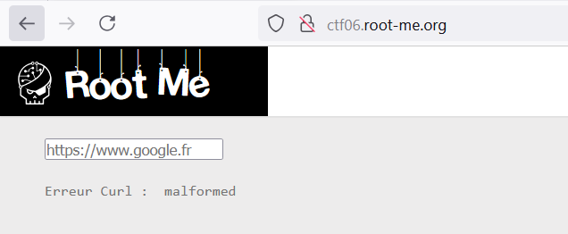
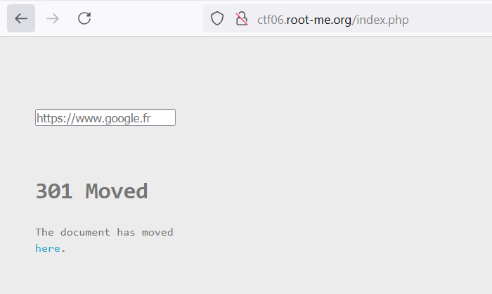
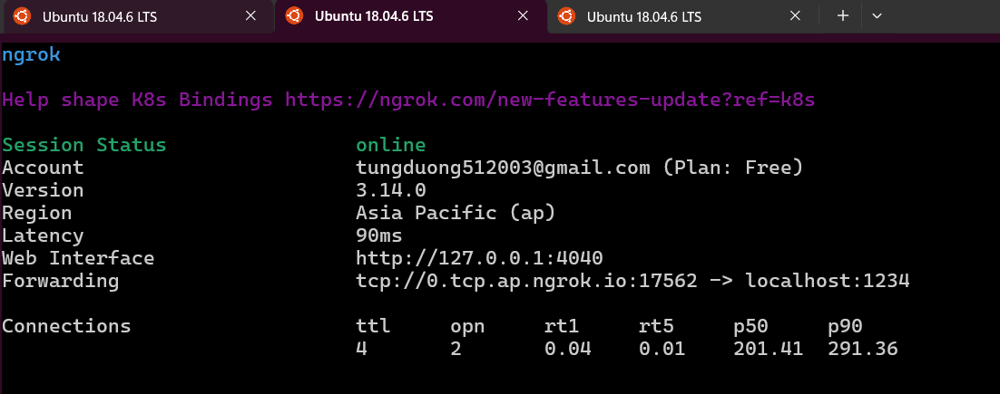
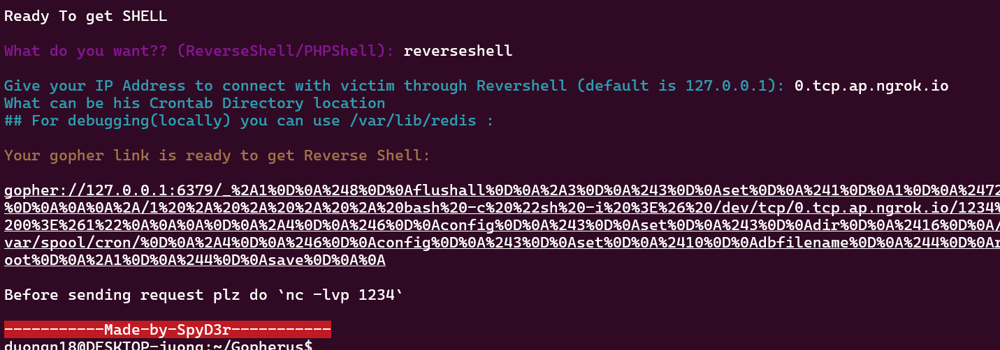
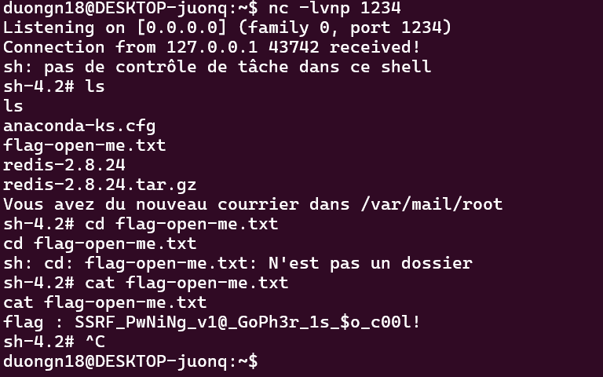

Challenge: 

Đầu tiên khi vào web nó sẽ có chức năng crawl page:

Cho input hợp lệ vào: 

Còn nếu ko hợp lệ:

Với ssrf, ta sẽ cần đánh lừa rằng server đang truy cập url mình cung cấp, nên mình sẽ cần cung cấp các url nội bộ nơi mà server có quyền cao hơn, với lí thuyết như vậy ta có thể thay url bằng `127.0.0.1:80`:

Và lần lượt đổi port để tìm ra port mở, dùng intruder ta tìm ra được thêm port `6379` của redis: 

Nhưng khi truy cập thì không thành công, không thu được gì.

Tìm kiếm từ khóa ssrf thì ta có thể timd được cách dùng gopher để rce 1 số cổng mở trên server trong đó có redis: 
`https://book.hacktricks.xyz/pentesting-web/ssrf-server-side-request-forgery#ssrf-redirect-to-gopher`

`https://github.com/tarunkant/Gopherus`

Mở kết nối tcp:

Tạo payload với kết nối tcp có sẵn để tạo reverse shell:

