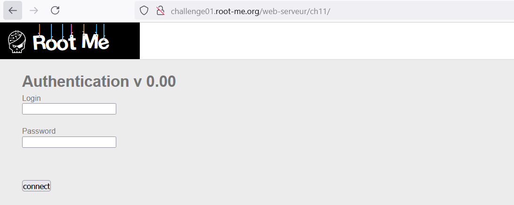
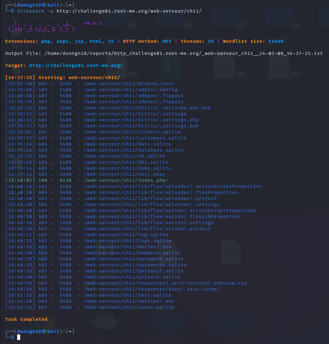
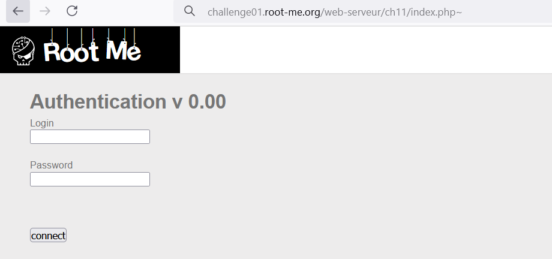
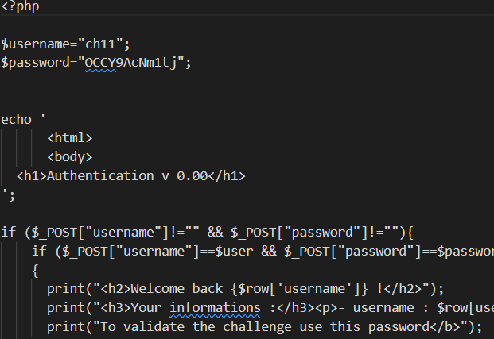

https://www.root-me.org/en/Challenges/Web-Server/Backup-file

Với phần hướng dẫn: No clue và khi truy cập ta được:

Với tên file là Back up thì ta dự đoán là có thể tải được backup của web ở 1 nơi nào đó. Vì ở đây không có thêm đường dẫn nào, nên quay trở về bước đầu Pentest ta cần đi Recon:
Dùng dirsearch trong kali tìm kiếm thêm directory cho web: 

Ta thấy rằng chỉ có /web-serveur/ch11/index.php~ là phản hồi 200 còn lại phản hồi là 403 cần xác thực nên ta truy cập vào đường dẫn này để xem kết quả: 

Chạy link và nó sẽ tự động tải 1 file backup về, ở file này ta dễ dàng lấy được password:
