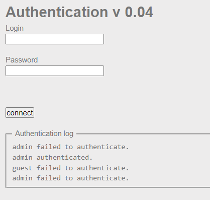
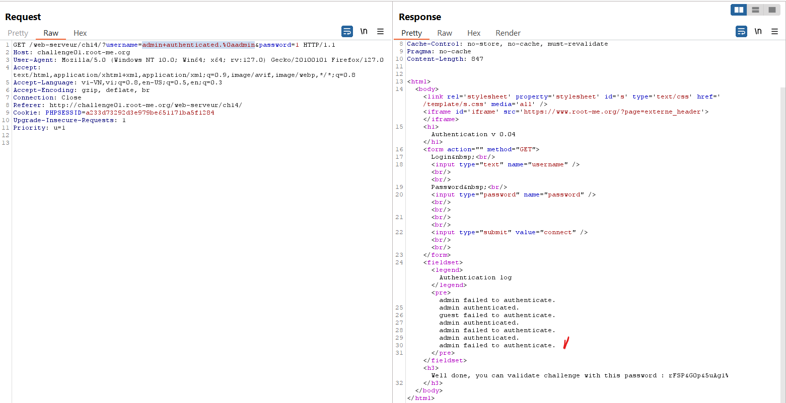

Tìm hiểu về CRLF injection: 
https://owasp.org/www-community/vulnerabilities/CRLF_Injection

CR viết tắt của Carriage Return (ASCII 13, \r) 

LF viết tắt của Line Feed (ASCII 10, \n) 

là 2 kí tự điều khiển để chấm dứt dòng và xuống dòng. Trong Window thì cả \r\n đều nhận diện, còn Linux chỉ nhận diện \n và với HTTP protocol thì CR-LF thường được sử dụng để chấm dứt dòng.

Tấn công thử: 
https://owasp.org/www-community/attacks/Log_Injection mục tiêu là sẽ cần thay đổi log của 1 trang web.
~~~
...
String val = request.getParameter("val");
try {
    int value = Integer.parseInt(val);
}
catch (NumberFormatException) {
    log.info("Failed to parse val = " + val);
}
...
~~~
Đoạn code này sẽ xem thử val có phải số nguyên không và nếu không phải sẽ ghi vào log.
Ví dụ khi mình nhập để val = twenty-one nó sẽ được:
```
INFO: Failed to parse val=twenty-one
```
Vậy bây giờ nếu nhập vào là ```twenty-one%0a%0aINFO:+User+logged+out%3dbadguy``` thì log sẽ là:
```
INFO: Failed to parse val=twenty-one

INFO: User logged out=badguy
```
Ở đây do %0a%0a là 2 kí tự xuống dòng (kí tự điều khiển) nên việc chỉ cộng chuỗi mà không xử lí các vấn đề khác dẫn đến chuỗi có các kí tự điều khiển dẫn đến có những hành vi khác thường.

Nguy hiểm hơn là việc có thể nhúng code vào log:
```
https://www.somedomain.tld/index.php?file=`
<?php echo phpinfo(); ?>`
```
sau parameter file đáng lẽ chỉ là 1 chuỗi nhưng vì không xử lí nên dấu ` giúp cho PHP hiểu đó là đoạn code và xử lí nó. Đây là 1 dạng của Command Injection.

Quay lại challenge: https://www.root-me.org/en/Challenges/Web-Server/CRLF

Với mục đích là thay đổi log nên ta chỉ việc sử dụng các kí tự điều khiển vào. Đầu tiên ta thử với 1 trường hợp bình thường khi ta đăng nhập admin:admin:


Ta dự đoán log là:

username + 'failed to authenticate' khi sai password

username + 'authenticated' khi đúng user và password

Bây giờ ta sửa đoạn username thành: 
```admin+authenticated.%0aadmin``` 
với password bất kì. 
Ta sẽ nhận được 2 dòng tương ứng và có được password:
