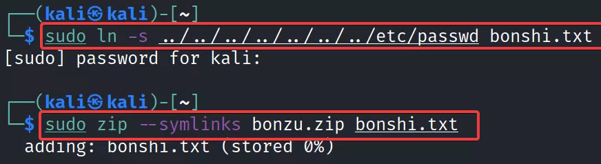

### What Is Symlink?
Symlink (hay còn gọi là symbolic link) là một loại tệp trong Linux trỏ đến một tệp hoặc thư mục khác trên hệ thống của bạn. Liên kết tượng trưng tương tự như các phím tắt trong Windows.

### What Is ZIP Symlink Vulnerability?
Một archive có thể chứa một symlink. Liên kết tượng trưng là một tệp đặc biệt liên kết đến một tệp khác. Bằng cách tải lên ZIP chứa liên kết tượng trưng và sau khi giải nén ZIP, bạn có thể truy cập liên kết tượng trưng để có quyền truy cập vào các tệp mà lẽ ra không thể truy cập được. Để làm như vậy, bạn cần lấy liên kết tượng trưng của mình để trỏ đến các tệp bên ngoài web root, ví dụ: `/etc/passwd`.

Những loại sự cố này thường xảy ra khi nhà phát triển cho phép tệp ZIP trong chức năng tải lên. Khi người dùng tải tệp ZIP độc hại lên ứng dụng, họ chỉ cần lấy tệp ZIP và giải nén nó mà không cần xác thực thêm.

### Exploitation
Nhóm đánh giá đã tạo một Liên kết tượng trưng của tệp “/etc\passwd” trên hệ thống của họ và nén tệp trong kho lưu trữ ZIP bằng lệnh sau: \
`sudo ln -s ../../../../../../../../../../etc/passwd name_of_symlink.txt`

`sudo zip --symlink zip_file.zip  name_of_symlink.txt`

Khi hệ thống unzip, nó sẽ lấy nội dung ở đường link gắn vào file `name_of_symlink.txt`, vì vậy, dù không truy cập trực tiếp vào các file hệ thống hay các file ko đủ quyền nhưng lại có thể lấy nội dung của nó. 

Ngoài ra, symlink trong upload file còn có thể dùng để upload file ở 1 folder khác với folder định sẵn.

Ý tưởng :
- Bước 1: Tạo một symlink tên là `link_webroot` đến `/var/www/html`. Sau đó zip và upload lên server. Lúc này trên sever có symlink `link_webroot` trỏ đến `/var/www/html`
- Bước 2: Tạo một thư mục tên là `link_webroot`. Ghi `shell.php` với nội dung là `<?php phpinfo();?>` vào thư mục `link_webroot`. Sau đó zip lại và upload lên server
Khi ứng dụng unzip và ghi thư mục `link_webroot` nó vô tình ghi vào symlink `link_webroot`, từ đó tạo ra file `shell.php` với nội dung là `<?php phpinfo(); ?>` tại DocumentRoot
