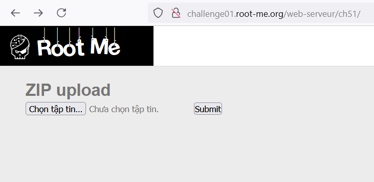
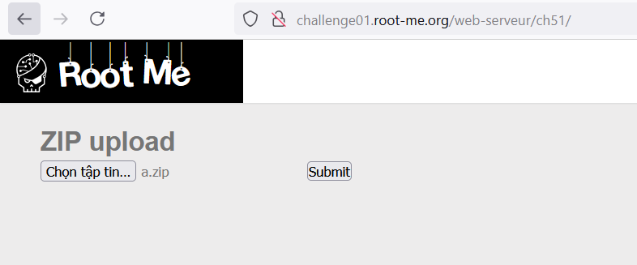
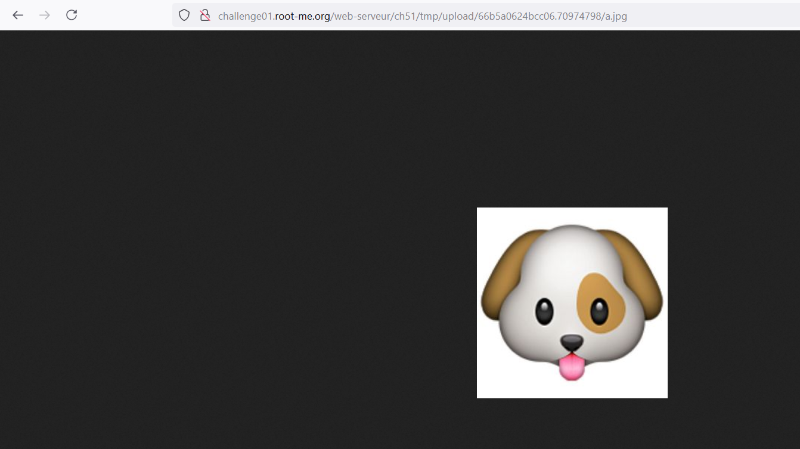
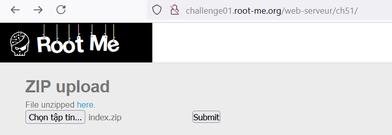
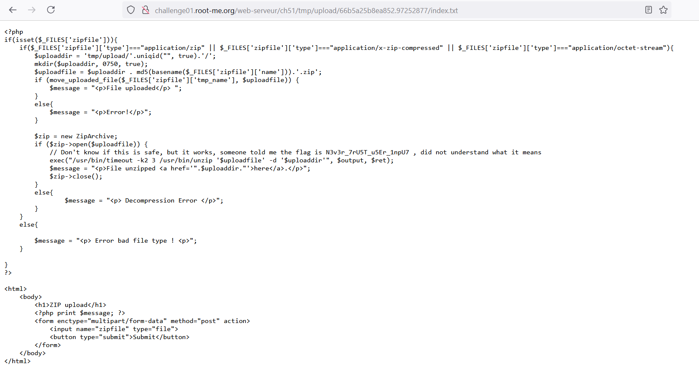

Challenge: http://challenge01.root-me.org/web-serveur/ch51/



Tìm hiểu về [Symlink](Symlink.md)

Đầu tiên vào trang web: 


Upload 1 file zip nó sẽ có 1 đường dẫn đến folder mà ở đó đã unzip file tải lên, và còn lại file trong tập zip ban đầu, ở đây là ảnh:


Ấn vào thì ta thấy ta có thể xem ảnh: 


Tiếp theo ta thử upload 1 file `txt` thì vẫn có thể hiển thị, nhưng nếu là 1 file `.php`:


Thì nó không cho phép truy cập. 

Vậy ở bài này, ta sẽ dùng Symlink để lấy nội dung file `index.php`:

Đầu tiên ta nhận thấy đường dẫn file ta upload sẽ được unzip và đưa vào đây:
`/web-serveur/ch51/tmp/upload/66b5a135dcd092.73844206/<file>`

File `index.php` sẽ nằm ở `/web-serveur/ch51/` vậy symlink sẽ là: 


Sau đó zip symlink này lại:


Upload file lên:


Ta nhận được file `index.txt` sau khi server unzip:




Code: 
```
<?php
if(isset($_FILES['zipfile'])){
    if($_FILES['zipfile']['type']==="application/zip" || $_FILES['zipfile']['type']==="application/x-zip-compressed" || $_FILES['zipfile']['type']==="application/octet-stream"){
        $uploaddir = 'tmp/upload/'.uniqid("", true).'/';
        mkdir($uploaddir, 0750, true);
        $uploadfile = $uploaddir . md5(basename($_FILES['zipfile']['name'])).'.zip';
        if (move_uploaded_file($_FILES['zipfile']['tmp_name'], $uploadfile)) {
            $message = "<p>File uploaded</p> ";
        }
        else{
            $message = "<p>Error!</p>";
        }
	
        $zip = new ZipArchive;
        if ($zip->open($uploadfile)) {
            // Don't know if this is safe, but it works, someone told me the flag is N3v3r_7rU5T_u5Er_1npU7 , did not understand what it means
            exec("/usr/bin/timeout -k2 3 /usr/bin/unzip '$uploadfile' -d '$uploaddir'", $output, $ret);
            $message = "<p>File unzipped <a href='".$uploaddir."'>here</a>.</p>";
	    $zip->close();
        }
	else{
		$message = "<p> Decompression Error </p>";
	}
    }
    else{
		
	$message = "<p> Error bad file type ! <p>";
    }

}
?>

<html>
    <body>
        <h1>ZIP upload</h1>
        <?php print $message; ?>
        <form enctype="multipart/form-data" method="post" action>
            <input name="zipfile" type="file">
            <button type="submit">Submit</button>
        </form>
    </body>
</html>
```

Ở đây ta thấy server dùng `exec("/usr/bin/timeout -k2 3 /usr/bin/unzip '$uploadfile' -d '$uploaddir'", $output, $ret);` để unzip.

Cách sửa: Sử dụng các thư viện PHP như ZipArchive có hỗ trợ kiểm tra và xử lý file zip an toàn hơn so với dùng lệnh exec() hoặc sau khi unzip cần kiểm tra xem nó phải symlink không sau đó mới trả về kết quả cho người dùng.