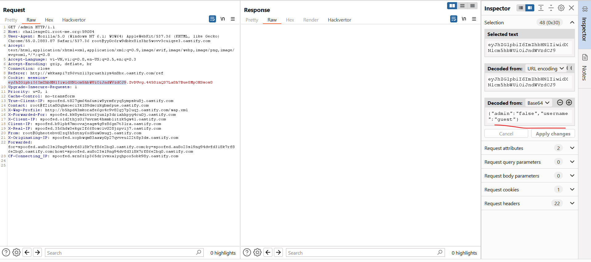
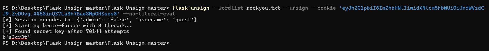
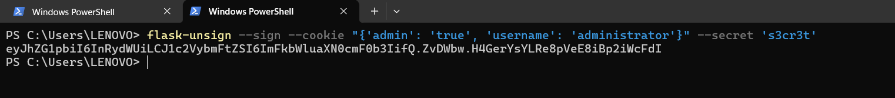
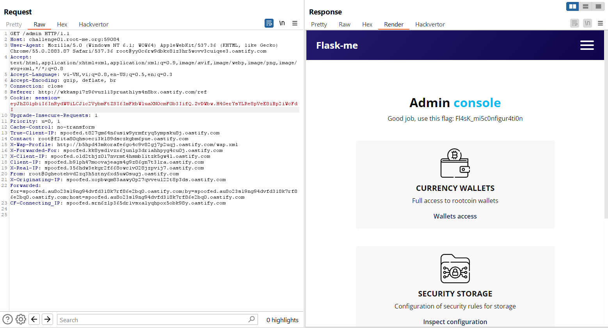

Challenge: http://challenge01.root-me.org:59084/

Ta sẽ cố gắng truy cập vào path `/admin`.

Ta sẽ suy nghĩ về việc thay đổi cookie này, nhìn qua thì có vẻ giống với JWT nhưng khi tìm hiểu về flask session, ta biết flask không dùng JWT mà dùng 1 cách tạo session riêng, và đã có tool bypass.

Từ đây, ta thao túng cookie này:\

Kết quả:\

