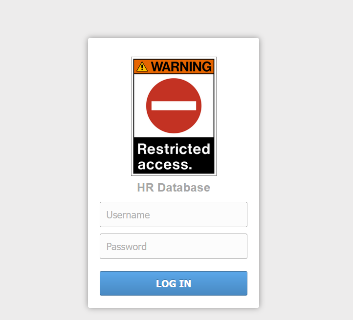
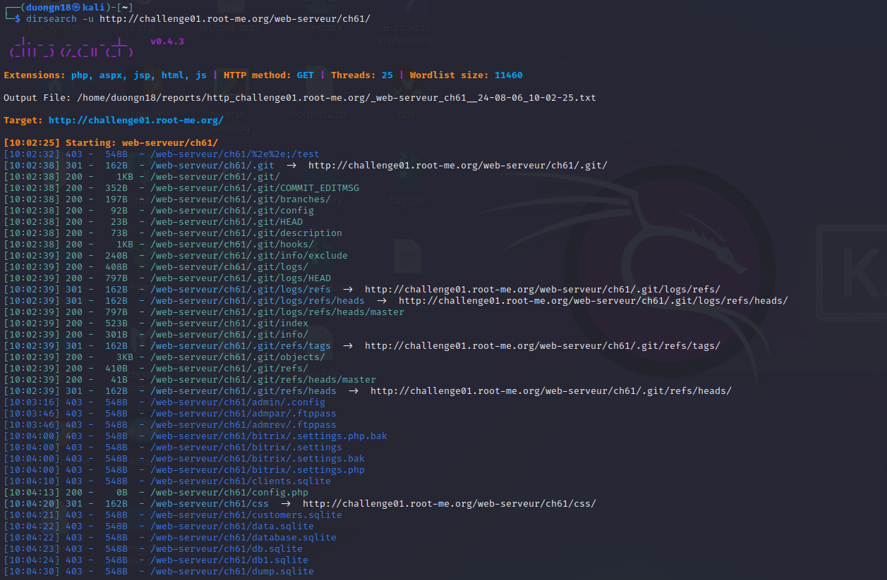
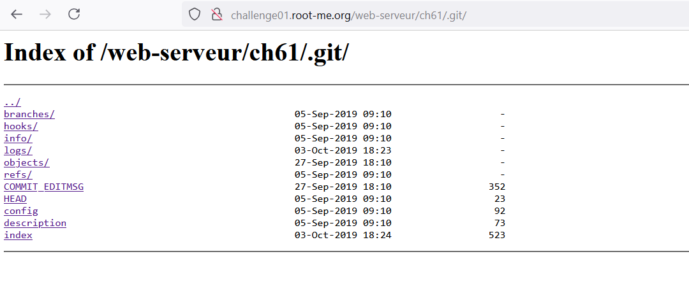
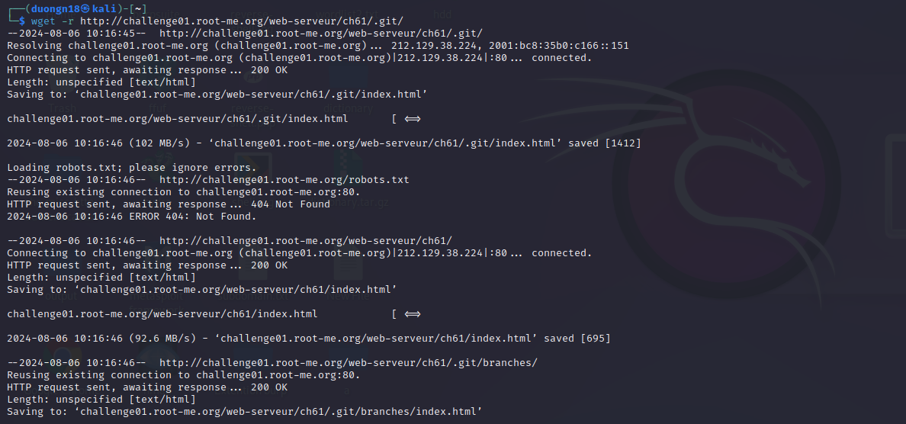
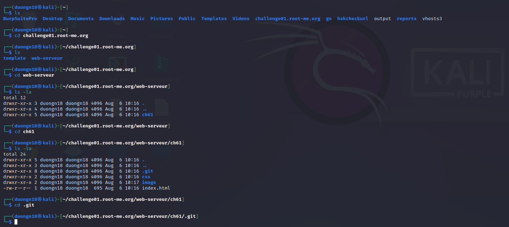
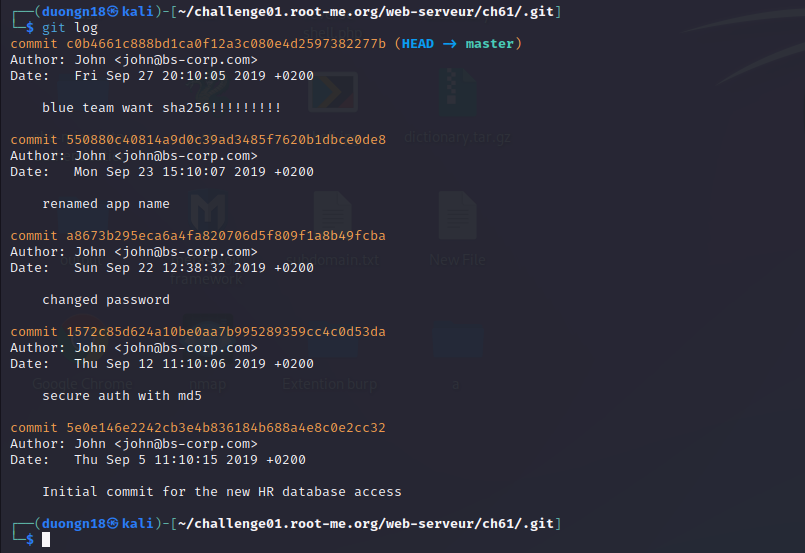
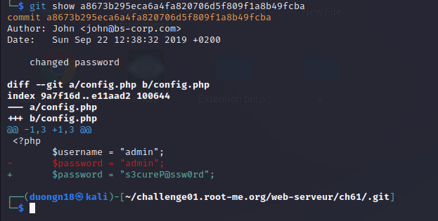
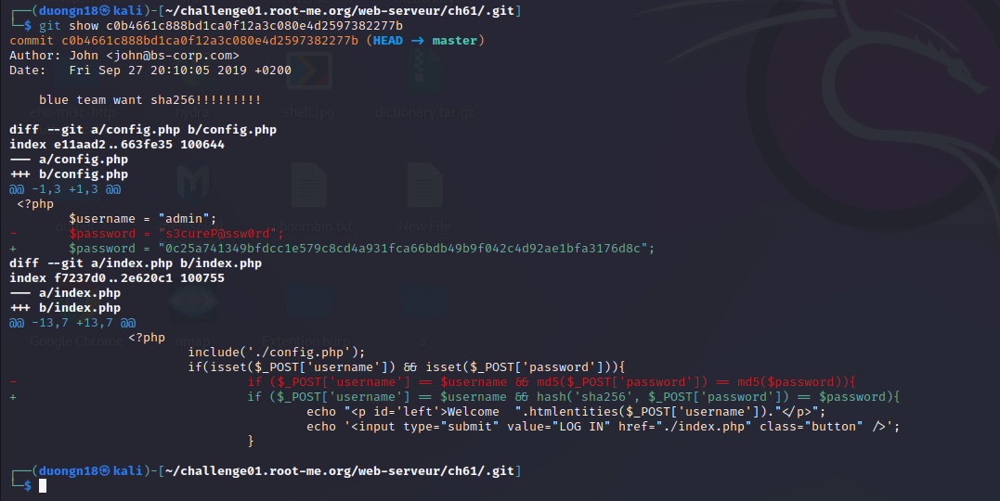
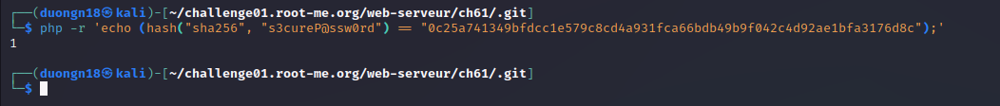

Challenge: http://challenge01.root-me.org/web-serveur/ch61/

Với thông tin là về Code Manager và document hướng dẫn dẫn đến trang GIT, ta sẽ thử tìm thêm directory:

Truy cập vào: http://challenge01.root-me.org/web-serveur/ch61/.git/

Ta chú ý đến message: `changed password` và `blue team want sha256!!!!!!!!!` :

Ở lần commit này dev đã thay đổi password từ `admin` sang `s3cureP@ssw0rd`

Ở lần commit này dev đã thay đổi password sang 1 đoạn hash và thay đổi cách xác thực password từ hàm md5 thành hash, ta sẽ thử check hash của `s3cureP@ssw0rd`: 

Note: Không đưa folder .git vào folder web, khi commit nên có file .gitignore để tránh những file không mong muốn bị tải lên và bị lộ 1 số URL nhạy cảm. 

