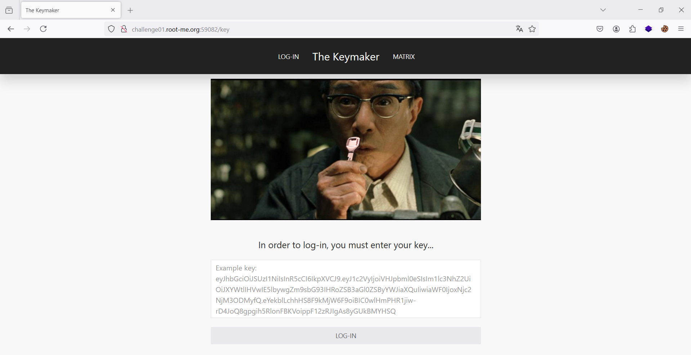
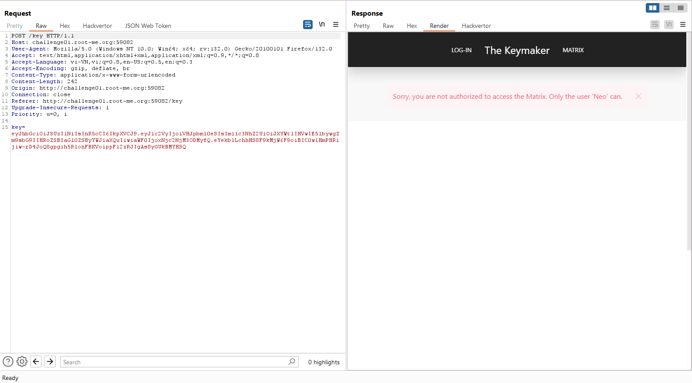
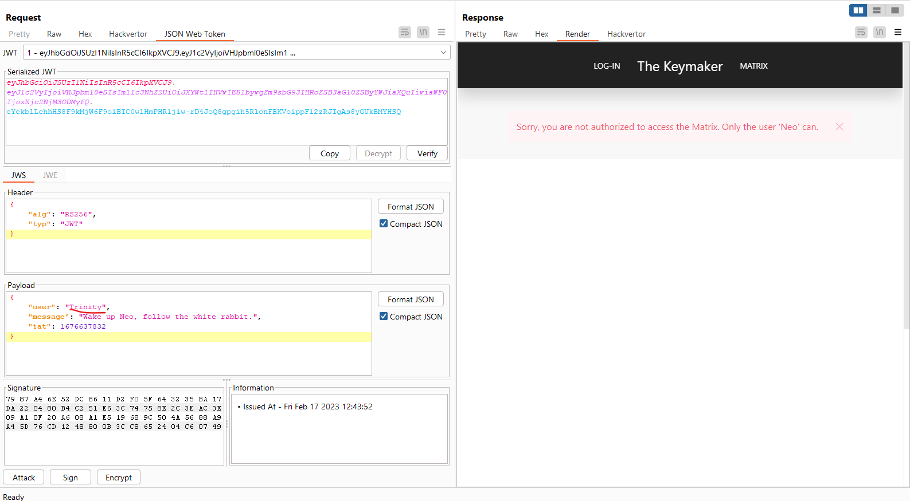
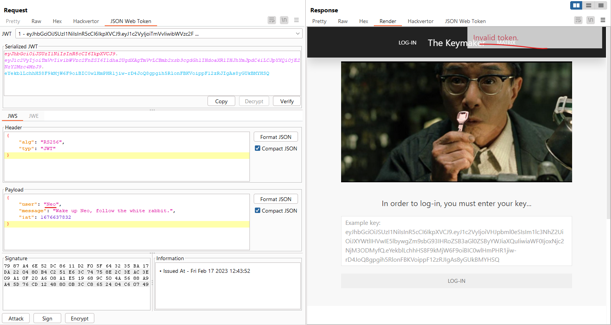
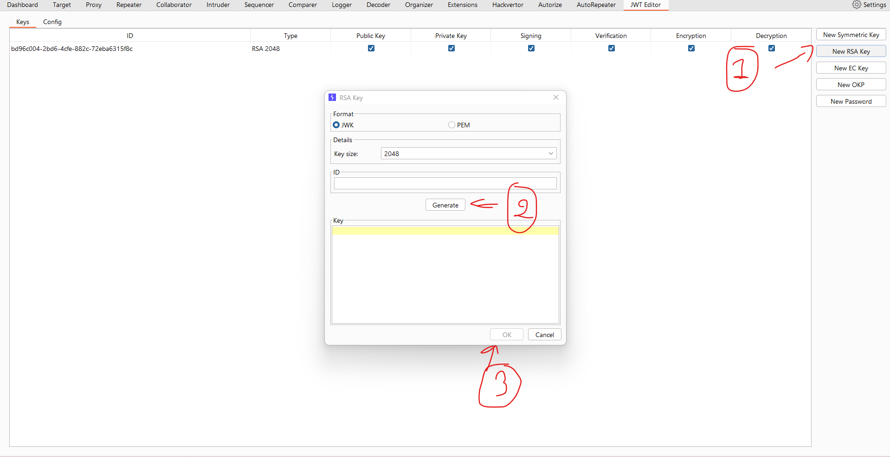
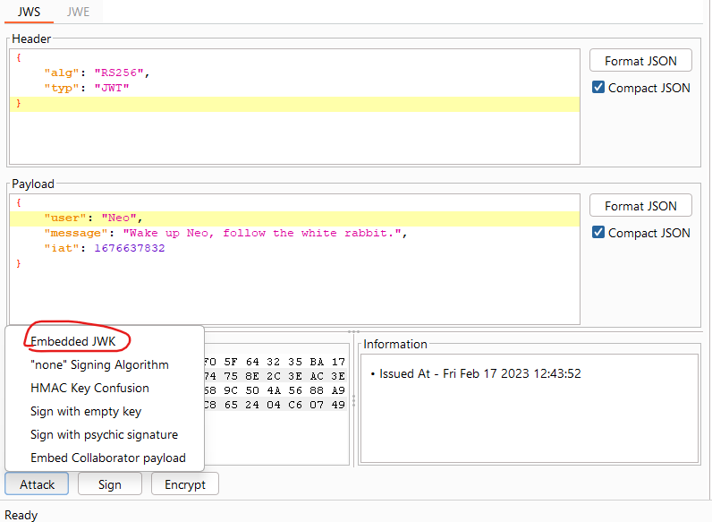
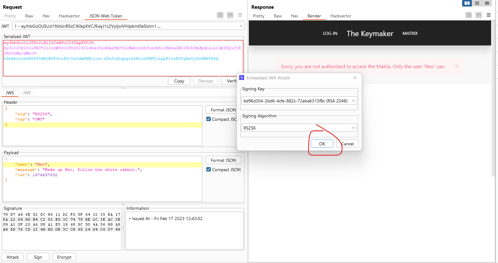
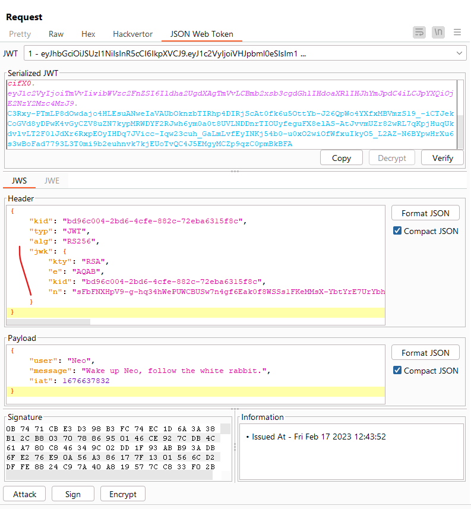
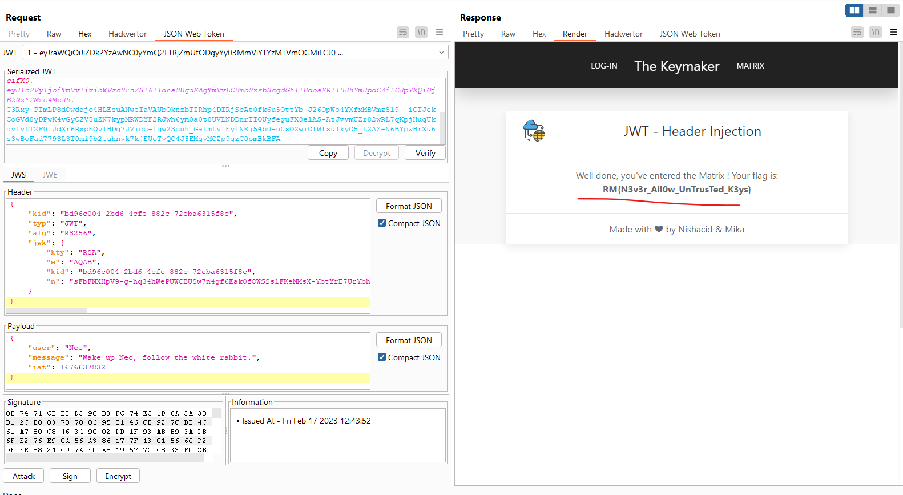

## JWT - Header Injection

Challenge: http://challenge01.root-me.org:59082/

Nhập theo key mẫu ta được: 

Ở đây ta thấy nó bảo rằng chỉ cho `Neo` thôi, nên ta sẽ chuyển `user` thành `Neo`:

Ta nhận được thông báo `Invalid token` khả năng là do khóa sai, với đề bài là `Header Injection` ta tìm kiếm và tìm ra rằng header của jwt có thể dùng `jwk` hoặc `jku` để tạo khóa hoặc lấy khóa từ 1 url, ở đây ta sẽ tạo khóa `jwk`:

