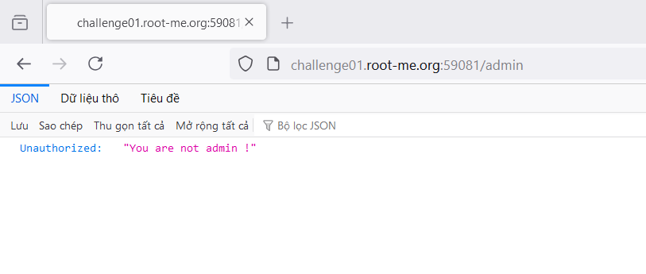
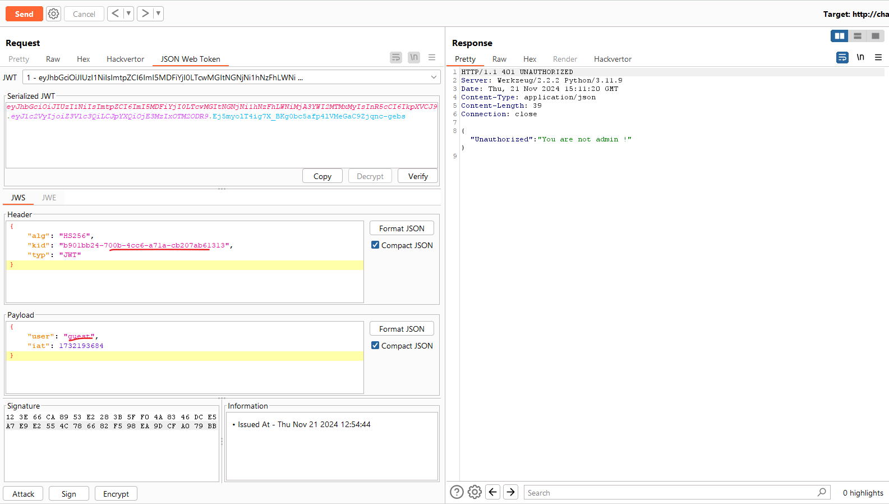
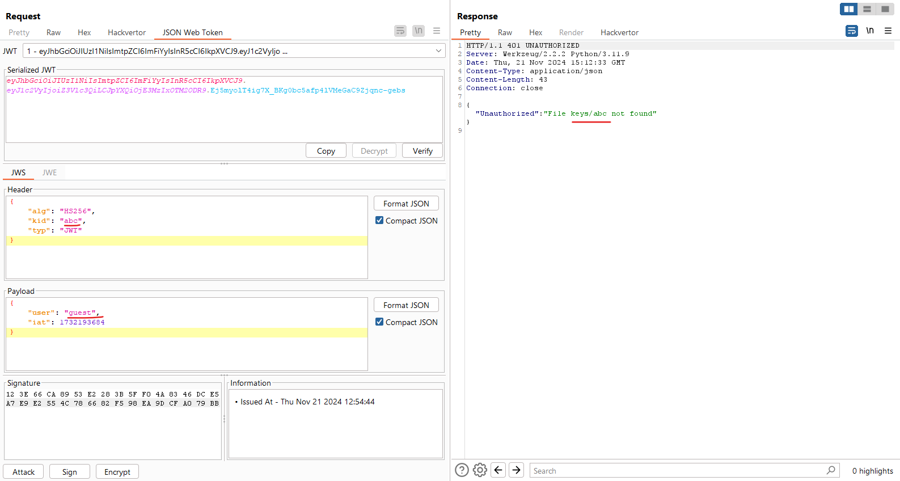
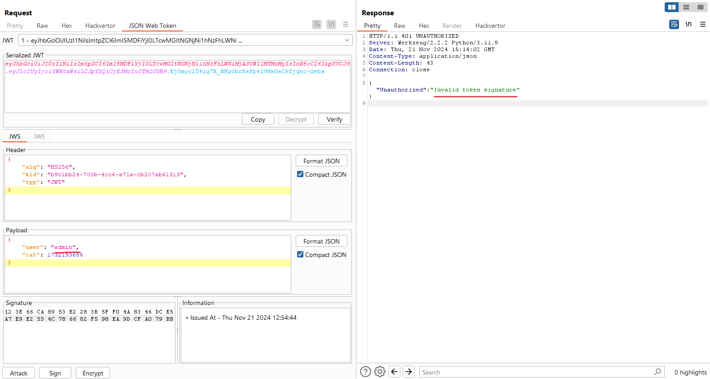
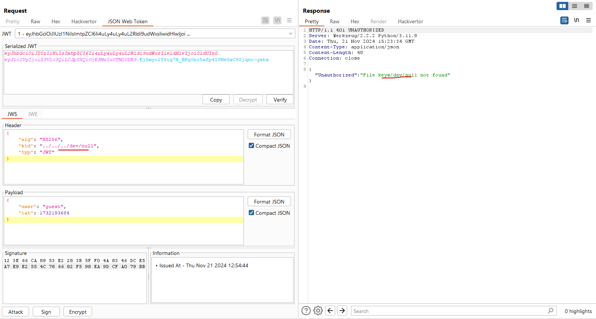
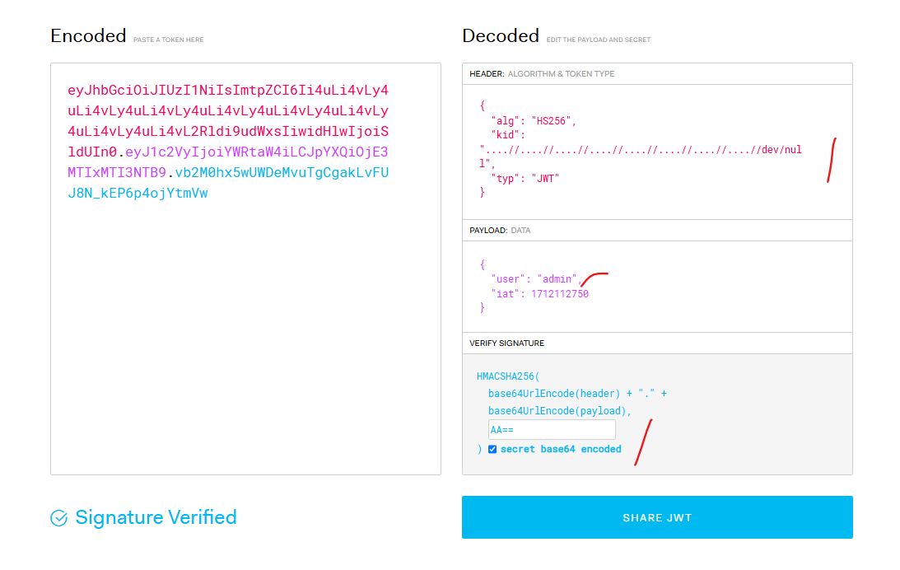
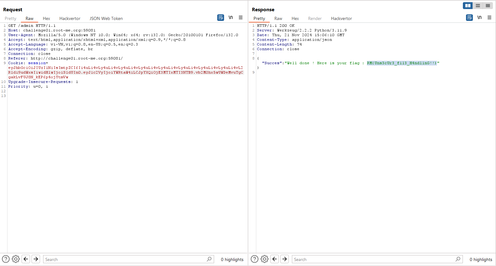

## JWT - Unsecure File Signature

Challenge: http://challenge01.root-me.org:59081

Truy cập vào `http://challenge01.root-me.org:59081/admin` ta nhận được phản hồi:

Bắt gói tin ta thấy ở đây cookie là 1 đoạn jwt:

Ở đây trên tiêu đề cũng đã cho ta gợi ý về việc sử dụng `kid`, ta thử thay đổi `kid`: 

Còn khi thay đổi `user`:

Vậy là ta hiểu cơ chế là nó dùng 1 file khóa trong `keys` để kiểm tra với `secret key` trong jwt, nếu trùng signature này thì sẽ đúng 

Mặt khác vì nó filter `../` nên cần dùng `....//` để traversal thành công: 

Với `kid` thì có 2 lỗ hổng có thể khai thác là LFI và SQL, ở đây là LFI rồi, ta sẽ cố gắng điều hướng nó đến `dev/null` và file này có giá trị là null nên ta cần mã hóa jwt theo `secret key` là `null` hay ở dạng base64 là `AA==`:

