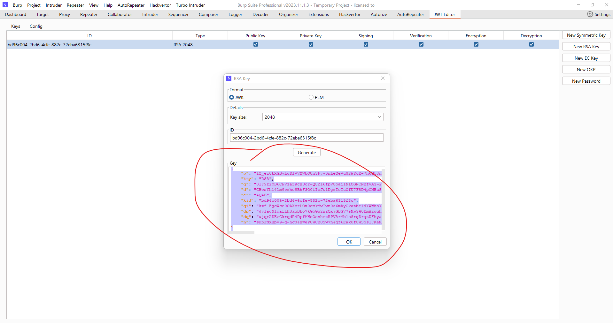
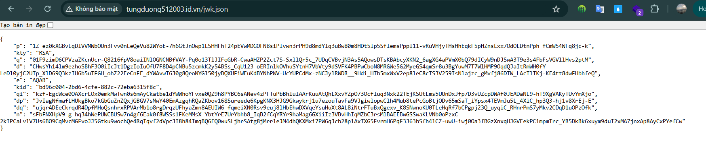
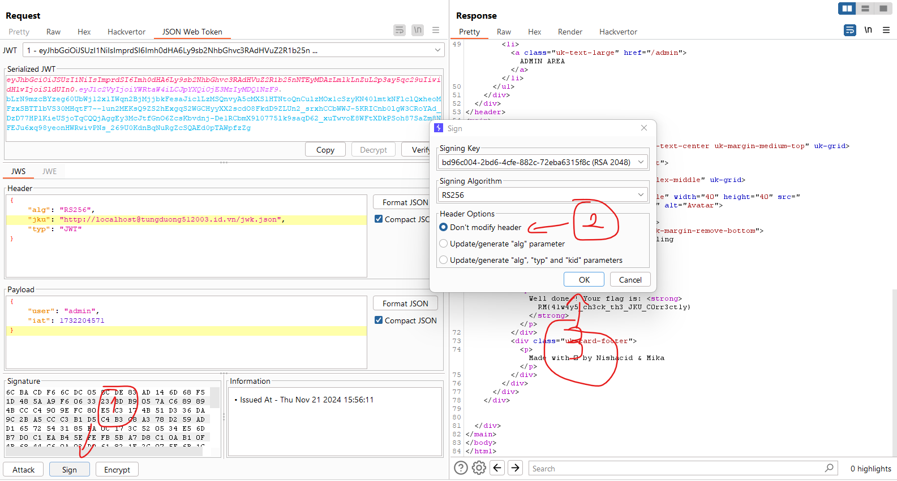
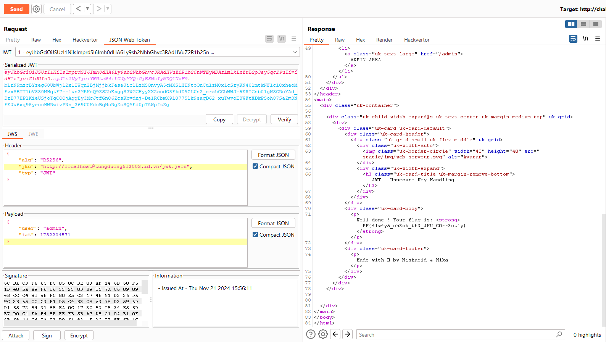

## JWT - Unsecure Key Handling

Challenge: http://challenge01.root-me.org:59080

Để giải quyết bài này cần 1 server để đưa file key lên

Tạo 1 key: 

Đưa key lên: 

Và ở đây đề bài dùng file `jwk.json` nhưng chú ý rằng `jku` lấy giá trị là 1 url và đưa file đó làm khóa 

Ở đây có 1 filter bắt buộc là bắt đầu phải là `http://localhost` nên ta sẽ dùng trick `@` để ngắt đoạn đầu và khi request sẽ chỉ lấy đoạn url phía sau `@`: 

Ta sẽ `sign` nó theo khóa mà ta tải lên file json đó, còn phần header trỏ đến file mà ta tải lên:

Và kết quả: 

