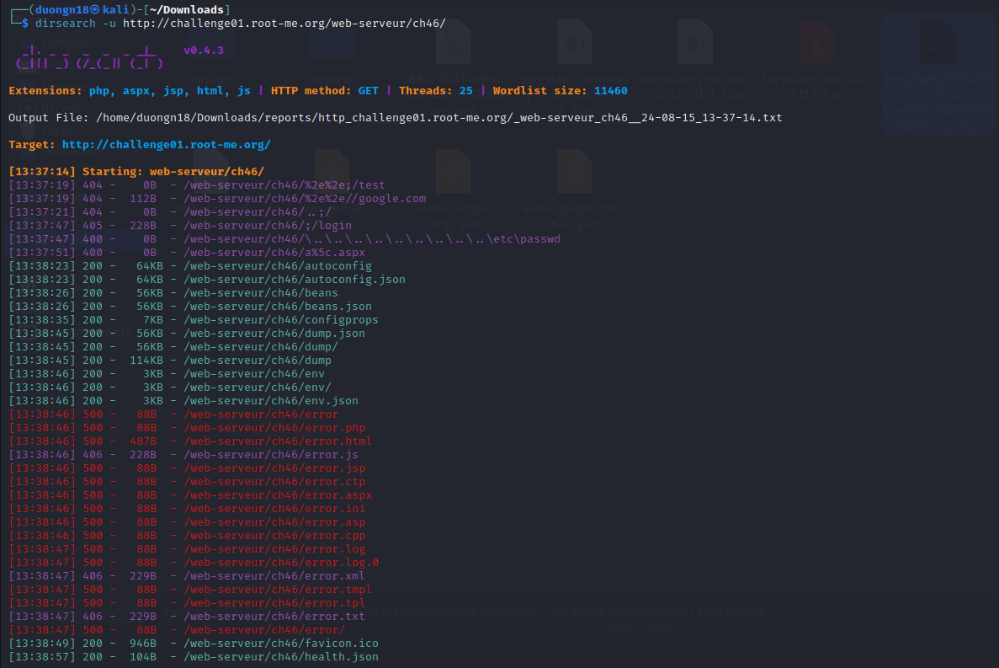
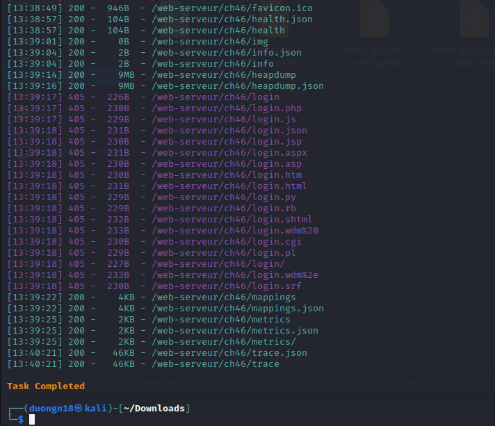
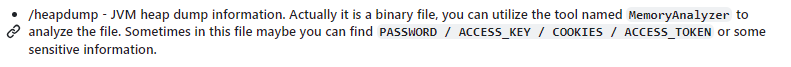
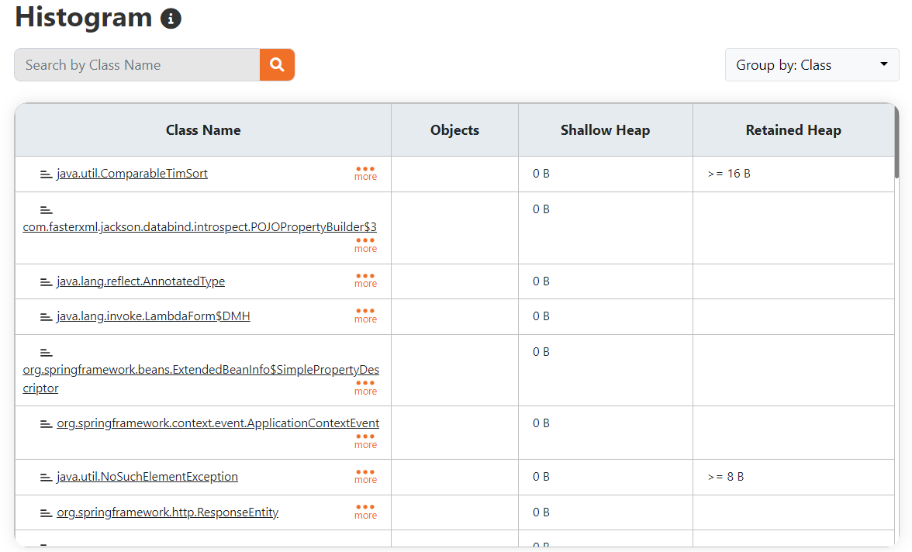
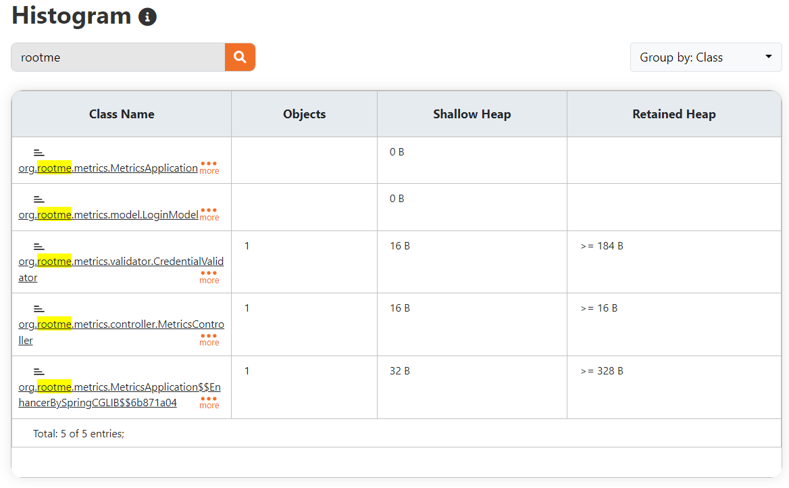
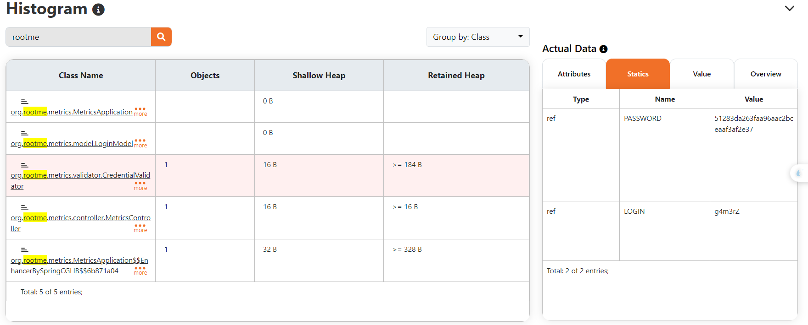
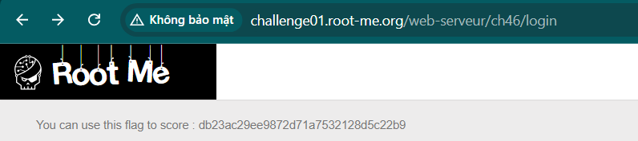

Challenge: http://challenge01.root-me.org/web-serveur/ch46/

Với hướng dẫn: `Metrics, a dangerous feature`

Thử search với từ khóa `java spring boot metrics exploit` thì nó không ra gì cả :) nhưng có 1 số trang web đề cập đến việc khi sử dụng java sprint boot thì có 1 số endpoit sẽ tự sinh ra để giám sát trong quá trình deploy nó lên https://github.com/pyn3rd/Spring-Boot-Vulnerability

Ta thấy rất nhiều endpoint ở đây truy cập từng endpoint để tìm thêm thông tin. Mặt khác các thông tin search được thì endpoint `/heapdump` có thể bị lộ 1 số thông tin nhạy cảm: 

Khi truy cập `/heapdump` thì tải 1 file đuôi `.hprof.gz` với tìm từ khóa `read hprof file` thì ta tìm được `https://medium.com/@nilasini/how-to-analyze-the-heapdump-bafea086b7f` sau đó ta tìm được 1 trang web có thể analyze heapdump: `https://heaphero.io/` tải file lên ta thấy có rất nhiều class được add vào. Ở đây ta cần tìm kiếm 1 số từ khóa như password, username, login, rootme,...

Thì ở đây ta tìm được: 

