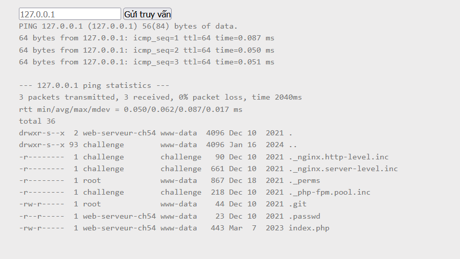

Challenge: http://challenge01.root-me.org/web-serveur/ch54/

Đầu tiên là truy cập và thực hiện 1 input đúng: 


Ta đoán ở đây công việc web thực hiện là sẽ ping đến địa chỉ IP input và xuất ra màn hình. Cấu trúc có thể là: ping IP

Để thực hiện thêm câu lệnh trong command ta có thể dùng: 
- `;` dùng để ngăn tách lệnh trước và làm thêm câu lệnh sau đó:


- `|` toán tử pipe để truyền lệnh trước cho lệnh sau


- `||` toán tử or thực hiện lệnh đúng vậy nên ta phải làm điều kiện cho câu lệnh phía trước sai để thực hiện câu lệnh đứng sau:


- `&` thực hiển cả 2 lệnh nhưng chỉ hiện thị lệnh thứ 2


- `&&` thực hiện lệnh thứ 2 nếu lệnh 1 đúng


- `` backstick và `$()` để thực hiện chuỗi lệnh trong đó trước sau đó mới thực hiện lệnh bên ngoài

Trở lại challenge, với input: `127.0.0.1; id` ta nhận được:
 

Ta biết được đã có thể thêm command với cách này.

Input: `127.0.0.1; ls -la`


Input: `127.0.0.1; cat .passwd`


Done!

File index.php:

Input: `127.0.0.1; cat index.php`


Ở đây phần input thứ 2 ở dưới là do file index.php được đưa vào html và server đã thực thi file này 1 lần nữa. Xem mã nguồn: 


```
<html>
<head>
<title>Ping Service</title>
</head>
<body>
<form method="POST" action="index.php">
        <input type="text" name="ip" placeholder="127.0.0.1">
        <input type="submit">
</form>
<pre>
<?php 
$flag = "".file_get_contents(".passwd")."";
if(isset($_POST["ip"]) && !empty($_POST["ip"])){
        $response = shell_exec("timeout -k 5 5 bash -c 'ping -c 3 ".$_POST["ip"]."'");
        echo $response;
}
?>
</pre>
</body>
</html>
```

Ở đây do địa chỉ IP từ input chỉ được kiểm tra xem có tồn tại và có khác rỗng ko mà không được filter các toán tử nên có thể thêm tự do các toán tử dẫn đến chèn các câu lệnh khác với mong muốn.

Để tránh lỗi này xảy ra cần thực hiện black list hoặc white list cho đầu vào. 