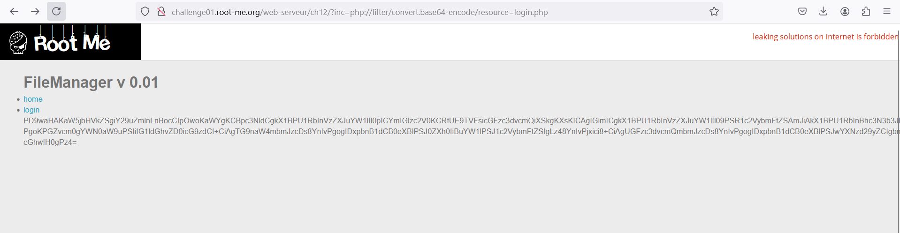
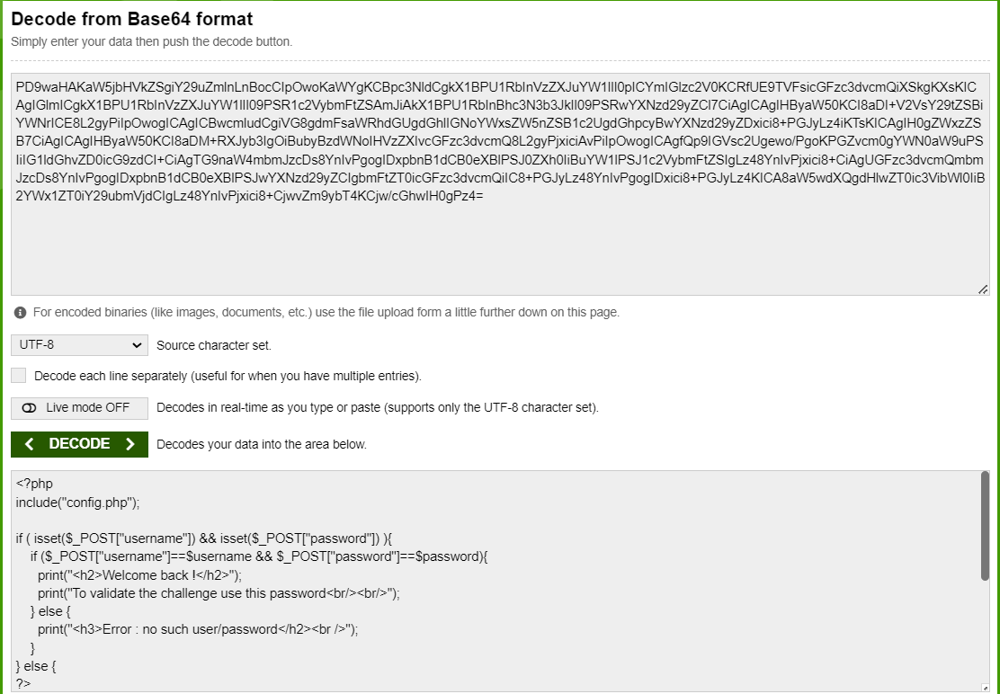

Challenge: https://www.root-me.org/en/Challenges/Web-Server/PHP-Filters

Với tên bài là PHP-Filters khiến mình lầm tưởng về việc Filter trong PHP bởi vì nếu search từ khóa này nó không ra được thứ nó đang hướng tới. Mà bài này đang đề cập đến **PHP Wrapper**.
https://www.php.net/manual/en/wrappers.php.php và ở trong này nhắc đến **php://filter**

PHP Wrapper có rất nhiều tính năng: thực thi câu lệnh (trong cả GET expect:// hoặc  data:// và POST php://input), đọc file php://filter,...

Ở đây mục tiêu ta sẽ tìm đọc file login.php bằng php://filter.
Dùng ```php://filter/convert.base64-encode/resource=login.php``` ta nhận được code của login.php ở dạng base64:


Copy và decode nó:


Ta thấy ở đây include thêm 1 file config.php và nó nằm cùng thư mục với login.php nên chỉ cần đổi tên ta đọc file config.php này: 


Decode 1 lần nữa: 


