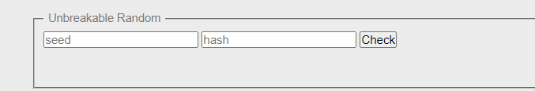
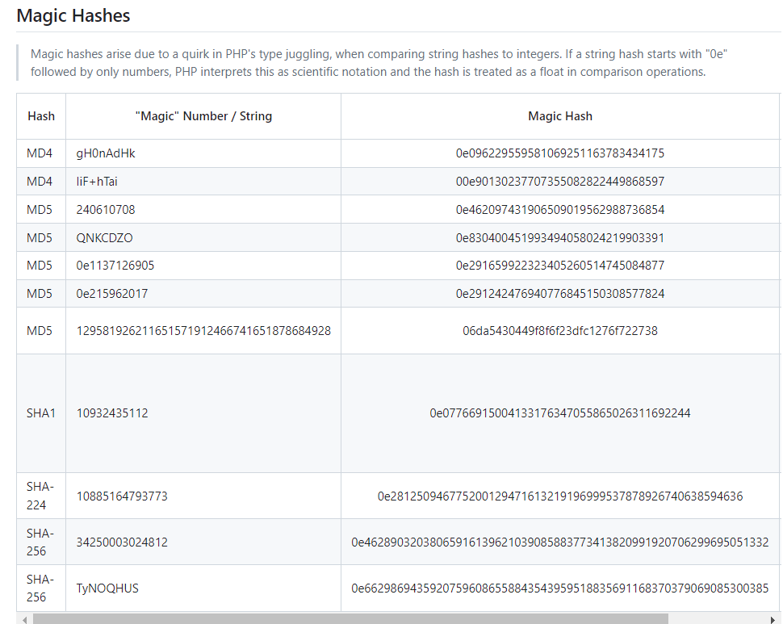
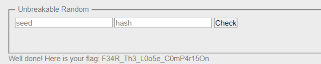

Challenge: http://challenge01.root-me.org/web-serveur/ch55/

Đầu tiên vào web và đọc source code: [index.php](index.php)

Ta thấy code sẽ theo luồng: 

Input `seed` và `hash` sẽ được lọc chỉ còn chữ và số [a-zA-Z0-9]
sau đó `hash` sẽ được md5()
sau đó nó sinh ra 1 số random `$r`

Sau đó nó sẽ so sánh: `$s.$r == $h` ở đây ta thấy chỉ dùng `==` mà không phải `===` thì có khả năng nó bị Loose Comparison.

Tìm kiếm PHP Loose Comparison ta thấy có 1 loạt so sánh có thể vượt qua `==`: https://github.com/swisskyrepo/PayloadsAllTheThings/blob/master/Type%20Juggling/README.md

Ta thấy có 1 magic hashes có thể vượt qua 1 số hàm hash, lí do là do `==` chỉ so sánh gần đúng nên với 1 hash bắt đầu với `0e...` và 1 chuỗi `oex..` thì nó sẽ cho là 2 số thực và trả về đúng.

Lấy 1 cặp: `hash=0e215962017:seed=0e291242476940776845150308577824`

