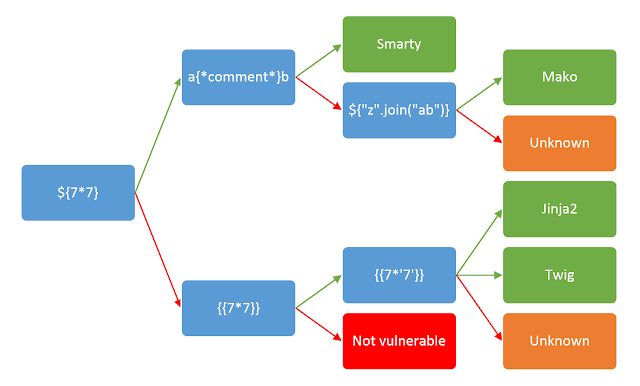

## Server Side Template Injections

### INTRODUCE

SSTI là một lỗ hổng xảy ra khi attacker có thể tiêm mã độc vào một template được thực thi trên máy chủ. 1 template là kết hợp giữa bố cục HTML và các biến động (dynamic variable), kẻ tấn công có thể thao túng các variable này nhằm thoát ra khỏi môi trường đó để thực thi lệnh nó muốn.

Jinja là một template engine phổ biến được sử dụng trong các ứng dụng web, ví dụ: 
```output = template.render(name=request.args.get('name'))```

Trong code này, tham số `name` từ yêu cầu của người dùng được chuyển trực tiếp vào template bằng phương thức `render` mà không có filter. Điều này có khả năng cho phép kẻ tấn công tiêm mã độc vào tham số `name`, dẫn đến SSTI.

Chẳng hạn, kẻ tấn công có thể tạo một yêu cầu với payload:
`http://vulnerable-website.com/?name={{bad-stuff-here}}`

Payload `{{bad-stuff-here}}` được đưa vào tham số `name`. Payload này có thể chứa các lệnh mẫu Jinja cho phép kẻ tấn công thực thi mã trái phép hoặc thao túng công cụ mẫu, có khả năng giành quyền kiểm soát máy chủ.

Để phát hiện SSTI chia ra 2 giai đoạn: 
- Phát hiện nơi bị SSTI
- Phát hiện công cụ (công nghệ) tạo template

### Detection
Để phát hiện SSTI đơn giản nhất là việc làm thay đổi template. Điều này liên quan đến việc đưa một chuỗi ký tự đặc biệt `${{<%[%'"}}%\` vào template và phân tích sự khác biệt trong phản hồi của máy chủ đối với dữ liệu thông thường so với payload đặc biệt này. 

Nếu 1 thông báo lỗi trả về từ phía máy chủ (thường là 500) thì có thể là nó đang bị tấn công. Việc quan sát thông báo lỗi có thể biết được engine nào đang sử dụng. 

Việc chèn template cũng có thể có 2 bối cảnh: 
- Plaintext context: đoạn input được đưa vào để render ra màn hình 

Ví dụ: `render('Hello ' + username)` 

Trong khi kiểm tra ta có thể nhập URL: 
`http://vulnerable-website.com/?username=${7*7}`

Nếu server trả về: `Hello 49` thì nó đang bị SSTI
- Code context: đoạn input người dùng là 1 biến để code đưa vào render.

Ví dụ:  ```greeting = getQueryParameter('greeting')
engine.render("Hello {{"+greeting+"}}", data)```

Ở web, đoạn URL: `http://vulnerable-website.com/?greeting=data.username` sẽ trả về `Hello Carlos`


### Identify the template engine used
Việc xác định công cụ tạo mẫu bao gồm việc phân tích các thông báo lỗi hoặc kiểm tra thủ công các payload dành riêng cho từng ngôn ngữ. Payload phổ biến gây ra lỗi bao gồm ${7/0}, {{7/0}} và <%= 7/0 %>. Việc quan sát phản hồi của máy chủ đối với các phép tính toán học giúp xác định chính xác công cụ tạo mẫu cụ thể.

Nhiều công cụ mẫu tồn tại. Trong số phổ biến nhất có thể kể đến Twig cho PHP, Freemarker cho Java, ERB cho Ruby, Jinja cho Python…



Ví dụ: tải trọng {{7*'7'}} trả về 49 trong Twig và 7777777 trong Jinja2. Không nên vội kết luận chỉ dựa trên một phản hồi thành công duy nhất.

### How to prevent
- Sanitization: 
Điều này liên quan đến việc phát hiện và xóa nội dung độc hại trước khi sử dụng nội dung đó để render. Do đó, cần phải phân tích hiệu quả dữ liệu input. Để làm điều này, có thể sử dụng nhiều phương tiện khác nhau (sử dụng biểu thức chính quy, white list, black list v.v.).
- Logic less template: 
Logic less template giúp tách biệt việc hiển thị và dịch code càng nhiều càng tốt. Mustache là một trong những phổ biến nhất, không thể tích hợp logic ứng dụng vào các mẫu Mustache.
Do đó, các cuộc tấn công RCE không còn có thể xảy ra nữa và điều này làm giảm đáng kể nguy cơ bị tấn công.


