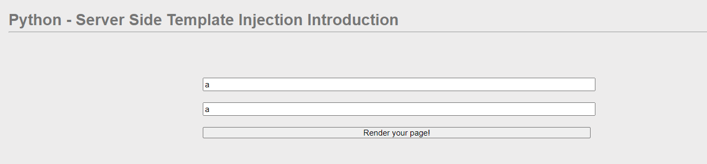
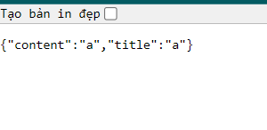
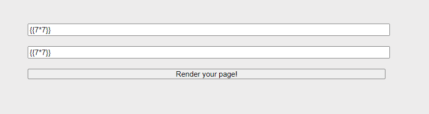
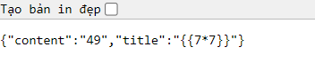
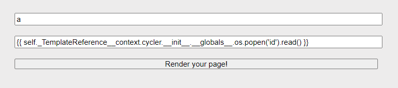
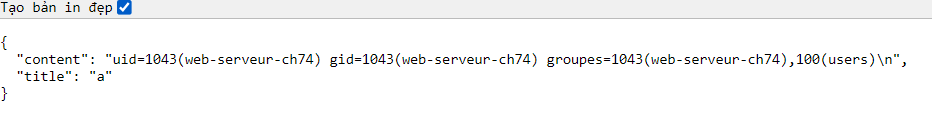
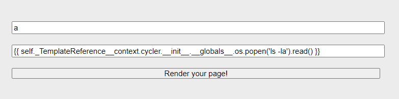
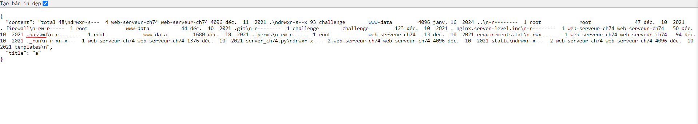
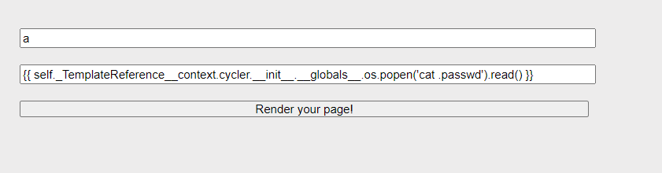
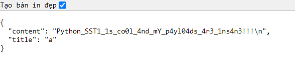

Challenge: http://challenge01.root-me.org:59074/

Tìm hiểu về Server-side Template Injection: [SSTI](SSTI.md)

Khai thác với jinja<chưa hiểu hết>: https://podalirius.net/en/publications/grehack-2021-optimizing-ssti-payloads-for-jinja2/
 
Quay lại challenge, đầu tiên thử 1 trường hợp bình thường: 

Đầu ra: 

Tiếp theo ta cần detect xem nó bị SSTI ở title hay content: 

Kết quả: 

Vậy ở đây `content` đang bị SSTI

