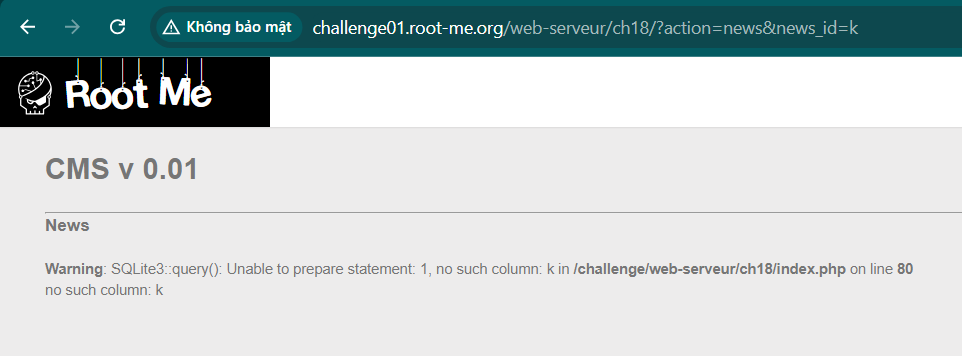
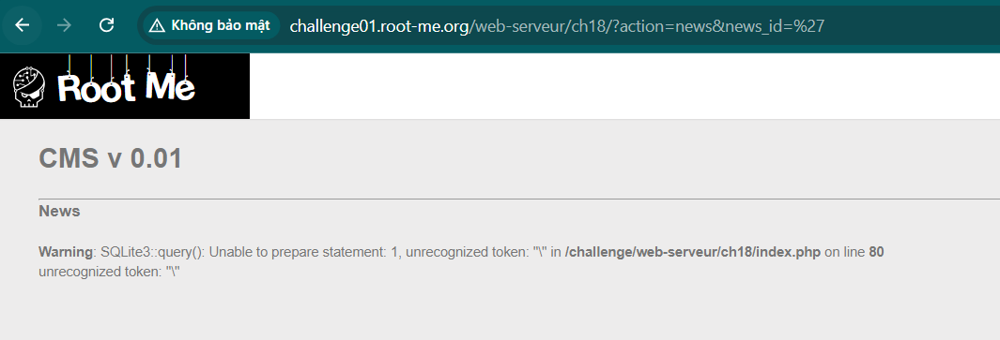
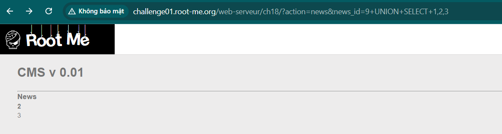
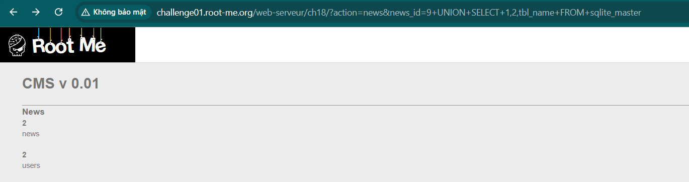
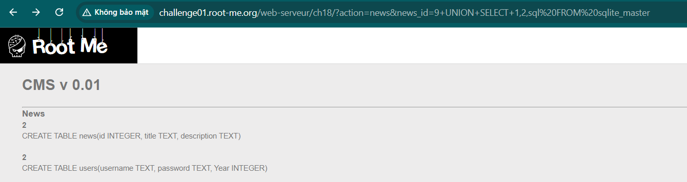
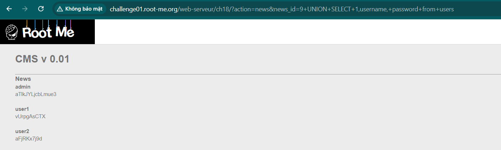

Challenge: https://www.root-me.org/en/Challenges/Web-Server/SQL-injection-Numeric

Mục đích bài này là tìm ra password của admin.
Test qua thì nó gồm 2 phần là đọc các bài news và đăng nhập. Và phần đọc bài thì parameter sẽ là các số:
```http://challenge01.root-me.org/web-serveur/ch18/?action=news&news_id=1```

Vì tên đề bài là numberic và khi thay các số bằng các chữ cái thì nó sẽ báo: 


Ở đây rõ ràng nó vẫn đưa 'k' vào tìm kiểm chỉ là không có kết quả để hiển thị. Nhưng nếu thay bằng kí tự ```'``` thì:


Dường như nó filter với dấu ' và nghĩ rằng bằng cách này thì khi nhập vào người nhập không thể can thiệp được chuỗi. 
Vậy thì quay lại các bước, bước đầu tiên là test xem có bao nhiêu trường được hiển thị: 


Thì ta có thể thấy có 3 trường được lấy ra nhưng chỉ có trường thứ 2 và 3 được hiển thị ra. Tiếp tục ta sẽ truy vấn tên các bảng: 

Và tiếp theo là tìm ra trong bảng có những trường nào:


Do không thể nhập kí tự ```'``` nên ở đây mình cho xuất ra hết câu lệnh tạo tất cả các bảng chứ không tìm riêng users được.

Cuối cùng là bem:
